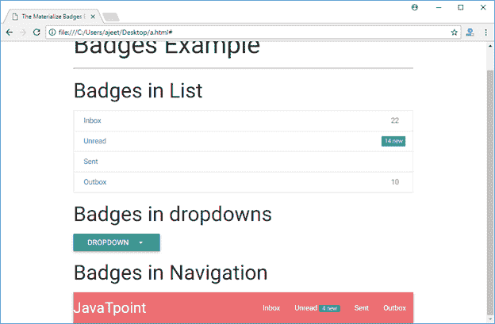

# Materialize CSS 徽章

> 原文：<https://www.javatpoint.com/materialize-css-badges>

Materialize CSS 徽章用于通知您有新的或未读的消息或通知。您可以将新类别添加到徽章中，为其提供背景。徽章可以是数字或图标。一般用来强调物品的数量。

请参见 Materialize CSS 徽章中使用的以下两个类:

| 索引 | 类别名 | 描述 |
| 1) | 标记 | 它用于将元素标识为 mdl 徽章组件。这是跨度元素所必需的。 |
| 2) | 新的 | 它用于向徽章组件添加一个“新”类，为其提供背景。 |

* * *

## 例子

让我们举一个例子，以不同的方式演示徽章的用法:

```
<!DOCTYPE html>
<html>
   <head>
      <title>The Materialize Badges Example</title>
      <meta name = "viewport" content = "width = device-width, initial-scale = 1">      
      <link rel = "stylesheet"
         href = "https://fonts.googleapis.com/icon?family=Material+Icons">
      <link rel = "stylesheet"
         href = "https://cdnjs.cloudflare.com/ajax/libs/materialize/0.97.3/css/materialize.min.css">
      <script type = "text/javascript"
         src = "https://code.jquery.com/jquery-2.1.1.min.js"></script>           
      <script src = "https://cdnjs.cloudflare.com/ajax/libs/materialize/0.97.3/js/materialize.min.js">
      </script> 
   </head>

   <body class = "container"> 
      <h2>Badges Example</h2>
      <hr/>

      <h3>Badges in List</h3>
      <div class = "collection">
         <a href = "#" class = "collection-item">Inbox<span class = "badge">22</span></a>
         <a href = "#" class = "collection-item">Unread<span class = "new badge">14</span></a>
         <a href = "#" class = "collection-item">Sent</a>
         <a href = "#" class = "collection-item">Outbox<span class = "badge">10</span></a>
      </div>

      <h3>Badges in dropdowns</h3>
      <ul id = "dropdown" class = "dropdown-content">
         <li><a href = "#">Inbox<span class = "badge">22</span></a></li>
         <li><a href = "#!">Unread<span class = "new badge">14</span></a></li>
         <li><a href = "#">Sent</a></li>
         <li><a href = "#">Outbox<span class = "badge">10</span></a></li>
      </ul>

      <a class = "btn dropdown-button" href = "#" data-activates = "dropdown">
         Dropdown<i class = "mdi-navigation-arrow-drop-down right"></i></a>
      <h3>Badges in Navigation</h3>
      <nav>
         <div class = "nav-wrapper">
            <a href = "" class = "brand-logo">JavaTpoint</a>
            <ul id = "nav-mobile" class = "right hide-on-med-and-down">
               <li><a href = "">Inbox</a></li>
               <li><a href = "">Unread<span class = "new badge">4</span></a></li>
               <li><a href = "#">Sent</a></li>
               <li><a href = "#">Outbox</a></li>
            </ul>
         </div>
      </nav>
   </body>
</html>

```

[Test it Now](https://www.javatpoint.com/oprweb/test.jsp?filename=materializecssbadges1)

输出:


