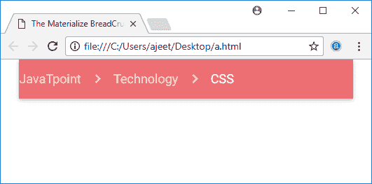

# Materialize CSS 面包屑

> 原文：<https://www.javatpoint.com/materialize-css-breadcrumb>

Materialize CSS 面包屑用于显示您的当前位置。这通常在您有多层内容时使用。

Materialize CSS 提供了各种 CSS 类，以一种简单的方式创建一个漂亮的面包屑。以下是可用类及其效果的列表。

| 指数 | 类别名 | 描述 |
| 1) | 导航包装器 | 将导航组件设置为面包屑/导航条包装器。 |
| 2) | 面包屑 | 将锚点元素设置为面包屑。最后一个锚点元素处于活动状态，而其余元素显示为灰色。 |

* * *

## 例子

```html

<!DOCTYPE html>
<html>
   <head>
      <title>The Materialize BreadCrumb Example</title>
      <meta name = "viewport" content = "width = device-width, initial-scale = 1">      
      <link rel = "stylesheet"
         href = "https://fonts.googleapis.com/icon?family=Material+Icons">
      <link rel = "stylesheet"
         href = "https://cdnjs.cloudflare.com/ajax/libs/materialize/0.97.3/css/materialize.min.css">
      <script type = "text/javascript"
         src = "https://code.jquery.com/jquery-2.1.1.min.js"></script>           
      <script src = "https://cdnjs.cloudflare.com/ajax/libs/materialize/0.97.3/js/materialize.min.js">
      </script> 
   </head>

   <body class = "container"> 
      <nav>
         <div class = "nav-wrapper">
            <div class = "col s10">
               <a href = "#" class = "breadcrumb">JavaTpoint</a>
               <a href = "#" class = "breadcrumb">Technology</a>
               <a href = "#" class = "breadcrumb">CSS</a>
            </div>
         </div>
      </nav>
   </body>   
</html>

```

[Test it Now](https://www.javatpoint.com/oprweb/test.jsp?filename=materializecssbreadcrumb1)

输出:

