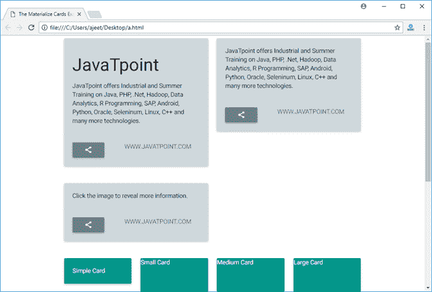

# Materialize CSS 卡

> 原文：<https://www.javatpoint.com/materialize-css-cards>

Materialize CSS 提供了不同的 CSS 类来应用各种预定义的视觉和行为增强来显示各种类型的卡片。

| 索引 | 类别名 | 描述 |
| 1) | 卡片 | 它用于将 div 元素标识为 Materialize 卡容器。它在“外部”栏中是必需的。 |
| 2) | 卡片内容 | 它用于将 div 标识为卡片内容容器，并且在“内部”div 上是必需的。 |
| 3) | 卡片标题 | 它用于将 div 标识为卡片标题容器，并且在“内部”标题 div 上是必需的。 |
| 4) | 卡片动作 | 它用于将 div 标识为卡片动作容器，并为动作文本分配适当的文本特征。“内部”行动部门需要它；内容直接进入 div，没有中间的容器。 |
| 5) | 卡片图像 | 它用于将 div 标识为卡片图像容器，并且在“内部”div 上是必需的。 |
| 6) | 卡片展示 | 它用于将 div 标识为显示的文本容器。 |
| 7) | 催化剂 | 它用于将 div 标识为要显示的显示文本容器和图像。它用于显示与图像相关的上下文信息。 |
| 8) | 卡片面板 | 它用于将 div 识别为带有阴影和填充的简单卡片。 |
| 9) | 卡片-小 | 它用于将 div 识别为小型卡。高度:300px |
| 10) | 卡片媒体 | 它用于将 div 标识为中型卡。高度:400px |
| 11) | 大型卡片 | 它用于将 div 标识为大尺寸卡片。高度:500px |

* * *

## 例子

让我们举一个例子来演示使用卡片类来展示各种类型的卡片。

```html

<!DOCTYPE html>
<html>
   <head>
      <title>The Materialize Cards Example</title>
      <meta name = "viewport" content = "width = device-width, initial-scale = 1">      
      <link rel = "stylesheet"
         href = "https://fonts.googleapis.com/icon?family=Material+Icons">
      <link rel = "stylesheet"
         href = "https://cdnjs.cloudflare.com/ajax/libs/materialize/0.97.3/css/materialize.min.css">
      <script type = "text/javascript"
         src = "https://code.jquery.com/jquery-2.1.1.min.js"></script>           
      <script src = "https://cdnjs.cloudflare.com/ajax/libs/materialize/0.97.3/js/materialize.min.js">
      </script> 
   </head>

   <body class = "container"> 
      <div class = "row">
         <div class = "col s12 m6">
            <div class = "card blue-grey lighten-4">
               <div class = "card-content">
                  <span class = "card-title"><h3>JavaTpoint</h3></span>
                  <p>JavaTpoint offers Industrial and Summer Training on Java, 
				  PHP, .Net, Hadoop, Data Analytics, R Programming, SAP, Android, Python, Oracle, 
				  Seleninum, Linux, C++ and many more technologies.</p>
               </div>

               <div class = "card-action">
                  <button class = "btn waves-effect waves-light blue-grey">
                     <i class = "material-icons">share</i></button>
                  <a class = "right blue-grey-text" href = "https://www.javatpoint.com">
                     www.javatpoint.com</a>
               </div>
            </div>
         </div>

         <div class = "col s12 m6">
            <div class = "card blue-grey lighten-4">
               <div class = "card-image">
                                  
               </div>

               <div class = "card-content">                  
                  <p>JavaTpoint offers Industrial and Summer 
				  Training on Java, PHP, .Net, Hadoop, Data Analytics, 
				  R Programming, SAP, Android, Python, Oracle, Seleninum, 
				  Linux, C++ and many more technologies.</p>
               </div>

               <div class = "card-action">
                  <button class = "btn waves-effect waves-light blue-grey">
                     <i class = "material-icons">share</i></button>
                  <a class = "right blue-grey-text" href = "https://www.javatpoint.com">
                    www.javatpoint.com</a>
               </div>
            </div>
         </div>
      </div>

      <div class = "row">
         <div class = "col s12 m6">
            <div class = "card blue-grey lighten-4">
               <div class = "card-image waves-effect waves-block waves-light">
                                  
               </div>

               <div class = "card-content activator">                  
                  <p>Click the image to reveal more information.</p>
               </div>

               <div class = "card-reveal">
                  <span class = "card-title grey-text text-darken-4">HTML5
                     <i class = "material-icons right">close</i></span>
                  <p>JavaTpoint offers Industrial and Summer Training on Java, 
				  PHP, .Net, Hadoop, Data Analytics, R Programming, SAP, Android, Python, Oracle, 
				  Seleninum, Linux, C++ and many more technologies.</p>
               </div>

               <div class = "card-action">
                  <button class = "btn waves-effect waves-light blue-grey">
                     <i class = "material-icons">share</i></button>
                  <a class = "right blue-grey-text" href = "https://www.javatpoint.com">
                     www.javatpoint.com</a>
               </div>
            </div>
         </div>
      </div>

      <div class = "row">
         <div class = "col s12 m3">
            <div class = "card-panel teal">
               <span class = "white-text">Simple Card</span>
            </div>
         </div>

         <div class = "col s12 m3">
            <div class = "card small teal">
               <span class = "white-text">Small Card</span>
            </div>
         </div>

         <div class = "col s12 m3">
            <div class = "card medium teal">
               <span class = "white-text">Medium Card</span>
            </div>
         </div>

         <div class = "col s12 m3">
            <div class = "card large teal">
               <span class = "white-text">Large Card</span>
            </div>
         </div>
      </div>     	  
   </body>   
</html>

```

[Test it Now](https://www.javatpoint.com/oprweb/test.jsp?filename=materializecsscards1)

输出:

