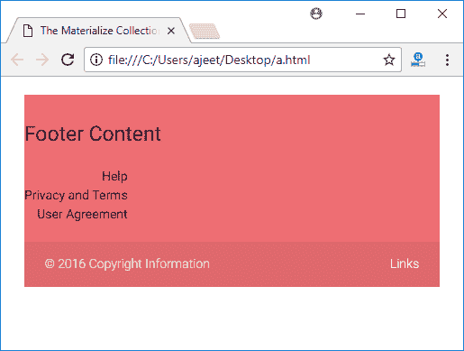

# Materialize CSS 页脚

> 原文：<https://www.javatpoint.com/materialize-css-footer>

页脚用于在页面末尾组织大量网站导航和信息。Materialize CSS 提供了不同的类，方便用户获取网站的附加信息。

| 索引 | 类别名 | 描述 |
| 1) | 页脚 | 它用于将 div 容器设置为页脚。 |
| 2) | 页脚-版权 | 它用于将 div 容器设置为页脚版权容器。 |

* * *

## 例子

让我们举一个例子来演示如何使用页脚类来展示一个示例页脚。

```html
<html>
   <head>
      <title>The Materialize Collections Example</title>
      <meta name = "viewport" content = "width = device-width, initial-scale = 1">      
      <link rel = "stylesheet"
         href = "https://fonts.googleapis.com/icon?family=Material+Icons">
      <link rel = "stylesheet"
         href = "https://cdnjs.cloudflare.com/ajax/libs/materialize/0.97.3/css/materialize.min.css">
      <script type = "text/javascript"
         src = "https://code.jquery.com/jquery-2.1.1.min.js"></script>           
      <script src = "https://cdnjs.cloudflare.com/ajax/libs/materialize/0.97.3/js/materialize.min.js">
      </script> 
   </head>

   <body class = "container">       
      <footer class = "page-footer">
         <div class = "row">
            <div class = "col s12 m6 l6">
               <h5 class = "black-text">Footer Content</h5>
            </div>

            <div class = "col">
               <ul>
                  <li><a href = "#" class = "black-text text-lighten-4 right">
                     Help</a></li>
                  <li><a href = "#" class = "black-text text-lighten-4 right">
                     Privacy and Terms</a></li>
                  <li><a href = "#" class = "black-text text-lighten-4 right">
                     User Agreement</a></li>
               </ul>
            </div>
         </div>

         <div class = "footer-copyright">
            <div class = "container">
               ? 2016 Copyright Information
               <a class = "grey-text text-lighten-4 right" href = "#!">Links</a>
            </div>
         </div>         
       </footer>
   </body>   
</html>

```

[Test it Now](https://www.javatpoint.com/oprweb/test.jsp?filename=materializecssfooter1)

