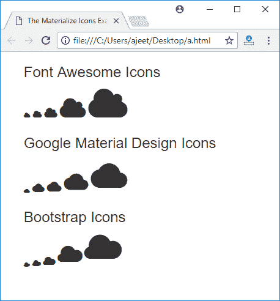

# 物化 CSS 图标

> 原文:[https://www.javatpoint.com/materialize-css-icons](https://www.javatpoint.com/materialize-css-icons)

物化 CSS 包含来自谷歌的 932 个材料设计图标。这些图标可以直接从材料设计规范中下载。

物化 CSS 支持三种类型的图标库:

*   字体超赞图标
*   谷歌材质图标
*   引导图标

* * *

## 如何使用物化 CSS 图标

您必须将图标的名称放在 HTML *元素的类中才能使用图标。*

您可以使用以下类来控制图标的大小。

| 索引 | 类别名 | 描述 |
| 1) | 微小的 | 它用来画一个非常小的图标。1rem。 |
| 2) | 小的 | 它用于绘制小尺寸的图标。2rem。 |
| 3) | 媒介 | 它用于绘制中等大小的图标。4em。 |
| 4) | 大的 | 它用于绘制大尺寸的图标。6 雷姆。 |

**例**

让我们举一个例子来演示物化 CSS 中使用的图标:

```

<html>
   <head>
      <title>The Materialize Icons Example</title>
      <meta name="viewport" content="width=device-width, initial-scale=1">
    <link rel="stylesheet" href="https://maxcdn.bootstrapcdn.com/bootstrap/3.3.7/css/bootstrap.min.css">
    <script src="https://ajax.googleapis.com/ajax/libs/jquery/3.2.1/jquery.min.js"></script>
    <script src="https://maxcdn.bootstrapcdn.com/bootstrap/3.3.7/js/bootstrap.min.js"></script>
    <meta name = "viewport" content = "width = device-width, initial-scale = 1">      
      <link rel = "stylesheet"
         href = "https://fonts.googleapis.com/icon?family=Material+Icons">
      <link rel = "stylesheet"
         href = "https://cdnjs.cloudflare.com/ajax/libs/materialize/0.97.3/css/materialize.min.css">
      <script type = "text/javascript"
         src = "https://code.jquery.com/jquery-2.1.1.min.js"></script>           
      <script src = "https://cdnjs.cloudflare.com/ajax/libs/materialize/0.97.3/js/materialize.min.js">
      </script> 
      <link rel = "stylesheet"
         href = "https://cdnjs.cloudflare.com/ajax/libs/font-awesome/4.4.0/css/font-awesome.min.css">
      <link rel = "stylesheet"
         href = "http://maxcdn.bootstrapcdn.com/bootstrap/3.3.4/css/bootstrap.min.css">
   </head>

   <body class = "container">

      <h3>Font Awesome Icons</h3>
      <i class = "fa fa-cloud tiny"></i>
      <i class = "fa fa-cloud"></i>	  
      <i class = "fa fa-cloud small"></i>
      <i class = "fa fa-cloud medium"></i>
      <i class = "fa fa-cloud large"></i>     

      <h3>Google Material Design Icons</h3>	  
      <i class = "material-icons tiny">cloud</i>
      <i class = "material-icons small">cloud</i>
      <i class = "material-icons">cloud</i>
      <i class = "material-icons medium">cloud</i>
      <i class = "material-icons large">cloud</i>      

      <h3>Bootstrap Icons</h3>
      <i class = "glyphicon glyphicon-cloud tiny"></i>
      <i class = "glyphicon glyphicon-cloud"></i>      
      <i class = "glyphicon glyphicon-cloud small"></i>
      <i class = "glyphicon glyphicon-cloud medium"></i>
      <i class = "glyphicon glyphicon-cloud large"></i>      
   </body>  
</html>

```

[Test it Now](https://www.javatpoint.com/oprweb/test.jsp?filename=materializecssicons1)

输出:

