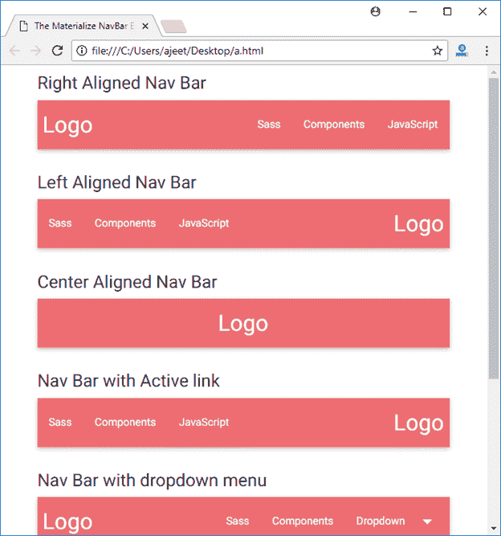

# Materialize CSS Navbar

> 原文：<https://www.javatpoint.com/materialize-css-navbar>

Navbar 用于创建一个简单的导航栏。Materialize CSS 提供了各种 CSS 类来创建一个导航栏。

Navbar 在推荐的容器分区中使用。navbar 有两个主要部分:

*   徽标或品牌链接
*   导航链接(您可以将这些链接向左或向右对齐)

您可以通过以下方式使用导航栏:

*   右对齐链接
*   左对齐链接
*   中心标志
*   活动链接
*   Navbar 下拉菜单
*   带有链接和图标的导航栏
*   带文本的导航栏图标

* * *

## 例子

让我们举一个 Materialize CSS 的例子来演示上面所有的属性:

```html

<html>
   <head>
      <title>The Materialize NavBar Example</title>
      <meta name = "viewport" content = "width = device-width, initial-scale = 1">      
      <link rel = "stylesheet"
         href = "https://fonts.googleapis.com/icon?family=Material+Icons">
      <link rel = "stylesheet"
         href = "https://cdnjs.cloudflare.com/ajax/libs/materialize/0.97.3/css/materialize.min.css">
      <script type = "text/javascript"
         src = "https://code.jquery.com/jquery-2.1.1.min.js"></script>           
      <script src = "https://cdnjs.cloudflare.com/ajax/libs/materialize/0.97.3/js/materialize.min.js">
      </script>	 

      <script>
         $( document ).ready(function()) {
            $(".dropdown-button").dropdown();
         });
      </script>
   </head>

   <body class = "container"> 
      <div class = "row" style = "width:560px;">
         <div class = "col s12 m12 l12" >
            <h5>Right Aligned Nav Bar</h5>
            <nav>
    <div class="nav-wrapper">
      <a href="#" class="brand-logo left">Logo</a>
      <ul id="nav-mobile" class="right">
        <li><a href="sass.html">Sass</a></li>
        <li><a href="badges.html">Components</a></li>
        <li><a href="collapsible.html">JavaScript</a></li>
      </ul>
    </div>
  </nav>
         </div>
      </div>

      <div class = "row" style = "width:560px;">
         <div class = "col s12 m12 l12">
            <h5>Left Aligned Nav Bar</h5>
           <nav>
    <div class="nav-wrapper">
      <a href="#" class="brand-logo right">Logo</a>
      <ul id="nav-mobile" class="left">
        <li><a href="sass.html">Sass</a></li>
        <li><a href="badges.html">Components</a></li>
        <li><a href="collapsible.html">JavaScript</a></li>
      </ul>
    </div>
  </nav>
         </div>
      </div>

      <div class = "row" style = "width:560px;">
         <div class = "col s12 m12 l12">
            <h5>Center Aligned Nav Bar</h5>
            <nav>
               <div class = "nav-wrapper">
                  <a href = "#" class = "brand-logo center">Logo</a>
                  <ul id = "nav-mobile" class = "right hide-on-med-and-down">                    
                     <li><a href = "#">Java</a></li>
                  </ul>
               </div>
            </nav>
         </div>
      </div>

      <div class = "row" style = "width:560px;">
         <div class = "col s12 m12 l12">
            <h5>Nav Bar with Active link</h5>
            <nav>
    <div class="nav-wrapper">
      <a href="#!" class="brand-logo right">Logo</a>
      <ul class="left">
        <li><a href="sass.html">Sass</a></li>
        <li><a href="badges.html">Components</a></li>
        <li class="active"><a href="collapsible.html">JavaScript</a></li>
      </ul>
    </div>
  </nav>
         </div>
      </div>

      <div class = "row" style = "width:560px;">
         <div class = "col s12 m12 l12">
            <h5>Nav Bar with dropdown menu</h5>
            <ul id="dropdown1" class="dropdown-content">
  <li><a href="#!">one</a></li>
  <li><a href="#!">two</a></li>
  <li class="divider"></li>
  <li><a href="#!">three</a></li>
</ul>
<nav>
  <div class="nav-wrapper">
    <a href="#!" class="brand-logo left">Logo</a>
    <ul class="right">
      <li><a href="sass.html">Sass</a></li>
      <li><a href="badges.html">Components</a></li>
      <!-- Dropdown Trigger -->
      <li><a class="dropdown-button" href="#!" data-activates="dropdown1">Dropdown<i class="material-icons right">arrow_drop_down</i></a></li>
    </ul>
  </div>
</nav>
         </div>
      </div>

      <div class = "row" style = "width:560px;">
         <div class = "col s12 m12 l12">
            <h5>Nav Bar with Links and Icons</h5>
            <nav>
    <div class="nav-wrapper">
      <a href="#!" class="brand-logo left"><i class="material-icons">cloud</i>Logo</a>
      <ul class="right">
        <li><a href="sass.html"><i class="material-icons">search</i></a></li>
        <li><a href="badges.html"><i class="material-icons">view_module</i></a></li>
        <li><a href="collapsible.html"><i class="material-icons">refresh</i></a></li>
        <li><a href="mobile.html"><i class="material-icons">more_vert</i></a></li>
      </ul>
    </div>
  </nav>
         </div>
         </div>
         <div class = "row" style = "width:560px;">
         <div class = "col s12 m12 l12">
            <h5>Nav Bar Icon with Text</h5>
            <nav>
    <div class="nav-wrapper">
      <a href="#!" class="brand-logo left">Logo</a>
      <ul class="right">
        <li><a href="sass.html"><i 
		class="material-icons left">search</i>Link with Left Icon</a></li>
        <li><a href="badges.html"><i 
		class="material-icons right">view_module</i>Link with Right Icon</a></li>
      </ul>
    </div>
    </div>
  </nav>
      </div>        	 	  
   </body>  
</html>

```

[Test it Now](https://www.javatpoint.com/oprweb/test.jsp?filename=materializecssnavbar1)

输出:


