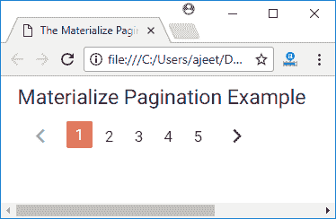

# Materialize CSS 分页

> 原文：<https://www.javatpoint.com/materialize-css-pagination>

分页用于将长页面拆分成更短、更容易理解的块。它用于链接单个主页上的小页面。

分页类用于在 Materialize CSS 中添加分页。

**分页:**用于将 ul 元素设置为分页组件。

* * *

## 例子

```html

<html>
   <head>
      <title>The Materialize Pagination Example</title>
      <meta name = "viewport" content = "width = device-width, initial-scale = 1">      
      <link rel = "stylesheet"
         href = "https://fonts.googleapis.com/icon?family=Material+Icons">
      <link rel = "stylesheet"
         href = "https://cdnjs.cloudflare.com/ajax/libs/materialize/0.97.3/css/materialize.min.css">
      <script type = "text/javascript"
         src = "https://code.jquery.com/jquery-2.1.1.min.js"></script>
      <script src = "https://cdnjs.cloudflare.com/ajax/libs/materialize/0.97.3/js/materialize.min.js">
      </script>
   </head>

   <body class = "container"> 
      <div class = "row" style = "width:560px;">
         <div class = "col s12 m12 l12" >
            <h5>Materialize Pagination Example</h5>
            <ul class = "pagination">
               <li class = "disabled"><a href = "#!">
                  <i class = "material-icons">chevron_left</i></a></li>
               <li class = "active"><a href = "#!">1</a></li>
               <li class = "waves-effect"><a href = "#!">2</a></li>
               <li class = "waves-effect"><a href = "#!">3</a></li>
               <li class = "waves-effect"><a href = "#!">4</a></li>
               <li class = "waves-effect"><a href = "#!">5</a></li>
               <li class = "waves-effect"><a href = "#!">
                  <i class = "material-icons">chevron_right</i></a></li>
            </ul>
         </div>
      </div>      
   </body>  
</html>

```

[Test it Now](https://www.javatpoint.com/oprweb/test.jsp?filename=materializecsspagination1)

输出:

