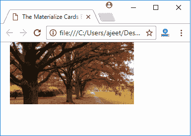

# Materialize JS 媒体

> 原文：<https://www.javatpoint.com/materialize-css-js-media>

Materialize JS 媒体组件指定与大型媒体对象相关的东西，如图像、视频、音频等。

## 材料箱

材质盒是 Lightbox 插件的一个材质设计实现。当用户点击图像时，图像被放大。材质框将图像居中，并以平滑、无震动的方式放大。如果您想关闭图像，您可以再次单击图像，滚动，或按下 ESC 键。

**JavaScript**

**JavaScript**

```html

<script>$(document).ready(function(){
    $('.materialboxed').materialbox();
  });</script>

```

* * *

## 例子

让我们举个例子来演示“材质”框中的媒体(图像)。

```html

<!DOCTYPE html>
<html>
   <head>
      <title>The Materialize Cards Example</title>
      <meta name = "viewport" content = "width = device-width, initial-scale = 1">      
      <link rel = "stylesheet"
         href = "https://fonts.googleapis.com/icon?family=Material+Icons">
      <link rel = "stylesheet"
         href = "https://cdnjs.cloudflare.com/ajax/libs/materialize/0.97.3/css/materialize.min.css">
      <script type = "text/javascript"
         src = "https://code.jquery.com/jquery-2.1.1.min.js"></script>           
      <script src = "https://cdnjs.cloudflare.com/ajax/libs/materialize/0.97.3/js/materialize.min.js">
      </script> 
   </head> 
   <body class = "container"> 
    </img>
<script>$(document).ready(function(){
    $('.materialboxed').materialbox();
  });</script>
   </body>   
</html>

```

[Test it Now](https://www.javatpoint.com/oprweb/test.jsp?filename=materializecssjsmedia1)

输出:


* * *

## 字幕

你可以很容易地给你的照片添加一个简短的标题。只需添加标题作为数据标题属性。

### 例子

```html

<!DOCTYPE html>
<html>
   <head>
      <title>The Materialize Cards Example</title>
      <meta name = "viewport" content = "width = device-width, initial-scale = 1">      
      <link rel = "stylesheet"
         href = "https://fonts.googleapis.com/icon?family=Material+Icons">
      <link rel = "stylesheet"
         href = "https://cdnjs.cloudflare.com/ajax/libs/materialize/0.97.3/css/materialize.min.css">
      <script type = "text/javascript"
         src = "https://code.jquery.com/jquery-2.1.1.min.js"></script>           
      <script src = "https://cdnjs.cloudflare.com/ajax/libs/materialize/0.97.3/js/materialize.min.js">
      </script> 
   </head> 
   <body class = "container"> 
    

<script>$(document).ready(function(){
    $('.materialboxed').materialbox();
  });</script>
   </body>   
</html>

```

[Test it Now](https://www.javatpoint.com/oprweb/test.jsp?filename=materializecssjsmedia2)

输出:




* * *

## 滑块

滑块是一个简单而优雅的图像转盘。您也可以有字幕，这些字幕将根据它们的对齐方式自行转换。您还可以在滑块底部显示指示器。

#### 注意:这也是 Hammer.js 兼容的！尝试用手指滑动来滚动滑块。

```html

<!DOCTYPE html>
<html>
   <head>
      <title>The Materialize Cards Example</title>
      <meta name = "viewport" content = "width = device-width, initial-scale = 1">      
      <link rel = "stylesheet"
         href = "https://fonts.googleapis.com/icon?family=Material+Icons">
      <link rel = "stylesheet"
         href = "https://cdnjs.cloudflare.com/ajax/libs/materialize/0.97.3/css/materialize.min.css">
      <script type = "text/javascript"
         src = "https://code.jquery.com/jquery-2.1.1.min.js"></script>           
      <script src = "https://cdnjs.cloudflare.com/ajax/libs/materialize/0.97.3/js/materialize.min.js">
      </script> 
   </head> 
   <body class = "container"> 
     <div class="slider">
    <ul class="slides">
      <li>
         <!-- random image -->
        <div class="caption center-align">
          <h3>This is our big Tagline!</h3>
          <h5 class="light grey-text text-lighten-3">Here's our small slogan.</h5>
        </div>
      </li>
      <li>
         <!-- random image -->
        <div class="caption left-align">
          <h3>Left Aligned Caption</h3>
          <h5 class="light grey-text text-lighten-3">Here's our small slogan.</h5>
        </div>
      </li>
      <li>
         <!-- random image -->
        <div class="caption right-align">
          <h3>Right Aligned Caption</h3>
          <h5 class="light grey-text text-lighten-3">Here's our small slogan.</h5>
        </div>
      </li>
      <li>
         <!-- random image -->
        <div class="caption center-align">
          <h3>This is our big Tagline!</h3>
          <h5 class="light grey-text text-lighten-3">Here's our small slogan.</h5>
        </div>
      </li>
    </ul>
  </div>
<script>$(document).ready(function(){
      $('.slider').slider();
    });</script>
   </body>   
</html>

```

[Test it Now](https://www.javatpoint.com/oprweb/test.jsp?filename=materializecssjsmedia3)

输出:

