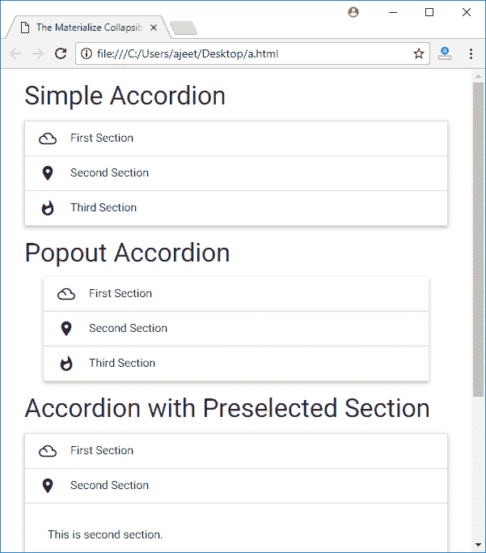

# Materialize CSS 可折叠

> 原文：<https://www.javatpoint.com/materialize-css-collapsible>

可折叠或手风琴用于获得各种预定义的视觉效果和行为增强，以显示各种类型的手风琴。Materialize CSS 提供了不同的 CSS 类来应用这些可折叠的。

| 索引 | 类别名 | 描述 |
|  | 可拆卸的 | 它用于将元素标识为 Materialize 可折叠组件。ul 元素必需。 |
|  | 可折叠集管 | 它用于将 div 设置为节标题。 |
|  | 可折叠车身 | 它用于将 div 设置为节内容容器。 |
|  | -波布 | 它用于创建可折叠的弹出窗口。 |
|  | 活跃的 | 它用于打开一个部分。 |
|  | 可膨胀的 | 它用于将可折叠组件标记为可展开。 |
|  | 手风琴 | 它用于将可折叠组件标记为手风琴。 |

* * *

## 例子

让我们举一个例子来演示 Materialize CSS 中的可折叠:

```html

<html>
   <head>
      <title>The Materialize Collapsible Example</title>
      <meta name = "viewport" content = "width = device-width, initial-scale = 1">      
      <link rel = "stylesheet"
         href = "https://fonts.googleapis.com/icon?family=Material+Icons">
      <link rel = "stylesheet"
         href = "https://cdnjs.cloudflare.com/ajax/libs/materialize/0.97.3/css/materialize.min.css">
      <script type = "text/javascript"
         src = "https://code.jquery.com/jquery-2.1.1.min.js"></script>           
      <script src = "https://cdnjs.cloudflare.com/ajax/libs/materialize/0.97.3/js/materialize.min.js">
      </script>
   </head>

   <body class = "container"> 
      <h4>Simple Accordion</h4>
      <ul class = "collapsible" data-collapsible = "accordion">
         <li>
            <div class = "collapsible-header">
               <i class = "material-icons">filter_drama</i>First Section</div>
            <div class = "collapsible-body"><p>This is first section.</p></div>
         </li>

         <li>
            <div class = "collapsible-header">
               <i class = "material-icons">place</i>Second Section</div>
            <div class = "collapsible-body"><p>This is second section.</p></div>
         </li>

         <li>
            <div class = "collapsible-header">
               <i class = "material-icons">whatshot</i>Third Section</div>
            <div class = "collapsible-body"><p>This is third section.</p></div>
         </li>
      </ul>

      <h4>Popout Accordion</h4>
      <ul class = "collapsible popout" data-collapsible = "accordion">
         <li>
            <div class = "collapsible-header">
               <i class = "material-icons">filter_drama</i>First Section</div>
            <div class = "collapsible-body"><p>This is first section.</p></div>
         </li>

         <li>
            <div class = "collapsible-header">
               <i class = "material-icons">place</i>Second Section</div>
            <div class = "collapsible-body"><p>This is second section.</p></div>
         </li>

         <li>
            <div class = "collapsible-header">
               <i class = "material-icons">whatshot</i>Third Section</div>
            <div class = "collapsible-body"><p>This is third section.</p></div>
         </li>
      </ul>

      <h4>Accordion with Preselected Section</h4>
      <ul class = "collapsible" data-collapsible = "accordion">
         <li>
            <div class = "collapsible-header">
               <i class = "material-icons">filter_drama</i>First Section</div>
            <div class = "collapsible-body"><p>This is first section.</p></div>
         </li>

         <li>
            <div class = "collapsible-header active">
               <i class = "material-icons">place</i>Second Section</div>
            <div class = "collapsible-body"><p>This is second section.</p></div>
         </li>

         <li>
            <div class = "collapsible-header">
               <i class = "material-icons">whatshot</i>Third Section</div>
            <div class = "collapsible-body"><p>This is third section.</p></div>
         </li>
      </ul>

      <h4>Expandables</h4>
      <ul class = "collapsible" data-collapsible = "expandable">
         <li>
            <div class = "collapsible-header">
               <i class = "material-icons">filter_drama</i>First Section</div>
            <div class = "collapsible-body"><p>This is first section.</p></div>
         </li>

         <li>
            <div class = "collapsible-header">
               <i class = "material-icons">place</i>Second Section</div>
            <div class = "collapsible-body"><p>This is second section.</p></div>
         </li>

         <li>
            <div class = "collapsible-header">
               <i class = "material-icons">whatshot</i>Third Section</div>
            <div class = "collapsible-body"><p>This is third section.</p></div>
         </li>
      </ul>	  		  
   </body>  
</html>

```

[Test it Now](https://www.javatpoint.com/oprweb/test.jsp?filename=materializecsscollapsible1)

输出:

