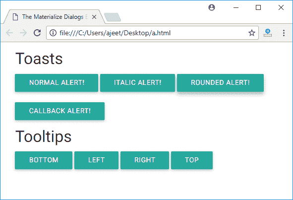

# 物化 CSS 对话框

> 原文:[https://www.javatpoint.com/materialize-css-dialogs](https://www.javatpoint.com/materialize-css-dialogs)

如果需要，对话框用于显示额外的信息。它们最初在页面上不可见。他们只在用户想看的时候才显示他们的内容。

物化 CSS 提供了各种特殊的方法向用户显示警告。

```

Materialize.toast(message, displayLength, className, completeCallback);

```

* * *

## 参数说明

**消息:**指定要向用户显示的消息。

**显示长度:**指定消息消失后的持续时间。

**类名:**它指定要应用于吐司的样式类。例如，“圆形”。

**completeCallback:** 指定吐司取消后要调用的回调方法。

物化 CSS 为对话框提供了不同的 CSS 类:

| 索引 | 类别名 | 描述 |
| 1) | 工具提示 | 它用于标识具有工具提示的组件。 |
| 2) | 数据位置 | 它指定工具提示的位置；底部、顶部、左侧或右侧。 |
| 3) | 数据延迟 | 它用于设置工具提示的持续时间，超过该时间后工具提示将消失 |
| 4) | 数据工具提示 | 用于设置工具提示内容。 |

### 例子

```

<html>
   <head>
      <title>The Materialize Dialogs Example</title>
      <meta name = "viewport" content = "width = device-width, initial-scale = 1">      
      <link rel = "stylesheet"
         href = "https://fonts.googleapis.com/icon?family=Material+Icons">
      <link rel = "stylesheet"
         href = "https://cdnjs.cloudflare.com/ajax/libs/materialize/0.97.3/css/materialize.min.css">
      <script type = "text/javascript"
         src = "https://code.jquery.com/jquery-2.1.1.min.js"></script>           
      <script src = "https://cdnjs.cloudflare.com/ajax/libs/materialize/0.97.3/js/materialize.min.js">
      </script>
 <script>
         function showToast(message, duration) {
            Materialize.toast(message, duration);
         }
         function showToast1(message, duration) {
            Materialize.toast('<i>'+ message + '</i>', duration);
         }
         function showToast2(message, duration) {
            Materialize.toast(message, duration, 'rounded');
         }
         function showToast3(message, duration) {
            Materialize.toast('Hello World!', duration, '', function toastCompleted() {
               alert('Toast dismissed!');
            });
         }
      </script>
   </head>
   <body class = "container"> 
      <h4>Toasts</h4>
      <a class = "btn" onclick = "showToast('Hello World!', 3000)">Normal Alert!</a>
      <a class = "btn" onclick = "showToast1('Hello World!', 3000)">Italic Alert!</a>
      <a class = "btn" onclick = "showToast2('Hello World!', 3000)">Rounded Alert!</a>
      <br/><br/>
      <a class = "btn" onclick = "showToast3('Hello World!', 3000)">Callback Alert!</a>	  
      <h4>Tooltips</h4>
      <a class = "btn tooltipped" data-position = "bottom" data-delay = "50"
         data-tooltip = "I am in bottom!">Bottom</a>
      <a class = "btn tooltipped" data-position = "left" data-delay = "50"
         data-tooltip = "I am in left!">Left</a>
      <a class = "btn tooltipped" data-position = "right" data-delay = "50"
         data-tooltip = "I am in right!">Right</a>
      <a class = "btn tooltipped" data-position = "top" data-delay = "50"
         data-tooltip = "I am in top!">Top</a>
   </body>  
</html>

```

[Test it Now](https://www.javatpoint.com/oprweb/test.jsp?filename=materializecssdialogs1)

输出:

