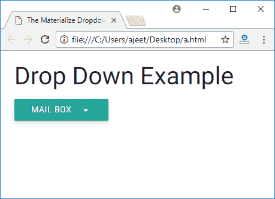
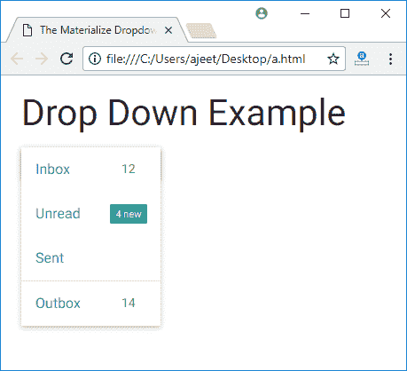

# Materialize CSS 下拉列表

> 原文：<https://www.javatpoint.com/materialize-css-dropdowns>

Materialize CSS 提供下拉工具。它提供了几个 CSS 类来将 ul 元素作为下拉列表，并将 ul 元素的 id 添加到按钮或锚点元素的数据激活属性中。

以下是类别及其效果的列表:

| 索引 | 类别名 | 描述 |
| 1) | 下拉列表-内容 | 它用于将 ul 标识为Materialize下拉组件。ul 元素需要它。 |
| 2) | 数据激活 | 它用于指定下拉 ul 元素的 id。 |

* * *

## 如何使用下拉菜单？

要向任何按钮添加下拉列表，您必须确保数据激活属性与

### 例子

让我们举个例子来演示下拉菜单:

```

<!DOCTYPE html>
<html>
   <head>
      <title>The Materialize Dropdowns Example</title>
      <meta name = "viewport" content = "width = device-width, initial-scale = 1">      
      <link rel = "stylesheet"
         href = "https://fonts.googleapis.com/icon?family=Material+Icons">
      <link rel = "stylesheet"
         href = "https://cdnjs.cloudflare.com/ajax/libs/materialize/0.97.3/css/materialize.min.css">
      <script type = "text/javascript"
         src = "https://code.jquery.com/jquery-2.1.1.min.js"></script>           
      <script src = "https://cdnjs.cloudflare.com/ajax/libs/materialize/0.97.3/js/materialize.min.js">
      </script> 
   </head>

   <body class = "container"> 
      <h3>Drop Down Example</h3>
      <ul id = "dropdown" class = "dropdown-content">
         <li><a href = "#">Inbox<span class = "badge">12</span></a></li>
         <li><a href = "#!">Unread<span class = "new badge">4</span></a></li>
         <li><a href = "#">Sent</a></li>
         <li class = "divider"></li>
         <li><a href = "#">Outbox<span class = "badge">14</span></a></li>
      </ul>

      <a class = "btn dropdown-button" href = "#" data-activates = "dropdown">Mail Box
         <i class = "mdi-navigation-arrow-drop-down right"></i></a>	 
   </body>
</html>

```

[Test it Now](https://www.javatpoint.com/oprweb/test.jsp?filename=materializecssdropdowns1)

输出:


