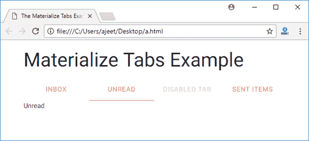

# Materialize CSS 标签

> 原文：<https://www.javatpoint.com/materialize-css-tabs>

“Materialize CSS”选项卡包含一个无序的选项卡列表，这些选项卡具有对应于选项卡 id 的哈希。当您单击每个选项卡时，只有具有相应选项卡 id 的容器会变得可见。如果要使选项卡不可访问，请添加类。禁用该选项卡。

Materialize CSS 中有三种类型的选项卡:

*   可变宽度标签
*   固定宽度标签
*   可滚动标签

您可以在 Materialize CSS 中使用以下类:

| 索引 | 类别名 | 描述 |
| 1) | 制表符 | 它用于将 ul 标识为 Materialize 选项卡组件。ul 元素需要它。 |
| 2) | 活跃的 | 它用于激活选项卡。 |

* * *

## 例子

让我们举一个例子来演示 Materialize CSS 选项卡:

```

<!DOCTYPE html>
<html>
   <head>
      <title>The Materialize Tabs Example</title>
      <meta name = "viewport" content = "width = device-width, initial-scale = 1">      
      <link rel = "stylesheet"
         href = "https://fonts.googleapis.com/icon?family=Material+Icons">
      <link rel = "stylesheet" 
         href = "https://cdnjs.cloudflare.com/ajax/libs/materialize/0.97.3/css/materialize.min.css">
      <script type = "text/javascript"
         src = "https://code.jquery.com/jquery-2.1.1.min.js"></script>           
      <script src = "https://cdnjs.cloudflare.com/ajax/libs/materialize/0.97.3/js/materialize.min.js">
      </script> 
   </head>

   <body class = "container"> 
      <h3>Materialize Tabs Example</h3>
     <div class="row">
    <div class="col s12">
      <ul class="tabs">
        <li class="tab col s3"><a href="#inbox">Inbox</a></li>
        <li class="tab col s3"><a class="active" href="#unread">Unread</a></li>
        <li class="tab col s3 disabled"><a href="#outbox">Disabled Tab</a></li>
        <li class="tab col s3"><a href="#sentitems">Sent Items</a></li>
      </ul>
    </div>
    <div id="inbox" class="col s12">Inbox</div>
    <div id="unread" class="col s12">Unread</div>
    <div id="outbox" class="col s12">Outbox</div>
    <div id="sentitems" class="col s12">Sent Items</div>
  </div>
   </body>
</html>

```

[Test it Now](https://www.javatpoint.com/oprweb/test.jsp?filename=materializecsstabs1)

输出:

