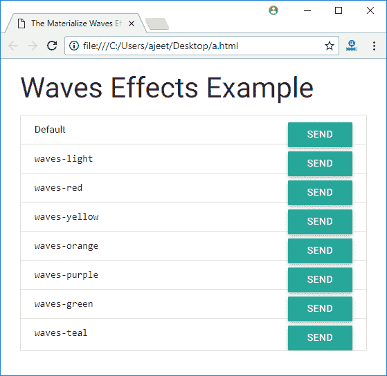

# 实现 CSS 波

> 原文：<https://www.javatpoint.com/materialize-css-waves>

物化 CSS 波被用作一个外部库，用于创建材质设计中概述的墨迹效果。

以下是物化 CSS 中类及其效果的列表:

| 索引 | 类别名 | 描述 |
| 1) | 波浪效应 | 它用于在控件上应用波浪效果。 |
| 2) | 光波 | 它用于应用白色波浪效果。 |
| 3) | 红色波浪 | 它用于应用红色波浪效果。 |
| 4) | 波浪-绿色 | 它用于应用绿色波浪效果。 |
| 5) | 波浪-黄色 | 它用于应用黄色波浪效果。 |
| 6) | 波浪-橙色 | 它用于应用橙色波浪效果。 |
| 7) | 波浪-紫色 | 它用于应用紫色波浪效果。 |
| 8) | 波浪色 | 它用于应用青色波浪效果。 |

* * *

## 如何应用物化 CSS 波？

你可以在任何元素上应用波浪效果。如果你想把波浪效果放在按钮上，把类波浪效果放在按钮上。如果你想让波浪效果变成白色，那就把两个波浪效果波浪光都作为类添加。

[波](#)

### 例子

让我们举个例子来演示按钮上的物化波效果。

```

<!DOCTYPE html>
<html>
   <head>
      <title>The Materialize Waves Effects Example</title>
      <meta name = "viewport" content = "width = device-width, initial-scale = 1">      
      <link rel = "stylesheet"
         href = "https://fonts.googleapis.com/icon?family=Material+Icons">
      <link rel = "stylesheet" 
         href = "https://cdnjs.cloudflare.com/ajax/libs/materialize/0.97.3/css/materialize.min.css">
      <script type = "text/javascript"
         src = "https://code.jquery.com/jquery-2.1.1.min.js"></script>           
      <script src = "https://cdnjs.cloudflare.com/ajax/libs/materialize/0.97.3/js/materialize.min.js">
      </script> 
   </head>

   <body class = "container"> 
      <h3>Waves Effects Example</h3>
      <div class="collection waves-color-demo">
            <div class="collection-item">Default<a href="#!" 
			class="waves-effect btn secondary-content">Send</a></div>
            <div class="collection-item"><code 
			class="language-markup">waves-light</code><
			a href="#!" class="waves-effect waves-light btn secondary-content">Send</a></div>
            <div class="collection-item"><code 
			class="language-markup">waves-red</code><
			a href="#!" class="waves-effect waves-red btn secondary-content">Send</a></div>
            <div class="collection-item"><code 
			class="language-markup">waves-yellow</code><
			a href="#!" class="waves-effect waves-yellow btn secondary-content">Send</a></div>
            <div class="collection-item"><code 
			class="language-markup">waves-orange</code><
			a href="#!" class="waves-effect waves-orange btn secondary-content">Send</a></div>
            <div class="collection-item"><code 
			class="language-markup">waves-purple</code><
			a href="#!" class="waves-effect waves-purple btn secondary-content">Send</a></div>
            <div class="collection-item"><code 
			class="language-markup">waves-green</code><
			a href="#!" class="waves-effect waves-green btn secondary-content">Send</a></div>
            <div class="collection-item"><code 
			class="language-markup">waves-teal</code><
			a href="#!" class="waves-effect waves-teal btn secondary-content">Send</a></div>
          </div>
        </div>
   </body>
</html>

```

[Test it Now](https://www.javatpoint.com/oprweb/test.jsp?filename=materializecsswaves1)

输出:

