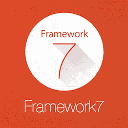

# Framework7 教程

> 原文：<https://www.javatpoint.com/framework7-tutorial>

Framework7 教程提供了 Framework7 的基本和高级概念。我们的 Framework7 教程是为初学者和专业人士设计的。

Framework7 是一个开源的 HTML 框架，用于为 iOS 和 Android 开发移动和网络应用程序。

我们的 Framework7 教程包括 Framework7 的所有主题，如什么是 Framework7，简介，安装，布局，导航栏，工具栏，搜索栏，状态栏，侧面板，覆盖，卡片，芯片，预加载器，列表视图，进度条，手风琴，按钮，动作按钮，表单，选项卡，选择器，日历，刷新，消息，通知等。

## 什么是Framework7

Framework7 是一个免费的开源 HTML 框架，用于为 iOS 和安卓设备开发混合移动应用或网络应用。它是由**弗拉基米尔·哈兰皮迪创作的一组来自 iDangero.us 的开源库和解决方案之一。**

Framework7 也可以用于其他框架，如 Angular、React 等。如果需要的话。

## 历史

Framework7 于 2014 年推出。最新的 1.4.2 版本于 2016 年 2 月发布，由麻省理工学院授权。

## Framework7 的特点

*   开源和免费使用。
*   非常容易使用，语法类似于 jQuery。
*   非常快。它有一个内置的快速点击库。
*   反应灵敏。它具有内置的网格系统布局，可以响应性地排列元素。
*   完全动态。它通过灵活的路由器 api 从模板加载页面。
*   使用本机视图。
*   页面动画。
*   高性能动画。
*   清除 JS API
*   内置帮助程序库。

## 优势

Framework7 的优势列表:

*   通过使用 Framework7，您无需学习就可以轻松地为 iOS 和安卓开发应用程序。
*   Framework7 包含许多预先设计好的小部件/组件。
*   它有内置的帮助程序库。
*   Framework7 不依赖于任何第三方库，甚至不依赖于 DOM 操作。相反，它有自己的定制 DOM7。
*   您可以轻松地将 Framework7 与 Angular 和 React 框架一起使用。
*   一旦你了解了 HTML、CSS 和一些基本的 JavaScript，Framework7 就能帮助你创建应用程序。
*   它通过 Bower 支持更快的开发。

## 不足之处

*   Framework7 仅支持 iOS 和安卓等平台。
*   与 iOS 和 Andriod 相比，Framework7 框架的在线社区支持较少。

* * *

## Framework7 索引

* * *

**Framework7 教程**

*   [Framework7 教程](framework7-tutorial)
*   [Framework7 安装](framework7-installation)
*   [Framework7 布局](framework7-layouts)
*   [Framework7 导航条](framework7-navbars)
*   [Framework7 工具栏](framework7-toolbars)
*   [Framework7 侧板](framework7-side-panels)
*   [Framework7 内容块](framework7-content-block)
*   [Framework7 布局网格](framework7-layout-grid)
*   [Framework7 覆盖层](framework7-overlays)
*   [Framework7 预加载器](framework7-preloaders)
*   [Framework7 进度条](framework7-progress-bar)
*   [Framework7 列表视图](framework7-list-views)
*   [Framework7 手风琴](framework7-accordion)
*   [Framework7 卡](framework7-cards)
*   [Framework7 芯片](framework7-chips)
*   [Framework7 按钮](framework7-buttons)
*   [Framework7 动作按钮](framework7-action-button)

**Framework7 形成**

*   [Framework7 表格](framework7-form)
*   [Ajax 表单提交](ajax-form-submit)
*   [Framework7 复选框&收音机](framework7-checkboxes-and-radios)
*   [Framework7 禁用元素](framework7-disabled-elements)
*   [Framework7 表单数据](framework7-form-data)
*   [Framework7 表格存储](framework7-form-storage)
*   [Framework7 智能选择](framework7-smart-select)
*   [Framework7 表单元素](framework7-form-elements)
*   [Framework7 全布局表单](framework7-full-layout-form)
*   [Framework7 图标输入](framework7-icons-and-inputs)
*   [Framework7 插入](framework7-insert)
*   [Framework7 仅输入](framework7-just-inputs)
*   [Framework7 标签&输入](framework7-labels-and-inputs)

**Framework7 标签**

*   [Framework7 标签](framework7-tabs)
*   [Framework7 动画选项卡](framework7-animated-tabs)
*   [Framework7 内嵌标签](framework7-inline-tabs)
*   [Framework7 可切换标签](framework7-swipeable-tabs)
*   [使用 JS 显示标签](framework7-show-tab-using-javascript)
*   [从导航条切换标签](framework7-switch-tabs-from-navbar)
*   [标签 JavaScript 事件](framework7-tabs-javascript-events)

**Framework7 滑动**

*   [Framework7 旋转滑块](framework7-swiper-slider)
*   [Framework7 自定义控件](framework7-custom-controls)
*   [Framework7 默认开关](framework7-default-swiper-with-pagination)
*   [Framework7 惰性加载](framework7-lazy-loading)
*   [Framework7 多个开关](framework7-multiple-swipers)
*   [Framework7 嵌套开关](framework7-nested-swipers)
*   [Framework7 垂直开关](framework7-vertical-swiper)
*   [Framework7 空间 b/w 幻灯片](framework7-space-between-slides)

**Framework7 照片浏览器**

*   [Framework7 照片浏览器](framework7-photo-browser)
*   [创建照片浏览器](framework7-create-photo-browser-instance)
*   [Framework7 照片阵列](framework7-photos-array)
*   [照片浏览器方法](framework7-photo-browser-methods-and-properties)
*   [照片浏览器参数](framework7-photo-browser-parameters)

**Framework7 拾取器**

*   [Framework7 拾取器](framework7-picker)
*   [Framework7 自定义工具栏](framework7-custom-toolbar)
*   [Framework7 相关值](framework7-dependent-values)
*   [Framework7 内嵌选取器日期-时间](framework7-inline-picker-date-time)
*   [单值Framework7 拾取器](framework7-picker-with-single-value)
*   [Framework7 三维旋转效果](framework7-two-values-and-3d-rotate-effect)

**Framework7 日历**

*   [Framework7 日历](framework7-calendar)
*   [Framework7 日历实例](framework7-access-to-calendar-instance)
*   [Framework7 日历方法](framework7-calendar-methods-and-properties)
*   [Framework7 日历参数](framework7-calendar-parameters)

**Framework7 杂项**

*   [Framework7 自动完成](framework7-autocomplete)
*   [Framework7 无限滚动](framework7-infinite-scroll)
*   [Framework7 消息](framework7-messages)
*   [Framework7 消息栏](framework7-message-bar)
*   [Framework7 刷新](framework7-refresh)
*   [Framework7 通知](framework7-notifications)

**面试问题**

*   [Framework7 面试](framework7-interview-questions)

* * *

## 先决条件

要学习 Framework7，必须具备 HTML 和 CSS 的基础知识。

## 观众

我们的 Framework7 教程旨在帮助初学者和专业人士。

## 问题

我们保证您在本Framework7 教程中不会发现任何问题。但是如果有任何错误，请在联系表格中发布问题。