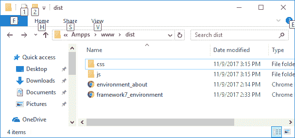

# Framework7 安装

> 原文：<https://www.javatpoint.com/framework7-installation>

## 下载 Framework7

下载 Framework7 有两种方法:

从 Framework7 Github 资源库下载:

或者您可以通过 bower 安装 Framework7:

```html
bower install framework7

```

## 从 cdn 下载 Framework7 库

内容分发网络是为用户提供文件服务的服务器网络。如果您在网页中使用 CDN 链接，它会将托管文件的责任从您自己的服务器转移到一系列外部服务器。这也提供了一个优势，如果你网页的访问者已经从同一个 CDN 下载了一个 Framework7 的副本，就不必重新下载了。您可以在 HTML 文档中包含以下 CDN 文件。

**iOS 应用布局 CDN:**

```html
<link rel = "stylesheet" 
href = "https://cdnjs.cloudflare.com/ajax/libs/framework7/1.4.2/css/framework7.ios.min.css" />

```

**Framework7 iOS CSS 库:**

```html
<link rel = "stylesheet" 
href = "https://cdnjs.cloudflare.com/ajax/libs/framework7/1.4.2/css/framework7.ios.colors.min.css" />

```

**安卓/物料应用布局的 cdn:**

```html
<script src = "https://cdnjs.cloudflare.com/ajax/libs/framework7/1.4.2/js/framework7.min.js"></script>

```

**Framework7 JS 库:**

```html
<script src = "https://cdnjs.cloudflare.com/ajax/libs/framework7/1.4.2/css/framework7.material.min.css"></script>

```

* * *

## Ampps 服务器

我们使用 AMPPS (AMPPS 是 Apache、MySQL、MongoDB、PHP、Perl & Python 的 WAMP、MAMP 和 LAMP 栈)服务器来执行我们所有的例子。

在下载/安装的包中，我们需要 dist/文件夹中的文件。

**Dist 文件夹路径:**

默认的 dist/文件夹路径是:C:\程序文件(x86)\Ampps\www\dist



放上你的 HTML，。在服务器根文件夹(dist 文件夹)中的 JS 和 CSS 文件，打开本地主机，然后运行页面。

### 示例:

创建一个 HTML 页面“framework7_environment.html”，包含以下代码:

```html
<!DOCTYPE html>
<html>

   <head>
      <meta name = "viewport" content = "width = device-width, initial-scale = 1, 
         maximum-scale = 1, minimum-scale = 1, user-scalable = no, minimal-ui" />
      <meta name = "apple-mobile-web-app-capable" content = "yes" />
      <meta name = "apple-mobile-web-app-status-bar-style" content = "black" />
      <title>My App</title>
      <link rel = "stylesheet" 
         href = "https://cdnjs.cloudflare.com/ajax/libs/framework7/1.4.2/css/framework7.ios.min.css" />
      <link rel = "stylesheet" 
         href = "https://cdnjs.cloudflare.com/ajax/libs/framework7/1.4.2/css/framework7.ios.colors.min.css" />
   </head>

   <body>
      //you can control the background color of the Status bar
      <div class = "statusbar-overlay"></div>
      <div class = "panel-overlay"></div>

      <div class = "panel panel-right panel-reveal">
         <div class = "content-block">
            <p>Contents goes here...</p>
         </div>
      </div>

      <div class = "views">
         <div class = "view view-main">
            <div class = "navbar">
               <div class = "navbar-inner">
                  <div class = "center sliding">My App</div>
                  <div class = "right">
                     <a href = "#" class = "link icon-only open-panel">
                        <i class = "icon icon-bars"></i>
                     </a>
                  </div>
               </div>
            </div>

            <div class = "pages navbar-through toolbar-through">
               <div data-page = "index" class = "page">
                  <div class = "page-content">
                     <p>This is simple application...</p>
                     <div class = "list-block">
                        <ul>
                           <li>
                              <a href = "envirmnt_about.html" class = "">
                                 <div class = "item-content">
                                    <div class = "item-inner">
                                       <div class = "item-title">Blog</div>
                                    </div>
                                 </div>
                              </a>
                           </li>
                        </ul>
                     </div>
                  </div>
               </div>
            </div>

            <div class = "toolbar">
               <div class = "toolbar-inner">
                  <a href = "#" class = "link">First Link</a>
                  <a href = "#" class = "link">Second Link</a>
               </div>
            </div>
         </div>
      </div>

      <script type = "text/javascript" 
         src = "https://cdnjs.cloudflare.com/ajax/libs/framework7/1.4.2/js/framework7.min.js"></script>

      <script>
         // here initialize the app
         var myApp = new Framework7();

         // If your using custom DOM library, then save it to $$ variable
         var $$ = Dom7;

         // Add the view
         var mainView = myApp.addView('.view-main', {

            // enable the dynamic navbar for this view:
            dynamicNavbar: true
         });

         //use the 'pageInit' event handler for all pages
         $$(document).on('pageInit', function (e) {

            //get page data from event data
            var page = e.detail.page;

            if (page.name === 'blog') {

               // you will get below message in alert box when page with data-page attribute is equal to "about"
               myApp.alert('Here its your About page');
            }
         })
      </script>
   </body>

</html>

```

创建另一个 HTML 页面“envirmnt_about.html”，代码如下:

```html
.
<div class = "navbar">
   <div class = "navbar-inner">
      <div class = "left">
         <a href = "#" class = "back link">
            <i class = "icon icon-back"></i>
            <span>Back</span>
         </a>
      </div>

      <div class = "center sliding">My Blog</div>
      <div class = "right">
         <a href = "#" class = "link icon-only open-panel">
            <i class = "icon icon-bars"></i>
         </a>
      </div>
   </div>
</div>

<div class = "pages">
   <div data-page = "blog" class = "page">
      <div class = "page-content">
         <div class = "content-block">
            <h2>My Blog</h2>
            <p>Lorem Ipsum is simply dummy text of the printing and typesetting industry. 
			Lorem Ipsum has been the industry's standard dummy text ever since the 1500s, 
			when an unknown printer took a galley of type and scrambled it to make a type specimen book.</p>
         </div>
      </div>
   </div>
</div>

```

将以上两个页面保存在 dist 文件夹中。现在打开服务器: **http://localhost/dist/** 并运行示例。