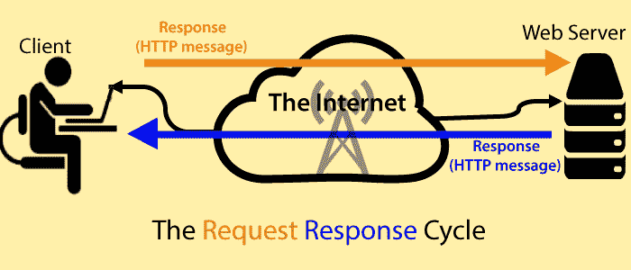

# 网络工作

> 原文:[https://www.javatpoint.com/working-of-web](https://www.javatpoint.com/working-of-web)

我们将在左侧有一个客户端，在右侧有一个服务器。用户想看一个网站，比如[www.javatpoint.com/java-tutorial](https://www.javatpoint.com/java-tutorial)。用户使用客户端程序(通常是浏览器)键入页面的网址。但是首先，用户的计算机和网络服务器需要物理连接。那是互联网的工作。使用 TCP/IP 协议，它使用有线媒体或无线媒体的组合来建立连接，并做所有必要的工作来为两台计算机通过 HTTP 协议进行对话准备环境。

当连接建立时，客户端发送一个称为 HTTP 消息的请求，但是因为 HTTP 是一个无连接协议，所以客户端断开与服务器的连接并等待响应。

另一方面，服务器处理请求，准备响应，再次建立连接，并以 HTTP 消息的形式再次将响应发送回客户端。然后两台电脑完全断开。

* * *