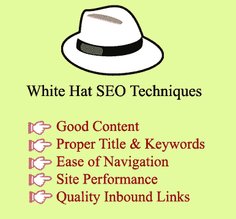

# 白帽 SEO 技术

> 原文：<https://www.javatpoint.com/white-hat-seo-techniques>

下面列出了 6 种流行的白帽 SEO 技术:

1.  好内容
2.  正确使用标题、关键词和元标签
3.  易于导航
4.  站点性能
5.  质量入站链接
6.  移动友好性

### 1)内容好

一个独特的，写得好的内容让你的网站看起来更值得信任，对搜索引擎和人类访问者更有价值。它为 SEO 您的网站，这有助于您在搜索引擎列表中获得更高的排名，因为搜索引擎为最终用户的搜索提供最合适的网站。

### 2)正确使用标题、关键词和元标签

包含在 HTML 代码中的信息被称为元数据。它为爬虫程序提供关于站点的信息，用于分类和索引。因此，适当的标题、关键字和元标签应该包含在元数据中。

### 3)易于导航

搜索引擎在评估一个网站的有用性时也会考虑导航的便利性，所以要避开不相关的链接，使用普遍可识别的链接。它不仅对用户很重要，对索引网站的爬虫也很重要。

### 4)现场表现

网站和页面性能是搜索引擎评估网站的另一个考虑因素。搜索引擎的爬虫无法对不可用的网站或页面进行索引；一周甚至一天的不良网站或页面会对网站流量产生不利影响。所以，确保你的网站加载速度快，并且可以随时访问。

### 5)优质入站链接

该网站必须有高质量的入站链接，因为搜索引擎定期评估反向链接的相关性。如果一个网站被发现有不相关的反向链接，它将被搜索引擎打折或处罚，例如，一个关于印度农业的网站包含许多欧洲网站关于技术的链接，将被搜索引擎降级。

### 6)移动友好性

自 2016 年以来，随着谷歌开始强调移动结果，移动友好性已经成为一个重要的 SEO 因素。究其原因，移动用户在手机上浏览内容的数量激增。所以，确保你有一个移动友好的网站。

* * *