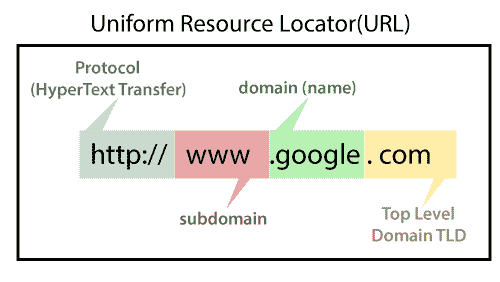

# 什么是域

> 原文：<https://www.javatpoint.com/what-is-domain>

域名是一个或多个 IP 地址的标识；例如，域名 google.com 指向 IP 地址“74.125.127.147”。域名的发明是因为它很容易记住一个名字，而不是一长串数字。在搜索栏中输入域名比输入一长串数字更容易。

因此，人们需要在浏览器的网址栏中输入您网站的网址才能访问您的网站。简单来说，假设你的网站是一个房子，那么域名就是它的地址。

域名不能超过 63 个字符，不包括。com，。net，。org，。edu 等。除扩展名外，域的最小长度为一个字符。它在协议和子域后的 URL 中输入，如下例和图像所示:

例如 https://www.google.com

https:(协议)

www。(子域)

google.com(域名和域名后缀)

## 域名如何工作:

当域名在您的网络浏览器中输入时，会向构成域名系统(DNS)的全球服务器网络发送一个请求，这就像互联网的电话簿。

然后，服务器搜索与该域相关的名称服务器，并将请求转发给名称服务器。名称服务器是大型计算机，由托管公司管理。托管公司将请求转发到存储您的站点的 web 服务器。网络服务器获取请求的网页或信息，并将其转发给浏览器。

域名系统由互联网名称与数字地址分配机构管理。这是一个创建和实施域名政策的非营利组织。

ICANN 授权被称为域名注册商的公司销售域名。它还允许他们代表您对域名注册管理机构进行更改，并出售域名、管理其记录、续订和转让给其他注册服务商。作为域名所有者，您需要在域名注册到期前进行续订。

* * *