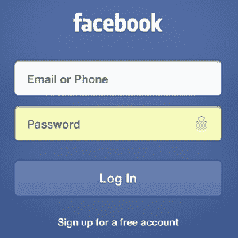

# 搜索引擎和门户的区别

> 原文：<https://www.javatpoint.com/difference-between-search-engine-and-portal>

* * *

## 搜索引擎

搜索引擎是一个程序，旨在使用户能够浏览万维网上的信息或内容。它有助于在最短的时间内检索到所需的信息。它允许您输入特定的关键字或短语，并检索与这些关键字和短语匹配的项目列表。因此，它不会立即提供信息；它只是检索与关键字或其他搜索项相关的页面。一些流行的搜索引擎是谷歌、必应和雅虎！搜索。

* * *

## 入口

门户是互联网上的一个私人位置，作为访问万维网上可用信息的一个点。门户是通过唯一的网址、唯一的用户名和密码访问的，即除了网址之外，还需要个人登录才能看到门户上的内容。一些受欢迎的门户网站是 facebook.com、gmail.com 和 twitter.com。

