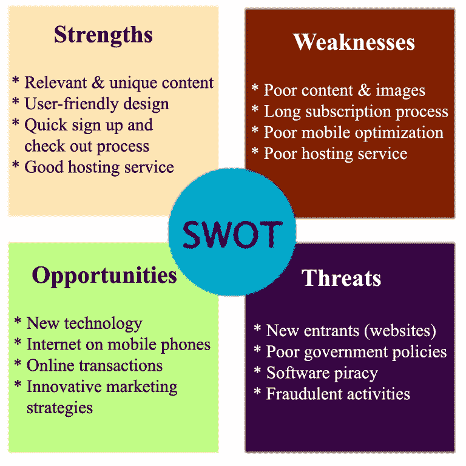

# 网站的 SWOT 分析

> 原文：<https://www.javatpoint.com/swot-analysis-of-a-website>

SWOT 代表优势、劣势、机会和威胁。这是组织用来评估其业务和企业生存能力的四个因素。以类似的方式，这些因素可以用来评估网站当前和未来的增长。

优势和劣势是**内部因素**，由一个组织控制。机会和威胁是**组织无法控制的外部因素**。经过 SWOT 分析，你可以找到你网站的**优势**和**劣势**以及**机会**和**威胁**。

SWOT 分析从为你的网站设定具体的目标和目的开始。这些目标或目的应该是可衡量的和现实的，即在未来一年增加 10%的利润，增加 15%的点击率，减少 5%的购物车投放率等。在你确定了你的目标和目的之后，你可以从以下步骤开始进行 SWOT 分析。

### 强项

它指的是竞争对手网站上没有的优势。这些竞争优势有助于您的网站获得相对于其他类似网站的竞争优势，例如相关和独特的内容、用户友好的设计以及快速注册和结账流程等。可以成为你网站的强项。

### 弱点

它指的是你的网站上减缓你的进度或阻止你实现目标和目的的功能。要识别您的网站弱点，您可以将您网站的某个功能与竞争对手网站的相同功能进行比较。如果您的竞争对手比您更好地执行此功能，那么请将此功能视为您应该改进的弱点。

### 机会

它指的是可以帮助你提高网站性能和知名度的外部因素。这些因素超出了你的控制范围，如果你明智地加以利用，可以帮助你实现你的目标。网站的一些常见机会是改善访问者体验的新技术、专注于社交网络的 web 2.0 趋势、手机互联网、在线交易、创新营销策略等。

### 威胁

它指的是可能阻止网站实现其目标和目的的外部因素。这些因素是你无法控制的，如果你忽视这些威胁，你的网站就无法取得进展。对网站的一些常见威胁包括新进入者(网站)、软件盗版、不利的政府法规、不断变化的客户需求、模仿您的想法和功能的竞争对手、欺诈活动等。