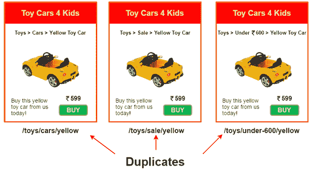
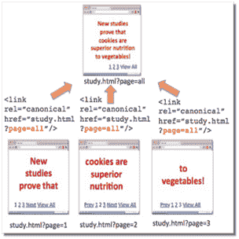

# 规范标签

> 原文：<https://www.javatpoint.com/seo-canonical-tag>

规范标签也称为规范网址或网址规范化。它包含在网页的 HTML 代码中，以显示内容的原始来源。因此，它是一个用来防止重复内容问题的 HTML 元素。它指定了网页的规范网址“首选版本”，并告诉搜索引擎其他相似的网址没有不同或重复；他们是一体的。因此，它防止了当相同的内容出现在多个网址上时出现的问题，这可能是由于以下原因之一。

*   一个网页在其网址前有或没有“www”前缀都可以访问
*   网页可通过“http”和“https”协议访问
*   一个网页有多个不同网址的版本，例如打印版本或使用分类时的版本等。

## 规范标签看起来如何/规范标签的一部分:

规范标签具有简单且一致的语法，并被放置在网页的部分。它显示为 rel="canonical "。

**例如:** <链接 rel = " canonical " href = https://example . com/sample-page/"/>

代码各部分的含义:

1.  link rel= "canonical ":此标签中包含的链接是此页面的原始(规范)版本。
2.  href = " https://example . com/sample-page/":您可以访问此网址来查找规范版本。

## 为什么规范标签在 SEO 方面很重要:

像谷歌这样的搜索引擎不喜欢重复的内容。这给他们带来了困惑，下面是如何做到的:

1.  谷歌不知道在多个页面中索引哪个版本的页面。
2.  要为查询排名的页面。
3.  是在一个页面上合并链接权益，还是在多个版本之间拆分。
4.  此外，过多的重复页面也会影响“爬网预算”谷歌可能会浪费时间抓取内容相似的不同网址，而不是在你的网站上发现其他新页面。

因此，如果您的网站上有两个或更多类似内容的页面，或者您的网站的内容也在另一个网站上使用，则必须使用规范的网址。这样，你可以将谷歌指向原始内容，并确保主页获得所有的信用和 SEO 的好处。

请看下面一个电商公司产品页面复制的例子；



在上图中，同一产品“黄色玩具车”有三个产品页面。除了面包屑链接，这些页面具有相同的内容。因此，在规范标签的帮助下，我们可以将一页标记为规范版本，并删除两个副本。


在上图中，使用规范标签，我们已经通知搜索引擎将位于[http://www.example.com/toys/cars/yellow]的页面视为原始页面，其他两个 URL 视为原始页面的变体。

因此，如果您的网站在多个网址上显示相同的内容，那么通过使用规范标签，您可以选择一个网址作为规范版本，并可以清除其他网址不是重复的。请参阅下面给出的另一个示例:

*   http://www.example.com/(主页)
*   http://范例. com/
*   http://example.com/index.html

现在，为了将主页面显示为规范的 a 版本，我们可以在另外两个 URL 的头部放置一个引用主页面**(http://www.example.com)**的规范标签。见下图；



### 如何应用规范标签？

您可以通过在您希望被搜索引擎识别为规范的页面的 HTML 代码的头部添加链接标签来应用此标签，例如，用规范标签指定 www.javatpint.com，代码将如下所示；

```

<link rel="canonical" href="http://www.javatpoint.com/seo-canonical-tag" /> 

```

## 规范标签如何帮助改善网站的 SEO

当你有一个页面的多个相似版本或者你的内容可以通过多个网址访问时，这是非常有用的。它使您能够选择一个版本作为规范的网址；您可以为每组相似的网址创建一个规范的网址。在你的规范标签准备好之后，搜索引擎会将所有类似版本的链接视为规范版本的链接，这有助于提高你网站的 SEO。

* * *