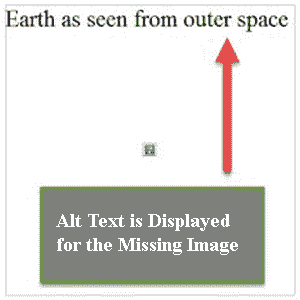

# 图像和替代文本

> 原文：<https://www.javatpoint.com/seo-images-and-alt-text>



替代文本代表替代文本。它也被称为“alt 说明”和“alt 属性”这是一个添加到 HTML 中的图像标签的功能，为搜索引擎提供了文本替代。它帮助搜索引擎知道图像是关于什么的，因为他们看不到或解释图像，因为他们看不到、理解或解释图像。

Alt 文本旨在优化图像的速度和 SEO。当图像由于某些原因无法显示时，如连接缓慢、网址中断或用户正在使用屏幕阅读器，它会出现在空白图像框中。因此，Alt 标签为搜索引擎爬虫提供了更好的图像描述，帮助它们正确地索引图像。

**图像替代标签示例:**

```

<!DOCTYPE>  
<html>    
<body>      
  
</body>    
</html>

```

## 下面给出了放置替代文本的一些好处

1.  如果图像由于任何原因未能加载或未能在页面上呈现，alt 标记将会出现以告知图像的内容。它帮助用户了解那里有什么样的图像。
2.  搜索引擎旨在理解页面上的文本，而不是图像。因此，如果您的图像带有 alt 标签，搜索引擎将从 alt 标签中了解图像显示的内容，并向用户提供正确的图像。
3.  如果主要关键字与图像相关，您可以将它们包含在 alt 标记中。这将提高你的图像搜索的关键词排名。
4.  Alt 标签对视觉障碍者非常有帮助，因为他们主要使用屏幕阅读器来浏览网页。alt 标签有助于屏幕阅读器识别和解释屏幕空框中显示的内容。

## 如何写出好的 alt 文字？

*   **描述性:**既要有相关性，也要有描述性。它应该为看不到图像的人提供足够的信息。
*   **短:**如果 alt 文本长度超过 125 个字符，大多数屏幕阅读器会将其剪掉。因此，您应该将其保持在指定的字符限制内。它不应该是句子或段落的形式。
*   **使用关键词:**它允许您将关键词合并到 alt 文本中，因此您可以向搜索引擎发出信号，表明您的页面与搜索查询高度相关。
*   **避免关键词填充:**不要用 alt 文字填充与图片无关的关键词。
*   **不要用图片当文字:**搜索引擎无法读取文字，文字是以图片的形式出现的。所以，不要用图像代替文字。如果你这样做了，描述你的图像在你的替代文本中说了什么。
*   **不要使用“的形象”、“的图片”等词语。在你的替代文本中:**没有必要使用这些词，因为替代文本已经在引用一个图像。
*   **使用 longdesc:** 对于需要更长描述的图像，使用。
*   **不要忽略表单按钮:**网站上使用图像作为“提交”按钮的表单应该有 alt 属性。因此，所有的图像按钮都应该提供一个 alt 属性来描述按钮的功能，如“搜索”、“注册”、“立即应用”等。

* * *