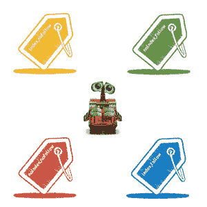

# Meta Tag 机器人

> 原文：<https://www.javatpoint.com/seo-robots-meta-tag>



机器人元标签用于向网络蜘蛛发出指令。它是通过在一个 HTML 文件的头部加入一个元标签来实现的。它是 1996 年在 W3C 研讨会上提出的，1999 年 12 月在 HTML 4.01 的附录 B 中描述了它的使用。

机器人元标签在页面优化中起着重要的作用，因为机器人元标签告诉搜索引擎如何处理页面内容。

## 为什么机器人元标签对 SEO 很重要？

这些标签主要用于防止页面出现在搜索引擎结果页面中，尽管它可以用于各种其他目的。有许多类型的内容，你可能不想被搜索引擎索引，以改善你的网站的 SEO。例如:

*   为用户提供很少或没有信息的薄页面
*   管理和感谢页面
*   PPC 登录页面
*   与产品发布、即将举行的活动和促销等相关的页面。
*   如果您没有使用规范标签来建议索引的主要版本，请复制内容。

**基本语法:**它有一个非常简单的基本语法。

```

<meta name="robots" content="instructions to be followed">  

```

因此，机器人元标签由两个属性组成:名称和内容。您必须为每个属性指定值。

在语法中，您可以将不同的值作为占位符，因为我们已经编写了“要遵循的说明”作为占位符。不同的值可以是 index、noindex、follow、nofollow、all 或 non-things。

## 机器人元标签的实现和意义:

```

<META NAME="ROBOTS" CONTENT="NOINDEX, NOFOLLOW">

```

这个标签上写着，“不要索引页面，也不要跟随页面上的链接。”它用于指示网络蜘蛛不要索引该页面，也不要跟随其他页面的链接”。因此，您的页面将从搜索索引中删除，并且您页面的其余部分将不会被爬网。这个标签主要在网站处于开发模式时使用，开发人员不希望蜘蛛选择页面进行索引。

```

<META NAME="ROBOTS" CONTENT="INDEX, NOFOLLOW">

```

这个标签上写着，“索引页面，但不要跟随页面上的链接。”它指示蜘蛛索引给定的页面，不要跟随其他页面的链接。因此，您的页面将包含在搜索索引中，但不会创建到其他页面的链接路径。

```

<META NAME="ROBOTS" CONTENT="NOINDEX, FOLLOW">

```

这个标签上写着，“不要索引页面，而是按照页面上的链接。”因此，蜘蛛不会索引给定的页面，而是会跟随其他页面的链接，也就是说，您的页面不会包含在搜索索引中，但会建立到其他页面的链接路径。

```

<META NAME="ROBOTS" CONTENT="INDEX, FOLLOW">

```

这个标签上写着，“索引页面并跟随页面上的链接。”因此，蜘蛛将索引给定的页面以及跟随到其他页面的链接，即，您的页面将被包括在搜索索引中，并且将建立到其他页面的链接路径。

* * *