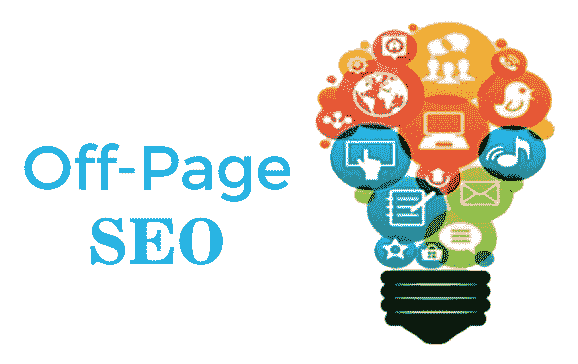
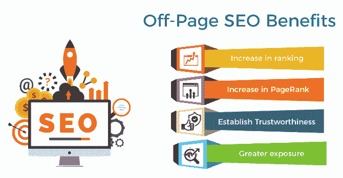
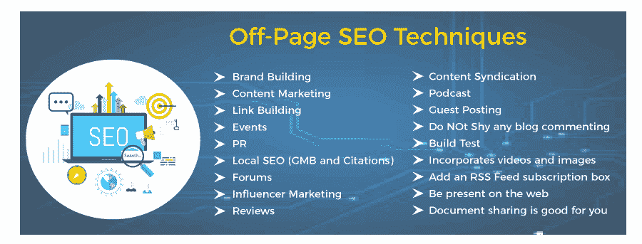
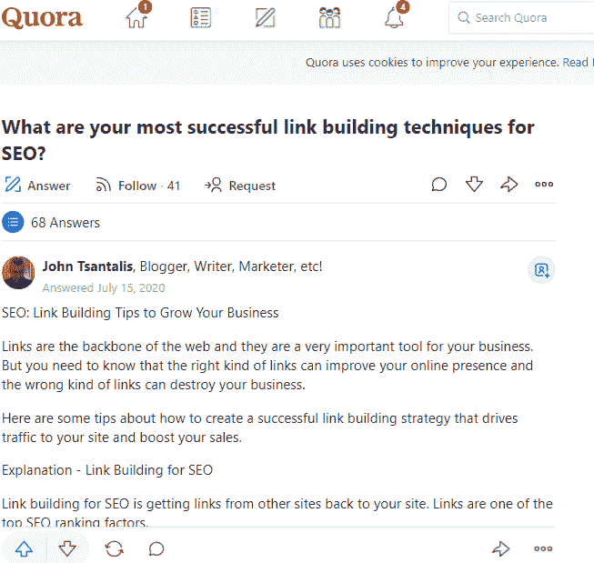

# 页面外 SEO 技术

> 原文：<https://www.javatpoint.com/off-page-seo-techniques>

## 什么是页面外 SEO？

页面外 SEO 又称**“站点外 SEO”，**是指在我们的网站之外采取的影响我们搜索引擎流量页面排名的行为 **(SERPs)。**

改善搜索引擎和用户对网站的受欢迎程度、权威性、可信度和相关性的感知，都是优化场外排名标准时需要考虑的变量。它是由互联网上其他值得信赖的地方完成的，如**人、网站、页面**等。，链接或推广我们的网站，并有效地“担保”我们内容的准确性或质量。

我们和其他人为了提高页面的搜索引擎排名而在网站之外执行的所有操作都被称为“页面外 SEO”

许多人将页面外 SEO 与链接建设联系在一起，但它包含的远不止这些。离页优化包括各种各样的做法，不会导致其他网站上的标准链接。页面内 SEO 发生在网站内，而页面外 SEO 发生在网站外。如果我们为另一个博客创建一篇客座博文或留下评论，我们就是在进行页面外的网站推广。

## 页面外 SEO 优势

以下是页面外 SEO 的好处:

1.  排名上升
2.  页面等级增加
3.  树立诚信
4.  更多曝光

### 1.排名上升

这是页外 SEO 最重要的优势。该网站将在 SERPs 中排名更高，这将导致更多的流量。

### 2.页面等级增加

页面排名意味着一个介于 0 到 10 之间的数字，这表明了网站在谷歌眼中的重要性。

它是谷歌创始人**拉里·佩奇和谢尔盖·布林**发明的系统，也是谷歌成功向搜索者呈现最重要结果的原因之一。

如今，在谷歌用来给网站排名的 250 多个排名因素中，页面排名是第 1 位。

### 3.树立诚信

除此之外，谷歌还新引入了**专长、权威、可信【E-A-T】、**的理念，在排名的情况下起到了必不可少的作用，直接关系到页外 SEO。

基本来说，谷歌需要对在某个主题上表现出技能和权威的网站进行排名，确保算法生成的网站可信的一个方法是通过传入链接的数量和种类。

### 4.更大的曝光度

更高的排名也意味着更突出的开放性，因为当一个网站排名第一时，它会获得更多的连接、访问和在线媒体指定。这就像一个永无止境的事件链，一件事通向另一件事，然后又通向另一件事，等等。

## 为什么页面外 SEO 很重要？

虽然搜索算法和排名方面不断变化，但 SEO 社区内部的总体共识是，有效的页面外 SEO 承担网站成本的重要性、可靠性和权威性在页面排名能力中占据重要地位。

虽然我们不知道谷歌具体的排名算法，但从我们搜索引擎排名方面的数据来看，场外 SEO 相关因素可能占了排名因素权重的一半以上。

## 页面外 SEO 技术

以下是页面外 SEO 技术:

1.  品牌建设
2.  内容营销
3.  链接建筑
4.  事件
5.  一对
6.  本地 SEO(GMB 和引文)
7.  论坛
8.  影响营销
9.  复习
10.  内容联合
11.  播客
12.  客人发帖
13.  不要回避任何博客评论
14.  构建测试
15.  包含视频和图像
16.  添加 RSS 源订阅框
17.  出现在网络上
18.  文档共享对你有好处

### 1.品牌建设

现在众所周知，谷歌奖励这个品牌。此外，品牌建设活动不仅必须是我们全面的 SEO 和营销战略的重要组成部分，也是我们页面外 SEO 方法的一部分。此外，一切都回来建立我们的在线权威，为客户和搜索引擎。

在品牌建设努力的帮助下，谷歌可以理解我们的可信度，谷歌已经成为页面外 SEO 的必要策略。当我们创建一个品牌时，我们会注意到我们会自动收到链接，并在互联网上提到它们，尽管我们并没有特意这样做。

但是品牌建设如何融入我们的 SEO 方法，主要的绩效指标是什么？

**品牌搜索**

可能我们正在建立品牌的最强有力的指标之一是品牌搜索的增加。

### 2.内容营销

人们很容易将内容营销视为仅仅是一种页面 SEO 方法，包括为我们自己的网站创建和发布内容。然而，从整体来看，内容营销包括页面内和页面外策略。

在我们自己的网站上发布优秀的内容只是内容营销的一个方面；我们在互联网上任何地方制作和发布的任何内容都属于内容营销。

内容营销是我们写客座博文时做的事情。发布与顶级报纸链接的信息图？这就是内容营销的意义所在。

将内容营销作为一种策略的吸引力在于，与资源建立令人难以置信的联系使得专注于页面外因素变得更加简单。通常情况下，这来自于我们正在制作的内容的进步——发布令人难以置信的引人入胜的资产，其他人需要共享和链接这些资产。

一般内容营销策略非常有效，有助于建立页面外信号，包括:

*   信息图表
*   白皮书和电子书
*   博客文章
*   调查、研究和研究论文

作为一种策略，内容营销与链接建设、社交媒体和公共关系交织在一起，所有这些都有助于推广我们的品牌。

简而言之，如果我们有一个神奇的材料，让人们知道它。我们的内容营销工具包将帮助我们不仅确定正在网上获得势头的热门话题，而且确定最重要的行业媒体来推广我们的内容。

### 3.链接建筑

鉴于链接在谷歌算法中的重要性，链接建设必须是任何页面外 SEO 策略的基础；然而，了解我们必须如何将链接构建作为一种离页策略来处理是至关重要的。

页面外 SEO 的主要目标之一是提升公司的权威。权威网站的链接有助于像权威一样建立我们自己的网站。它们充当一个网站到下一个网站的信任票。

链接建设的首要目标是从权威网站获取高质量的链接。质量应该永远优先于数量。理解我们的网站与竞争对手的网站之间的链接差距至关重要。然而，建立链接是一种离页策略，而不仅仅是针对网站(注意:说服权威网站相互链接并不简单，但如果技术得当，这是绝对可能的)。

以下是我们在构建链接时必须考虑的最重要的因素:

1.  唯一域
2.  话题相关性
3.  权威

**a)独特领域**

链接建立成功的另一个主要指标是指向你的站点的链接根域的数量，甚至高于反向链接的数量。研究表明，链接域的数量和更高的排名之间有明显的关系。作为你策略的一部分，应该重点关注领域多样性。

**b)话题相关性**

总是尝试从与你的主题相关的网站获取链接。例如，如果你经营一个旅游网站，你应该集中精力从其他旅游网站获取大部分链接，如博客、在线出版商**(如孤独星球)、**旅游板块等。这是合乎逻辑的。

覆盖相似主题的网站比不覆盖的网站更容易被链接到。很少链接来自其他主题也没关系。如果它们是自然的，有意义的，但尽量保持它们的大部分局部联系。

以下是一些链接构建策略:

*   新闻劫持
*   数字公关
*   资源链接建设
*   未链接的品牌建设

**c)权限**

希望我们能很好地理解为什么链接权限如此重要。

借助我们专有的指标——权威评分，我们可以找到我们搜索的任何网站的权威，以获取链接或理解当前指向我们领域的链接的权威。但是 AS 的含义是什么，它衡量什么？

权威评分是指我们的复合领域评分，它评估网站的整体质量，并确定该网站反向链接的价值。基于以下**表面粗糙度数据，**测量得分:

*   用户数量(来自我们的流量分析报告)。
*   关注与不关注链接。
*   该领域的反向链接的质量和数量。
*   有机搜索流量(来自我们的有机位置报告)。
*   用户数量(来自我们的流量分析报告)。

反向链接分析工具可用于了解更多关于当前链接的权威评分。在“反向链接”选项卡上，我们可以看到我们网站的链接及其相关的权威评分:

### 4.事件

另一个页面外 SEO 技术是事件。事件正在营销策略中卷土重来，信不信由你，它们可以帮助你的页面外 SEO 策略。

网络研讨会等在线活动的数量比以往任何时候都多，它们可以在很大程度上帮助您建立品牌。他们不仅能支持你吸引你的观众，还能为你的公司创造一个真正的氛围，促进社会参与，甚至建立联系。

你可以通过 Meetup.com 举办你的活动。另一个本地专家会议的搜索引擎是 Meetup.com。

### 5.一对

很长一段时间以来，框架、公关和 SEO 被视为两个完全出乎意料的广告学科，然而最近，界限变得模糊了，两者走到了一起。

鉴于数字公关是大规模获取权威链接的理想方法，它目前是各种 SEO 选择的链接构建策略。你可以利用公关策略来宣传一个非凡的故事和相关的可链接资产，并且获得大量链接是可行的。

根据最近的一项调查，平均每个活动获得 10 到 24 个不同链接域的链接。

页面外的 SEO 信号在更多方面得到了公关的帮助，而不仅仅是帮助建立链接。成功的公关活动还可以:

*   推动推荐流量。
*   通过将你的业务展示给你的目标受众并鼓励他们谈论它来促进你的业务。
*   提高品牌知名度和品牌搜索结果。
*   将你定位为你所在行业的思想领袖，有助于建立信任信号。

### 6.本地 SEO(GMB 和引文)

虽然本地 SEO 本身是一个完整的 SEO 学科，但有些部分不是重要的页面外 SEO 方法，其中最重要的是**谷歌我的业务**和**引用。**

***谷歌我的生意***

谷歌我的业务几乎是任何本地企业在线业务的重要组成部分，人们很容易忽视这样一个事实，即优化您的页面并使其在地图包中排名本质上是页面外 SEO。

谷歌我的生意不是你自己的网站，永远记住，任何不专注于你自己网站的努力都被认为是页面外的。

根据最近的报道，谷歌所有搜索中有 46%是本地信息，五分之四的人使用搜索引擎查找本地信息。这是一个简单的现实，如果你的企业没有在当地的 GMB 结果中列出，它就是你的竞争对手之一。

***引文***

引文是互联网上对你的业务的提及，通常不仅包括你的公司名称，还包括你的姓名、电话号码或地址。将它们视为业务目录。

如果您有一家本地企业需要对地理定位的搜索词进行排名，作为传统搜索引擎或地图包的一部分，您不能简单地忽略引用的相关性，因为引用被认为是主要的页面外排名标准之一。然而，一致性是引用成功的关键之一。

不一致的引用表明缺乏连贯性，所以要花时间仔细检查你所有的国家行动方案引用是否匹配。

### 7.论坛

你可能会惊讶地发现，论坛被建议作为一个页面外的 SEO 策略。这是什么原因呢？

因为 SEOs 一直在滥发论坛、评论和其他 UGC 网站来建立链接(作为建立不太好的链接的一种方式)。

因此，有些人已经完全放弃了社交聚会。然而，有一点需要再次强调:页面外 SEO 不仅仅是链接。

当论坛被用作更广泛策略的一个组成部分时，它可以增强你的广告融合。不要利用论坛(包含对你的垂直和更大平台明确的专业聚会，如 **Quora** 和 **Reddit** )来建立联系，而是用不同的心态去做。

考虑使用论坛直接参与关于你的专业领域的讨论，以专家的身份展示自己，并提升到专家或专家的地位。

其他一些平台允许您与潜在消费者进行公开对话，他们会主动询问您需要提供什么。这是开始建立关系和信任的好方法。

你可以通过一点点努力和投入，在论坛上迅速建立一个强大的社区和观众的信任度。尽管 Reddit 和 Quora 是值得开发的重要大型网站，但小众社区也同样有益。

自 2000 年代兴起以来，论坛的受欢迎程度有所下降，因此您的参赛者很有可能不在那里，从而更容易减少任何噪音。

### 8.影响者市场

在 2021 年，影响力营销将在各种论坛上展开。如果你回到几年前，这个策略是关于博主写赞助内容的。 **YouTube** 和 **Instagram** 这几天风靡一时。

如果你打算使用影响者营销来开发链接，确保它们被遵循；赞助内容中的链接违反了**谷歌网站管理员**指南。

影响力营销可以帮助您推广您的品牌，扩大您的内容覆盖面，并接触到新的受众。

### 9.复习

拥有一个好的网络声誉是最重要的。

你有没有意识到在线评论影响了 93%的人的购买决定？页面外的 SEO 策略，如评论，是至关重要的和被低估的，在线声誉管理是任何组织都不应该忽视的。

一家在第三方网站上获得积极反馈的公司正在树立自己的品牌。积极的评价有助于交谈和信任。

### 10.内容联合

为了补充他们自己独特的内容，出版商可能会从其他来源寻找联合信息。这对于他们来说比不断开发新内容更容易完成。

内容经常在属于由电视或广播集团控制的网络的一部分的站点之间联合。另一方面，出版商开始利用这一点来扩大他们网站上每天直播的内容量。

雅虎！是联合各种来源的内容的最受欢迎的平台之一。

为了扩大你的影响力和读者群，你可以考虑将自己的内容联合到其他媒体上。

### 11.播客

播客在这一刻疯狂地出名了，他们正在不断地获得更多的观众。事实上，44%的美国人一生中至少收听过一次播客，每月有 7300 万美国人收听播客。

它们很重要，如果你不把它们纳入你的营销策略，你可能会错过很多机会。

***我们来看看好处:***

*   他们是一个与新朋友联系、分享你的知识以及在谷歌以外的搜索引擎上获得知名度的绝佳机会。
*   因为大多数企业仍然没有使用播客作为营销策略的一部分，这是获得竞争优势的一个很好的方法。
*   苹果的播客仍然是一个搜索引擎，允许你使用关键词来识别相关的播客。

### 12.客人发帖

访客发帖，如果做得正确，可能会帮助你在目标受众面前开展业务，提供目标流量，并把自己表现为你的主题的专家。

而在现实中，链接不应该是客人发帖的唯一理由；它们只有在发生时才应该是一种优势。

客座博文的主要目标应该是吸引新的受众，走在可比网站的流量前面，用这个角度去接近策略，你会发现它真的很有用。

### 13.不要回避博客评论

有人说，推荐它是有风险的，因为它很容易变成一种黑帽做法。博客评论是一个很好的场外 SEO 实践，可以增加你网站的有机流量，提高你的搜索引擎排名。

互联网上的大量文章解释了如何在博客上正确评论，你只需要点击一下就知道了。然而，普遍的共识是，你应该“不怀好意”地执行它，避免使用任何其他方法。

给出你对话题的看法，引起你自己的注意，但不要在评论上签名。简单地把你的品牌包括在重要和相关的建议中，并使它的存在与此相关。

### 14.建立信任

场外 SEO 也包含信任是很常见的。综合考虑，你获得社交媒体或客户投票的方式。透明度是协助建立信任的无疑要求之一。发布有价值的内容，不要试图用时髦的标题和质量差的内容来欺骗你的读者。这无疑不是你如何建立有机交通！

**15。整合视频和图像**

个人喜欢玩和实验，不管它是否打算玩一些不同的东西，他们只是见证它。

这就是为什么《真相扩展》最近大受欢迎的原因，Snapchat、Instagram 和脸书加入了运动视觉，投射到这个现实中，让个人对兴趣变得疯狂。而这个 AR 是和视频、图片联系在一起的。

现在视频和图片都是病毒式的，所以你得赌一把。如何看待 **Vimeo(视频)、Pinterest、YouTube、Flickr、脸书、Instagram、Photobucket** **photo)、Snapchat(视频和图像)**等平台带着成功案例来到这里？

场外 SEO 是通过与页面内容无关的事件吸引访问者访问您网站的过程。因此，使用视频、播客、报价、信息图表和其他媒体来推广您的业务。简单以 Buzzfeed 或 Tastemade 的美味为例。他们疯狂地放视频，公众很喜欢。我相信他们获得的浏览量、书签、分享比一个数字营销和 SEO 专家写的博客帖子要多得多。

回到我们的羊身上，像 YouTube、Pinterest 等中心页面拥有很高的 PageRank 和信心，所以你可以加入他们，通过在他们的网站上发布关于你的产品的内容，将你的公司与他们联系起来。

感谢他们的分享和喜欢/拇指向上/向上投票系统，你将通过分享和喜欢实现品牌认可。

此外，你从 YouTube 视频中获得的链接和元描述非常有益，有助于提升你的页面外 SEO。

最后但同样重要的一点是，确保你正在优化你上传的文件标题、文件名、链接和描述部分。这些利基市场也将从 SEO 中受益。

### 16.添加 RSS 源订阅框

添加一个 RSS 提要描述是页面外 SEO 技术之一。有一些用户持续访问你的网站是好事，然后是大量的一次性访客。这就是为什么所有值得信赖的博客和品牌都会在墙上贴一个 RSS 订阅框。RSS 是丰富网站摘要的缩写。更重要的是，我相信这说明了一切。RSS 框/流 RSS/频道 RSS，或称为订阅框，使页面数据可以以 XML 格式访问。个人被“订阅”这个触发词所吸引，并留下他们的电子邮件地址来获取信息，而不必在网络上主动搜索。

通过利用这种联系方式，你改善了你的联系和支持者计划，有一个着迷的受益人，你可以发送和传达你的组织更新，博客文章，新闻，等等。你可以选择这个**谷歌 Feedburner。**

客户经常乐于从连续访问丰富的信息、数据和新闻中受益，而不必手动寻找它们，并且他们相当乐意在自己的家中或办公室舒适地通过电子邮件接收它们。此外，由于您可能需要额外搜索一些高质量的营销简讯来订阅，我们现在已经创建了一个，因此您无需介意。

### 17.出现在网络上

**麦当劳、可口可乐、**和**比克**遍地都是。假设有更多的人可能听说过与他们相关的事情，而不是听说过相机。而且，有可能是由于他们的营销策略很棒。他们知道如何解决所有客户的部分，满足所有崇拜者，并提供可检测和成本效益高的膳食或有用的产品。

出色的页面外 SEO 策略增加了品牌和权威的声誉。随时准备好，活在当下，让别人听到你的影像。考虑直接的方法将你的品牌传达给你的客户，并以优质的服务吸引他们。让他们觉得自己很特别。弄清楚如何与所有客户部分交谈，或者至少，定义你的目标受众，而不是在推广空间里漫无目的地闲逛。

### 18.文档共享对您有好处

文档共享是另一种页面外 SEO 技术。通过在不同的平台上分享与您的品牌相关的内容，您将可以选择对您的网站因不同原因无法完成的关键词进行排名，例如竞争过于激烈。如果你认为你的内容对其他人也有好处，那就把文档上传到文档共享网站，比如 **SlideShare、Academia、**和 **Scribd。**

该文档被视为一个传统的内容-执行关键字研究，并完全优化它们:成绩单，文件名，标题。把可行的行动号召和链接放回你的网站，放在任何有意义和可能的地方。

在这样的平台上发布文档的好处是，PowerPoint 和 PDF 文件不能被搜索引擎抓取，但这些网站可以帮助它们使其可读。除此之外，你还可以为你的网站借几个链接果汁，这非常棒。

* * *