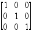

# 矩阵

> 原文：<https://www.javatpoint.com/mathml-matrices>

在 MathML 中，<mtable>元素用于创建表格或矩阵。<mtable>元素只包含<mtr>和<mtd>元素。这些元素类似于 HTML 中的、和

| Elements. |</mtd></mtr></mtable></mtable> 

**例如:**创建一个 3x3 矩阵，具有以下数据:



**等效 MathML 代码:**

```

<math xmlns='http://www.w3.org/1998/Math/MathML' display='block'>
<mrow>
  <mo>[</mo>
  <mtable>
    <mtr>
      <mtd>
        <mn>1</mn>
      </mtd>
      <mtd>
        <mn>0</mn>
      </mtd>
      <mtd>
        <mn>0</mn>
      </mtd>
    </mtr>
    <mtr>
      <mtd>
        <mn>0</mn>
      </mtd>
      <mtd>
        <mn>1</mn>
      </mtd>
      <mtd>
        <mn>0</mn>
      </mtd>
    </mtr>
    <mtr>
      <mtd>
        <mn>0</mn>
      </mtd>
      <mtd>
        <mn>0</mn>
      </mtd>
      <mtd>
        <mn>1</mn>
      </mtd>
    </mtr>
  </mtable>
  <mo>]</mo>
</mrow>

```

**注意:**默认情况下，< mtable >元素没有边框。因此，当您指定矩阵或矩阵的行列式时，您必须在<表>前后添加一个包含栅栏字符(例如“[”、“]”、“(”、“|”)的< mo >。

* * *

## 矩阵属性

| 索引 | 属性 | 描述 |
| 1) | 排列 | 它指定表格相对于其环境的垂直对齐方式。它的可能值是:轴、基线、底部、中心、顶部。 |
| 2) | 类别、id、样式 | 它是为样式表提供的。 |
| 3) | columnalign | 它指定单元格的水平对齐方式。它的可能值是:左、中(默认)和右。 |
| 4) | 列线 | 它指定列边框。允许使用由空格分隔的多个值，并将其应用于相应的列(例如 columnlines="none none solid ")。它的可能值是:无(默认)、实线和虚线。 |
| 5) | 列间距 | 它指定表列之间的间距。 |
| 6) | 显示样式 | 它引用一个布尔值，该值指定是否为显示的公式使用更多的垂直空间，或者如果设置为 false，是否使用更紧凑的布局来显示公式。 |
| 7) | 设计 | 它指定整个表格的边框。它的可能值是:无(默认)、实线和虚线。 |
| 8) | 框架间距 | 它指定在表格和框架之间添加额外的空间。 |
| 9) | 超链接 | 它用于设置指向指定 uri 的超链接。 |
| 10) | 数学背景 | 它指定背景颜色。您可以使用#rgb、#rrggbb 和 html 颜色名称。 |
| 11) | matcolor | 它指定文本颜色。您可以使用#rgb、#rrggbb 和 html 颜色名称。 |
| 12) | 旋转木质素 | 它指定单元格的垂直对齐方式。允许使用由空格分隔的多个值，并将其应用于相应的行(例如 rowalign=“上下轴”)。它的可能值是:轴、基线(默认)、底部、中心和顶部。 |
| 13) | 罗琳 | 它指定行边框。允许使用由空格分隔的多个值，并将其应用于相应的行(例如，rowlines="none none solid ")。它的可能值是:无(默认)、实线和虚线。 |
| 14) | 宽度 | 它指定整个表格的宽度。它接受长度值。 |

## 支持浏览器:

| 元素 | 铬 |  IE |  Firefox(壁虎) | 歌剧 |  Safari |
| <mtable></mtable> | 不支持 | 不支持 | 支持 | 不支持 | 仅基本支持 |

* * *