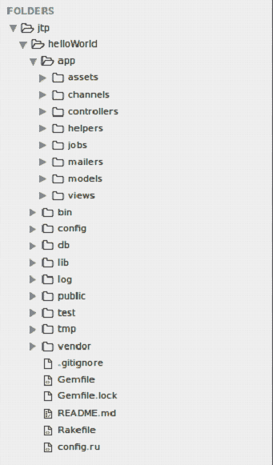

# Ruby on Rails 目录结构

> 原文：<https://www.javatpoint.com/ruby-on-rails-directory-structure>

在创建一个 Rails 应用程序时，会创建整个 Rails 目录结构。我们将在这里解释 Rails 5 目录结构。

**jtp** 目录(如下所示)有许多自动生成的文件和文件夹，构成了 Rails 应用程序的结构。

我们将解释上述目录中每个文件和文件夹的功能。

| 文件/文件夹 | 描述 |
| 应用 | 它是这个目录的剩余部分。基本上，它组织我们的应用程序组件。它持有 MVC。 |
| 应用/资产 | 此文件夹包含应用程序前端所需的静态文件，这些文件根据类型分组到文件夹中。 |
| 应用/控制器 | 所有控制器文件都存储在这里。控制器处理来自用户的所有网络请求。 |
| 应用程序/助手 | 它包含了所有辅助 MVC 的辅助函数。 |
| 应用程序/邮件程序 | 它包含应用程序的邮件特定功能。 |
| 应用程序/模型 | 它包含存储在应用程序数据库中的模型和数据。 |
| 应用/视图 | 该文件夹包含用于在我们的应用程序中填充数据的显示模板。 |
| 容器 | 它基本上包含启动应用程序的 Rails 脚本。它还可以包含用于设置、升级或运行应用程序的其他脚本。 |
| 配置 | 它配置我们应用程序的数据库、路由等等。 |
|  | 它包含我们当前的数据库模式和数据库迁移。 |
| 解放运动 | 它包含应用程序的扩展模块。 |
| 原木 | 它包含应用程序日志文件。 |
| 公众的 | 它包含静态文件和编译的资产。这是全世界唯一看到的文件夹。 |
| 试验 | 它包含单元测试、其他测试仪器和夹具。 |
| 终端监督程式（Terminal Monitor Program 的缩写） | 它包含临时文件，如缓存和 pid 文件。 |
| 小贩 | 它包含所有第三方代码，如供应商宝石。 |
| Gemfile | 这里声明了你的应用程序的所有 gem 依赖关系。这是强制性的，因为它包括 Rails 核心宝石和其他宝石。 |
| Gemfile.lock | 它保存了 gems 依赖树，包括应用程序的所有版本。 |
| README.md | 这是一份简短的应用说明手册。 |
| makefile 先生 | 它定位并加载可以从命令行运行的任务。 |
| config.ru | 用于启动应用程序的基于机架的服务器的机架配置。 |

* * *