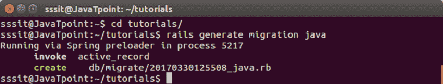

# Ruby on Rails 迁移

> 原文：<https://www.javatpoint.com/ruby-on-rails-migrations>

迁移是一种以一致和有组织的方式随时间改变数据库模式的方法。他们使用 Ruby DSL，通过它不需要手工编写 SQL。

SQL 片段可以手工编辑，但是你必须告诉其他开发人员你所做的更改，然后运行它们。您需要跟踪下一次部署时需要在生产机器上运行的更改。

每次迁移都是数据库的新版本。每次迁移都会通过添加或删除表、列或条目来修改数据库。活动记录将更新您的 db/schema.rb 文件，以匹配数据库的最新结构。

* * *

## 迁移的目的

在使用之前，了解迁移的目的非常重要。数据库用于所有的网络应用程序。

通常，SQL 语句用于运行数据库查询，以创建、修改、读取或删除数据库的列。

迁移文件包含一组关于如何创建数据库的特定说明。运行该文件时，Rails 将自动在数据库中进行更改。逐渐地，迁移文件将作为数据库如何改变的版本化历史。这意味着您将能够从指令集文件中重新创建数据库。

* * *

## 正在创建迁移文件

创建迁移文件的语法:

```

application_dir> rails generate migration table_name

```

这将创建一个名为 db/migrate/001_table_name.rb 的文件。迁移文件包含数据库表的基本数据结构。

建议在运行迁移生成器之前，清理模型生成器生成的现有迁移。

**示例:**

让我们在应用程序**教程中创建一个名为 **java** 的迁移。**

```

rails generate migration java

```



* * *

## 编辑代码

转到教程应用程序中的 db/migrate 目录。在当前文件 001_java.rb 中编写以下代码，

```

class Java < ActiveRecord::Migration 

   def self.up 
      create_table :java do |t| 
         t.column :title, :string, :limit => 32, :null => false 
         t.column :fee, :float 
         t.column :duration, :integer 
         t.column :index, :string 
         t.column :created_at, :timestamp 
      end 
   end 

   def self.down 
      drop_table :java 
   end 
end

```

在迁移到新版本的过程中使用 **self.up** 方法，如果需要，使用 **self.down** 回滚任何更改。

* * *

## 运行迁移

创建完所有必需的迁移文件后，您需要执行它们。要对数据库执行迁移文件，请运行以下代码:

```

rake db:migrate

```

如果不存在，它将创建一个“schema_info”表。它跟踪数据库的当前版本。

如果将创建新的迁移，那么这将是数据库的新版本。


* * *