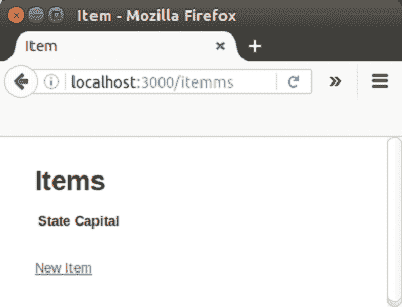
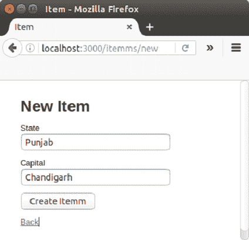
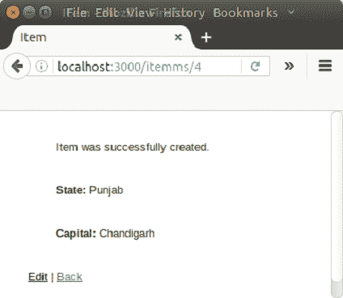
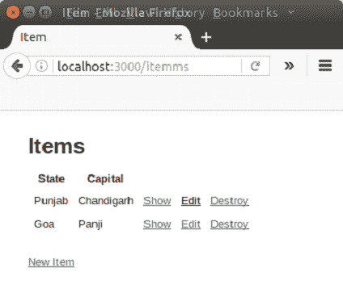
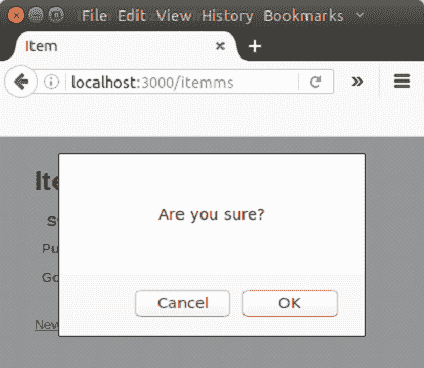
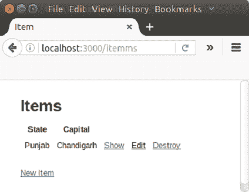

# Rails 上的 ruby AJAX

> 原文：<https://www.javatpoint.com/ruby-on-rails-ajax>

* * *

## AJAX 简介

AJAX 代表异步 Javascript 和 XML。它是几种技术的混合，是 Rails 应用程序的重要组成部分。它允许客户端更改，而无需重新加载页面。

让我们看看一个普通网络服务器的工作情况。在输入网址并点击搜索时，浏览器向服务器发出请求。为了组装搜索到的页面，它获取所有相关的资产，如 JavaScript 文件、图像和样式表。单击链接时，遵循相同的过程。这被称为“请求响应周期”。

JavaScript 向服务器发出请求，并解析响应。它可以更新页面上的信息。将这两种能力结合起来，就可以用 JavaScript 制作一个网页，只更新网页的一部分，而不需要从服务器加载整个网页。这种技术被称为 AJAX。

默认情况下，Rails 附带了 CoffeeScript。

让我们看一个使用 jQuery 库发出 Ajax 请求的示例代码

```
$.ajax(url: "/test").done (html) ->
  $("#results").append html

```

上面的代码从“/test”中获取数据，然后将结果附加到带有结果 id 的 div 中。

* * *

## 不引人注目的 JavaScript

为了处理附加到 DOM 的 JavaScript，Rails 使用了“不引人注目的 JavaScript”技术。这被认为是前端社区中最好的技术。

这被称为“不引人注目的”JavaScript，因为我们不会将 JavaScript 代码混合到 HTML 中。这样，我们可以通过添加数据属性轻松地将行为添加到任何链接中。很多好处加在一起就像整个 JavaScript 在每个页面上提供一样，这意味着它会在第一次页面加载时被下载，然后可以在之后的每个页面上被缓存。

**例**

让我们看一个对删除操作执行 Ajax 的例子。

**步骤 1** 创建一个名为**项目的应用程序。**

```
rails new item

```

**第 2 步**写下以下命令。

```
rails generate scaffold Itemm state:string country:string

```

**步骤 3** 写入迁移命令。

```
rake db:migrate

```

**步骤 4** 通过编写以下代码，在 AAP/view/items/index . html . erb 文件中更新您的销毁操作:

```
:remote => true, :class => 'delete_itemm' 

<tbody> 
    <% @itemms.each do |itemm| %> 
      <tr> 
        <td><%= itemm.state %></td> 
        <td><%= itemm.capital %></td> 
        <td><%= link_to 'Show', itemm %></td> 
        <td><%= link_to 'Edit', edit_itemm_path(itemm) %></td> 
        <td><%= link_to 'Destroy', itemm, method: :delete, data: { confirm: 'Are you sure?' }, :remote => true, :class => 'delete_itemm' %></td> 
      </tr> 
    <% end %> 
  </tbody>

```

**第五步**创建 app/view/items/destroy . js . erb 文件。

```
$('.delete_itemm').bind('ajax:success', function() { 
   $(this).closest('tr').fadeOut(); 
});	

```

**第 6 步**转到 app/controller/items _ controller . Rb 的控制器文件，并编写以下代码。

```
 def destroy 
   @itemm = Itemm.find(params[:id]) 
   @itemm.destroy 

   respond_to do |format| 
      format.html { redirect_to item_url } 
      format.json { head :no_content } 
      format.js   { render :layout => false } 
   end 

end

```

**步骤 7** 启动 Rails 服务器。

```
rails s

```

**第 8 步**在本地主机上运行。

```
http://localhost:3000/itemms

```



创建如下快照所示的项目。



它将创建如下所示的项目。



点击后退按钮。



如果您点击销毁链接，将通过 AJAX 显示一个弹出窗口。它将从列表中销毁该项目。



单击“确定”最终删除该项目。



* * *

### [计] 下载

[Download this example](https://static.javatpoint.com/rubyonrails/src/AJAX.zip)