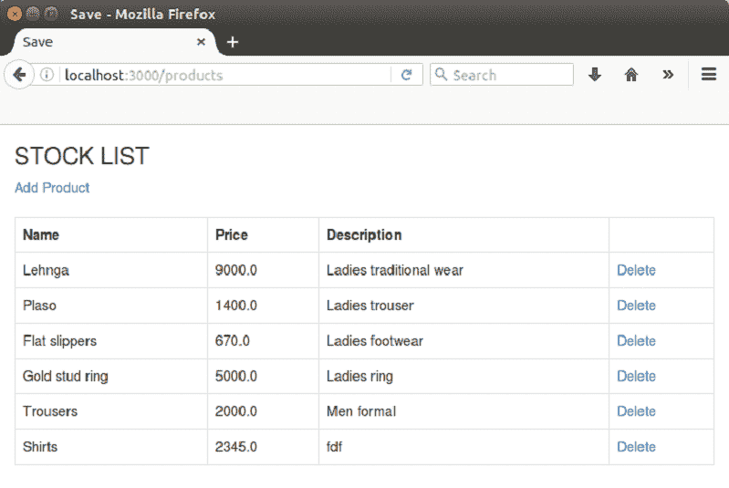

# Rails 从数据库中查看记录

> 原文：<https://www.javatpoint.com/ruby-on-rails-view-record>

我们将看到一个在应用程序中查看数据的示例。

**步骤 1** 创建一个新的 Rails 应用程序。

```
rails new viewrecord

```

**第二步**更改你要保存的目录。

```
cd viewrecord

```

**步骤 3** 从控制台创建控制器。

```
rails g controller products index show new create destroy

```

**步骤 4** 从控制台创建模型。

```
rails g model product name:string price:decimal short_description:text full_description:text

```

**第五步**转到 app/controller/products _ controller . Rb，写下以下代码。

```
class ProductsController < ApplicationController 

  # GET method to get all products from database 
  def index 
    @products = Product.all 
  end 

  # GET method to get a product by id 
  def show 
    @product = Product.find(params[:id]) 
  end 

  # GET method for the new product form 
  def new 
    @product = Product.new 
  end 

  # POST method for processing form data 
  def create 
    @product = Product.new(product_params) 
    if @product.save 
      flash[:notice] = 'Product added!' 
      redirect_to root_path 
    else 
      flash[:error] = 'Failed to edit product!' 
      render :new 
    end 
  end 

  def destroy 
    @product = Product.find(params[:id]) 
    if @product.delete 
      flash[:notice] = 'Product deleted!' 
      redirect_to root_path 
    else 
      flash[:error] = 'Failed to delete this product!' 
      render :destroy 
    end 
  end 

 def product_params 
    params.require(:product).permit(:name, :price, :old_price, :short_description, :full_description) 
  end 
   end 

```

**第 6 步**运行以下命令:

```
bundle install

```

**第七步**转到 app/view/products/index . html . erb 文件。

```
<h3>STOCK LIST</h3> 

      <div> 
        <%= link_to 'Add Product', new_product_path %> 
      </div> 
      <br> 

     <table class="table table-bordered table-striped"> 
       <tr> 
        <th>Name</th> 
        <th>Price</th> 
        <th>Description</th> 

      </tr> 

      <% @products.each do |product| %> 
          <tr> 
            <td><%= product.name %></td> 
            <td><%= product.price %></td> 
            <td><%= truncate(product.short_description, :length => 75) %></td> 
                <td><%= link_to 'Delete', product_path(product), method: :delete %></td> 

           </tr> 
      <% end %> 
    </table>

```

**第八步**转到 app/view/products/new . html . erb 文件。

```
<%= form_for @product, url: {action: :create} do |f| %> 

        <h3>Add a Product</h3> 

        <div class="field"> 
            <%= f.label :name %> 
              <%= f.text_field :name %> 
        </div> 

        <div class="field"> 
             <%= f.label :price %> 
             <%= f.text_field :price %> 
        </div> 

        <div class="field"> 
           <%= f.label :short_description %> 
              <%= f.text_field :short_description %> 
        </div> 
		 </p> 
      </div> 
      <div class="actions"> 
        <%= link_to 'Back', { controller: 'products', action: 'index'} %> 
        <%= f.submit 'Create Product' %> 
      </div> 
  <% end %> 
</div>

```

**第 9 步**启动服务器。

```
rails s

```

**步骤 10** 在本地主机上运行。

```
http://localhost:3000/products

```



* * *

### [计] 下载

[Download this example](https://static.javatpoint.com/rubyonrails/src/viewrecord.zip)