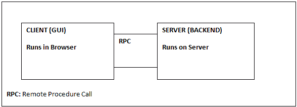

# GWT 简介

> 原文：<https://www.javatpoint.com/gwt-introduction>

GWT 是一个开发工具包，使开发人员能够开发互联网或网络应用程序。GWT 坚持使用可重用的方法来完成常见的网络应用任务，如书签、用户界面抽象、跨浏览器移植等。它提供了以下功能:

*   开发人员不需要像 GWT 通过不同绑定处理的那样擅长浏览器不兼容性。
*   GWT 是客户端和服务器的单一代码库。
*   GWT 选择了 Java，因为它提供了代码导航、重构等功能，开发变得更加有效。
*   GWT MVP(模型视图演示者)允许使用 JUnit 进行共享工作、更快的测试。事件总线通过将事件放在事件总线上，允许客户端应用程序中的许多更新。
*   它允许不同的 Java 工具与之集成，例如通过 gilead 的 hibernate。

## GWT 的组成部分

*   **GWT Java 到 JavaScript 编译器:**它把所有的 Java 编写的代码翻译成 JavaScript。
*   **GWT 开发模式:**允许开发者在开发模式下运行应用，即 app 在不编译 JavaScript 的情况下用 Java 运行。开发模式允许本机模式插件，称为谷歌网络工具包开发者插件。
*   **JRE 仿真库:** GWT 包括一个遵循 Java 运行时库的库，即 java.lang、java.lang.annotation、java.math、java.io、java.sql、java.util 等。
*   **GWT Web UI 类库:**为了创建一个小部件，GWT 由一组接口和类组成。

## 为什么要用 GWT？

*   **性能提升:**在 GWT，每发布一个新版本的框架，开发者都可以免费获得所有新功能。旧文件通过重新编译获得新功能，例如 GWT 1.5 中的辅助功能支持。
*   **调试:**我们可以像在 Java 应用程序中一样，使用 IDE 的调试器调试 GWT 应用程序。
*   **OOPHM:** 进程外托管模式(OOPHM)，允许开发人员在不同的浏览器上使用托管模式。它允许开发人员增加 GWT 潜力，例如在虚拟机中运行窗口，连接到工业工程，然后在托管模式下运行。
*   **UI Binder:** 它允许您使用 XML、HTML 和 Java 以一种简单且不太复杂的方式设计和定制您的小部件。
*   GWT 对软件架构采取了强有力的面向对象方法。

## GWT 应用细分

## GWT 提供了两种模式

1.  **开发模式:**它提供了直接用你的 Java 调试器调试应用程序的 Java 代码的工具。
2.  **Web 模式:**该模式可以将应用翻译成 HTML、CSS 和 JavaScript 代码，直接部署到 Web 服务器上。

## 应用程序开发过程

| 任务 | 概念 | GWT 工具和应用编程接口 |
| 1.创建 GWT 项目 | 生成文件和目录。 | 谷歌 Eclipse 插件，GWT 命令行工具，开发模式下的 webAppCreator。 |
| 2.设计应用程序 | 应用程序的基本布局。 | 语言限制。 |
| 3.构建用户界面 | 基于视觉设计添加用户界面组件。 | GWT 小部件和面板以及根面板。 |
| 4.客户端管理 | 处理键盘和鼠标事件。 | 单击处理程序和按键处理程序接口。 |
| 5.代码功能(客户端) | 为多个浏览器实现创建和维护一个代码。 | GWT 方法。 |
| 6.排除故障 | 在将 Java 代码编译成 JavaScript 之前，先对其进行调试。 | 发展模式。 |
| 7.应用样式 | 通过应用动态改变样式的 CSS 来增强用户界面。也应用一些静态元素，如图像等。 | GWT 模块，GWT 主题，样式表，GWT 方法，自动资源包含。 |
| 8.编译和部署应用程序 | 将您的 Java 代码编译成 JavaScript，并在生产模式下进行测试。 | GWT 编译器。 |