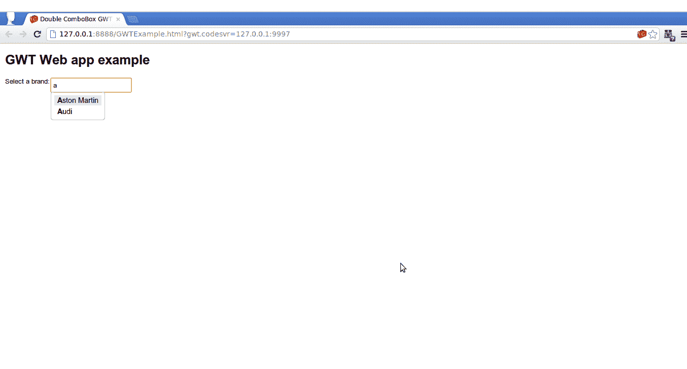

# GWT 建议箱

> 原文：<https://www.javatpoint.com/gwt-suggestbox>

GWT 建议框是一个文本框或文本区域，显示一组与用户输入相匹配的预配置选项。每个建议框都与一个建议循环相关联。建议循环用于在给定特定查询字符串的情况下提供一组选择。

### GWT 建议盒语法

```
public class SuggestBox extends Composite

```

### GWT 建议嵌套类

| 班级 | 描述 |
| 建议盒子。默认建议显示 | 这是建议盒的默认实现。建议显示在建议框下的弹出面板中显示建议。 |
| 建议盒子。建议回调 | 它是当用户选择一个建议时使用的回调 |
| 它是当用户选择一个建议时使用的回调 | 它用于向用户显示建议。 |

### GWT 建议建造商

| 构造器 | 描述 |
| 建议箱() | 这是一个默认的构造函数。 |
| 建议盒 | 这是一个建议盒的构造函数。 |
| 建议框(建议甲骨文，值框库<java.lang.string>框)</java.lang.string> | 它扩展了建议甲骨文和价值盒。 |
| 建议框(建议甲骨文，值框库<java.lang.string>框，建议框。建议显示建议显示)</java.lang.string> | 它在一个建议框中显示建议循环和值框。 |

### GWT 建议使用常用方法

| 修饰符和类型 | 方法 | 描述 |
| 空的 | addchangelistener(changelistener) | 它得到一个文本框。 |
| 空的 | addClickListener(ClickListener 监听器) | 它通过点击获得输入。 |
| 空的 | addeventhandler(建议处理程序) | 它添加了一个事件处理程序。 |
| 空的 | addFocusListener(FocusListener) | 它可以给特定区域添加模糊或焦点。 |
| 空的 | 添加键盘听筒（键盘听筒列表） | 它通过键盘输入。 |
| HandlerRegistration | addkeydown handler(keydown handler) | 它添加了一个 KeyDownEvent 处理程序。 |
| HandlerRegistration | addkeypress handler(keypress handler) | 它添加了一个 KeyPressEvent 处理程序。 |
| HandlerRegistration | 密钥处理程序(密钥处理程序) | 它添加了一个 KeyUpEvent 处理程序。 |
| HandlerRegistration | addSelectionHandler(选择处理程序<suggestoracle.suggestion>处理程序)</suggestoracle.suggestion> | 它添加了一个 SelectionEvent 处理程序。 |
| HandlerRegistration | addvaluechangehandler(valuechangehandler<java.lang.string>处理程序)</java.lang.string> | 它添加了一个 ValueChangeEvent 处理程序。 |
| 布尔 | isAnimationEnabled() | 它显示动画。 |
| 布尔 | isAutoSelectEnabled() | 它返回是否自动选择第一个建议。 |
| 布尔 | isEnabled() | 它获取此小部件是否已启用。 |
| 布尔 | 问题建议列表显示() | 它检查建议盒是否。建议显示正在显示。 |
| 受保护的空隙 | onenterford(Java . lang . string base id) | 当用户使用 UIObject.ensureDebugId(String)方法设置 id 时调用它。 |

* * *

### GWT 建议案例

```
import com.google.gwt.core.client.EntryPoint;
import com.google.gwt.user.client.ui.HorizontalPanel;
import com.google.gwt.user.client.ui.Label;
import com.google.gwt.user.client.ui.MultiWordSuggestOracle;
import com.google.gwt.user.client.ui.RootPanel;
import com.google.gwt.user.client.ui.SuggestBox;
import com.google.gwt.user.client.ui.VerticalPanel;

public class MyEntryPoint implements EntryPoint {

    public static final String TOYOTA = "Toyota";
    public static final String SEAT = "Seat";
    public static final String SUBARU = "Subaru";
    public static final String AUDI = "Audi";
    public static final String ASTON_MARTIN = "Aston Martin";

    @Override
    public void onModuleLoad() {
        SuggestBox carsSuggestBox = new SuggestBox(getCarsOracle());

        HorizontalPanel carsPanel = new HorizontalPanel();
        carsPanel.add(new Label("Select a brand:"));
        carsPanel.add(carsSuggestBox);

        VerticalPanel formPanel = new VerticalPanel();
        formPanel.add(carsPanel);

        RootPanel.get("container").add(formPanel);
    }

    private MultiWordSuggestOracle getCarsOracle(){
        MultiWordSuggestOracle carsOracle = new MultiWordSuggestOracle();
        carsOracle.add(TOYOTA);
        carsOracle.add(SEAT);
        carsOracle.add(ASTON_MARTIN);
        carsOracle.add(AUDI);
        carsOracle.add(SUBARU);

        return carsOracle;
    }

}

```

输出:

