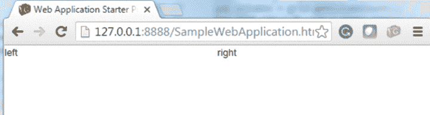

# GWT 根布局面板

> 原文：<https://www.javatpoint.com/gwt-root-layout-panel>

GWT RootLayoutPanel 允许我们选择布局面板的起点。在此面板中，**requires size . onresize()**方法在创建时或窗口调整大小时被调用。

### GWT RootLayoutPanel 类声明

来看看**com . Google . gwt . user . client . ui . rootlayoutpanel**的声明

```
 public class RootLayoutPanel extends LayoutPanel

```

### GWT RootLayoutPanel 方法

| 修饰符和类型 | 方法 | 描述 |
| 静态 RootLayoutPanel | get() | 它获取 RootLayoutPanel 的单例实例。 |
| 受保护的空隙 | onLoad() | 当一个小部件附加到浏览器的文档后，它会立即被调用。 |

* * *

## GWT RootLayoutPanel 示例

```
import com.google.gwt.event.logical.shared.ResizeEvent;
import com.google.gwt.event.logical.shared.ResizeHandler;
import com.google.gwt.user.client.Window;

/* This is the entry point method. */ 

public void onModuleLoad() {

// Attach two child widgets to a LayoutPanel, laying them out horizontally, splitting at 50%. Widget 

childOne = new HTML("left");
Widget childTwo = new HTML("right");
LayoutPanel p = new LayoutPanel();
p.add(childOne);
p.add(childTwo);
p.setWidgetLeftWidth(childOne, 0, Unit.PCT, 50, Unit.PCT);
p.setWidgetRightWidth(childTwo, 0, Unit.PCT, 50, Unit.PCT);

// Attach the LayoutPanel to the RootLayoutPanel
RootLayoutPanel.get().add(p);
 }

```

输出:

