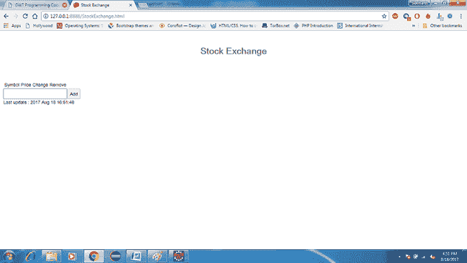
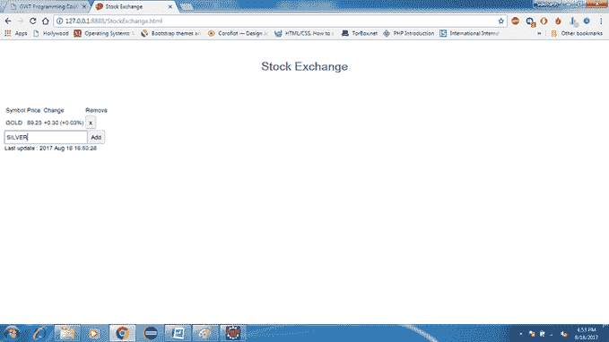

# GWT 证券交易所应用示例

> 原文：<https://www.javatpoint.com/gwt-stock-exchange-app>

在 GWT 证券交易所，我们将使用所有基本的小部件、面板和布局来使用名为证券交易所的谷歌网络工具包设计一个网络应用程序。

该应用程序可用于添加股票市场的内容，其价值将在一定时间间隔后发生变化。将被计算的值是价格，后面跟着**变化也有**选项来删除内容。

面板和小部件的使用如下:

*   **HTML 面板**
*   **伸缩表**
*   **流量面板**
*   **小时**

**创建的文件**

*   gwt 模块定义
*   StockExchange.html 主页面
*   StockExchange.css 应用程序样式表
*   Java 网络应用描述符
*   StockExchange.java·GWT 入境点班
*   GreetingService.java、GreetingServiceAsync.java、GreetingServiceImpl.java 和 GWT 示例 RPC 类
*   gwt 服务器运行时库
*   用于交换的 StockExchangeTest.java 启动器测试用例

**StockExchange.html**

```

<!doctype html>
<!-- The DOCTYPE declaration above will set the     -->
<!-- browser's rendering engine into                -->
<!-- "Standards Mode". Replacing this declaration   -->
<!-- with a "Quirks Mode" doctype is not supported. -->
<html>
  <head>
   <meta http-equiv="content-type" content="text/html; charset=UTF-8">
    <!--     -->
    <!-- Consider inlining CSS to reduce the number of requested files -->
    <!--     -->
    <link type="text/css" rel="stylesheet" href="StockExchange.css">
    <!--     -->
    <!-- Any title is fine       -->
    <!--     -->
    <title>Stock Exchange</title>

    <!--     -->
    <!-- This script loads your compiled module.   -->
    <!-- If you add any GWT meta tags, they must   -->
    <!-- be added before this line.                -->
    <!--    -->
    <script type="text/javascript" language="javascript" src="stockexchange/stockexchange.nocache.js"></script>

  </head>
  <!--      -->
  <!-- The body can have arbitrary html, or     -->
  <!-- you can leave the body empty if you want  -->
  <!-- to create a completely dynamic UI.       -->
  <!--      -->
  <body>
     <h1>Stock Exchange</h1>
     <div id="stockList"></div>
    <iframe src="javascript:''" id="__gwt_historyFrame" tabIndex='-1' 
	style="position:absolute;width:0;height:0;border:0"></iframe>
    <!-- RECOMMENDED if your web app will not function without JavaScript enabled -->
    <noscript>
      <div style="width: 22em; position: absolute; left: 50%; margin-left: -11em; 
	  color: red; background-color: white; border: 1px solid red; padding: 4px; font-family: sans-serif">
        Your web browser must have JavaScript enabled
        in order for this application to display correctly.
      </div>
    </noscript>
  </body>
</html>

```

**StockExchange.java**

```

package com.gwt.sample.stockexchange.client;
import com.google.gwt.core.client.EntryPoint;
import com.google.gwt.event.dom.client.ClickEvent;
import com.google.gwt.event.dom.client.ClickHandler;
import com.google.gwt.user.client.ui.Button;
import com.google.gwt.user.client.ui.FlexTable;
import com.google.gwt.user.client.ui.HorizontalPanel;
import com.google.gwt.user.client.ui.Label;
import com.google.gwt.user.client.ui.TextBox;
import com.google.gwt.user.client.ui.VerticalPanel;
import com.google.gwt.user.client.ui.RootPanel;
import com.google.gwt.event.dom.client.KeyCodes;
import com.google.gwt.event.dom.client.KeyDownEvent;
import com.google.gwt.event.dom.client.KeyDownHandler;
import com.google.gwt.user.client.Window;
import java.util.ArrayList;
import com.google.gwt.user.client.Timer;
import com.google.gwt.user.client.Random;
import com.google.gwt.i18n.client.NumberFormat;
import com.google.gwt.i18n.client.DateTimeFormat;
import java.util.Date;
/**
 * Entry point classes define <code>onModuleLoad()</code>.
 */
public class StockExchange implements EntryPoint {
	  private VerticalPanel mainPanel = new VerticalPanel();
	  private FlexTable stocksFlexTable = new FlexTable();
	  private HorizontalPanel addPanel = new HorizontalPanel();
	  private TextBox newSymbolTextBox = new TextBox();
	  private Button addStockButton = new Button("Add");
	  private Label lastUpdatedLabel = new Label();
	  private ArrayList<String> stocks = new ArrayList<String>();
	  private static final int REFRESH_INTERVAL = 5000; // m
	/**
	 * This is the entry point method.
	 */
	public void onModuleLoad() {
		stocksFlexTable.setText(0, 0, "Symbol");
	    stocksFlexTable.setText(0, 1, "Price");
	    stocksFlexTable.setText(0, 2, "Change");
	    stocksFlexTable.setText(0, 3, "Remove");
	 // Assemble Add Stock panel.
	    addPanel.add(newSymbolTextBox);
	    addPanel.add(addStockButton);
	    // Assemble Main panel.
	    mainPanel.add(stocksFlexTable);
	    mainPanel.add(addPanel);
	    mainPanel.add(lastUpdatedLabel);
	 // Associate the Main panel with the HTML host page.
	    RootPanel.get("stockList").add(mainPanel);
	 // Move cursor focus to the input box.
	    newSymbolTextBox.setFocus(true);
	    // Setup timer to refresh list automatically.
	      Timer refreshTimer = new Timer() {
	        @Override
	        public void run() {
	          refreshWatchList();
	        }
	      };
	      refreshTimer.scheduleRepeating(REFRESH_INTERVAL)
	    // Listen for mouse events on the Add button.
	    addStockButton.addClickHandler(new ClickHandler() {
	      public void onClick(ClickEvent event) {
	        addStock();
	      }
	    });
	    // Listen for keyboard events in the input box.
	      newSymbolTextBox.addKeyDownHandler(new KeyDownHandler() {
	        public void onKeyDown(KeyDownEvent event) {
	          if (event.getNativeKeyCode() == KeyCodes.KEY_ENTER) {
	            addStock();
	          }
	        }
	      });
	  }
	  /**
	   * Add stock to FlexTable. Executed when the user clicks the addStockButton or
	   * presses enter in the newSymbolTextBox.
	   */
	  private void addStock() {
	      final String symbol = newSymbolTextBox.getText().toUpperCase().trim();
	      newSymbolTextBox.setFocus(true);
	      // Stock code must be between 1 and 10 chars that are numbers, letters, or dots.
	      if (!symbol.matches("^[0-9A-Z\\.]{1,10}$")) {
	        Window.alert("'" + symbol + "' is not a valid symbol.");
	        newSymbolTextBox.selectAll();
	        return;
	      }
	      newSymbolTextBox.setText("");
	   // Don't add the stock if it's already in the table.
	      if (stocks.contains(symbol))
	        return;
	   // Add the stock to the table.
	      int row = stocksFlexTable.getRowCount();
	      stocks.add(symbol);
	      stocksFlexTable.setText(row, 0, symbol);
	   // Add a button to remove this stock from the table.
	      Button removeStockButton = new Button("x");
	      removeStockButton.addClickHandler(new ClickHandler() {
	        public void onClick(ClickEvent event) {
	          int removedIndex = stocks.indexOf(symbol);
	          stocks.remove(removedIndex);
	          stocksFlexTable.removeRow(removedIndex + 1);
	        }
	      });
	      stocksFlexTable.setWidget(row, 3, removeStockButton);
	      // Get the stock price.
	      refreshWatchList();
	    }
	  private void refreshWatchList() {
		     final double MAX_PRICE = 100.0; // $100.00
		     final double MAX_PRICE_CHANGE = 0.02; // +/- 2%
		     StockPrice[] prices = new StockPrice[stocks.size()];
		     for (int i = 0; i < stocks.size(); i++) {
		       double price = Random.nextDouble() * MAX_PRICE;
		       double change = price * MAX_PRICE_CHANGE
		           * (Random.nextDouble() * 2.0 - 1.0);
		       prices[i] = new StockPrice(stocks.get(i), price, change);
		     }
		     updateTable(prices);
		    }
	  private void updateTable(StockPrice[] prices) {
		  for (int i = 0; i < prices.length; i++) {
		        updateTable(prices[i]);
		      }
		// Display timestamp showing last refresh.
	      DateTimeFormat dateFormat = DateTimeFormat.getFormat(
	        DateTimeFormat.PredefinedFormat.DATE_TIME_MEDIUM);
	      lastUpdatedLabel.setText("Last update : " 
	        + dateFormat.format(new Date()));
		}
	  private void updateTable(StockPrice price) {
		     // Make sure the stock is still in the stock table.
		     if (!stocks.contains(price.getSymbol())) {
		       return;
		     }
		     int row = stocks.indexOf(price.getSymbol()) + 1;
		     // Format the data in the Price and Change fields.
		     String priceText = NumberFormat.getFormat("#,##0.00").format(
		         price.getPrice());
		     NumberFormat changeFormat = NumberFormat.getFormat("+#,##0.00;-#,##0.00");
		     String changeText = changeFormat.format(price.getChange());
		     String changePercentText = changeFormat.format(price.getChangePercent());
		     // Populate the Price and Change fields with new data.
		     stocksFlexTable.setText(row, 1, priceText);
		     stocksFlexTable.setText(row, 2, changeText + " (" + changePercentText
		         + "%)");
		    }
}

```

**股票价格. java**

```

package com.gwt.sample.stockexchange.client;
public class StockPrice {
  private String symbol;
  private double price;
  private double change;
  public StockPrice() {
  }
  public StockPrice(String symbol, double price, double change) {
    this.symbol = symbol;
    this.price = price;
    this.change = change;
  }
  public String getSymbol() {
    return this.symbol;
  }
  public double getPrice() {
    return this.price;
  }
  public double getChange() {
    return this.change;
  }
  public double getChangePercent() {
    return 10.0 * this.change / this.price;
  }
  public void setSymbol(String symbol) {
    this.symbol = symbol;
  }
  public void setPrice(double price) {
    this.price = price;
  }
  public void setChange(double change) {
    this.change = change;
  }
}

```

股票交易所. gwt.xml

```

<?xml version="1.0" encoding="UTF-8"?>
<!--
  When updating your version of GWT, you should also update this DTD reference,
  so that your app can take advantage of the latest GWT module capabilities.
-->
<!DOCTYPE module PUBLIC "-//Google Inc.//DTD Google Web Toolkit 2.7.0//EN"
  "http://gwtproject.org/doctype/2.7.0/gwt-module.dtd">
<module rename-to='stockexchange'>
  <!-- Inherit the core Web Toolkit stuff.  -->
  <inherits name='com.google.gwt.user.User'/>
  <!-- Inherit the default GWT style sheet.  You can change   -->
  <!-- the theme of your GWT application by uncommenting    -->
  <!-- any one of the following lines. -->
  <inherits name='com.google.gwt.user.theme.clean.Clean'/>
  <!-- <inherits name='com.google.gwt.user.theme.standard.Standard'/> -->
  <!-- <inherits name='com.google.gwt.user.theme.chrome.Chrome'/> -->
  <!-- <inherits name='com.google.gwt.user.theme.dark.Dark'/>     -->
  <!-- Other module inherits   -->
  <!-- Specify the app entry point class.   -->
  <entry-point class='com.gwt.sample.stockexchange.client.StockExchange'/>
  <!-- Specify the paths for translatable code -->
  <source path='client'/>
  <source path='shared'/>
  <!-- allow Super Dev Mode -->
  <add-linker name="xsiframe"/>
</module>

```

输出:


