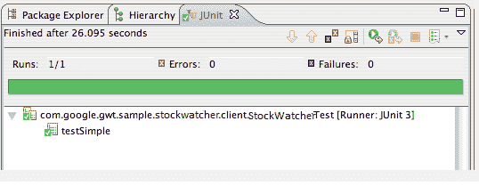

# GWT 测试

> 原文：<https://www.javatpoint.com/gwt-testing>

JUnit 为测试 GWT 应用程序提供了经过时间考验的框架。它由许多工具组成，可以根据用户需求直接创建测试用例。

现在，在网络项目**股票交易所**(在前一章中创建)的基础上，我们执行 JUnit 测试。

1.  像所有 GWT JUnit 测试用例一样，StockExchangeTest 类扩展了 com.google.gwt.junit.client 包中的 GWT 测试用例类。您可以通过扩展这个类来创建额外的测试用例。
2.  StockExchangeTest 类有一个抽象方法(getModuleName)，它必须返回 GWT 模块的名称。对于 StockExchange，那就是 com . Google . gwt . sample . stock exchange . stock exchange。
3.  StockExchangeTest 类是用一个样本测试用例同义反复测试生成的，testSimple。这个 testSimple 方法使用了它从 JUnit assert 类继承的众多 Assert 函数之一。
4.  assertTrue(布尔)函数断言传入的布尔参数的计算结果为 True。如果没有，testSimple 测试将在 JUnit 中运行时失败。

**StockExchangeTest.java**

```
package com.google.gwt.sample.stockexchange.client;
    import com.google.gwt.junit.client.GWTTestCase;
    /**
     * GWT JUnit tests must extend GWTTestCase.
 */
public class StockExchangeTest extends GWTTestCase {                       
      /**
       * Must refer to a valid module that sources this class.
   */
  public String getModuleName() {    
  return "com.google.gwt.sample.stockexchange.StockExchange";
  }
      /**
       * Add as many tests as you like.
   */
  public void testSimple() {                                              
assertTrue(true);
  }
    }

```

* * *

## 运行单元测试

您可以通过四种方式运行 JUnit 测试:

1.  从命令行，使用 junitCreator 生成的脚本
2.  在 Eclipse 中，为 Eclipse 使用谷歌插件
3.  在 Eclipse 中，使用由 webAppCreator 生成的 Eclipse 启动配置文件
4.  在手动测试模式下

我们正在使用 Eclipse 和谷歌插件:

Eclipse 的谷歌插件使得在 Eclipse 中运行测试变得很容易。

*   在开发模式下运行 JUnit 测试。
*   从包资源管理器中，右键单击要运行的测试用例，选择运行方式> GWT Junit 测试
*   简单测试执行时没有错误。



*   在生产模式下运行 JUnit 测试。
*   从包资源管理器中，右键单击要运行的测试用例，选择运行方式> GWT Junit 测试(生产模式)
*   简单测试执行时没有错误。

* * *

## 写作单元测试

*   编写一个 JUnit 测试来验证 StockPrice 类的构造函数是否正确设置了新对象的实例字段。
*   向 StockExchangeTest 类添加如下所示的 testStockPriceCtor 方法。

```
/**
     * Verify that the instance fields in the StockPrice class are set correctly.
 */
public void testStockPriceCtor() {
  String symbol = "XYZ";
  double price = 70.0;
  double change = 2.0;
  double changePercent = 100.0 * change / price;
  StockPrice sp = new StockPrice(symbol, price, change);
  assertNotNull(sp);
  assertEquals(symbol, sp.getSymbol());
  assertEquals(price, sp.getPrice(), 0.001);
  assertEquals(change, sp.getChange(), 0.001);
  assertEquals(changePercent, sp.getChangePercent(), 0.001);
}

```

**在开发模式下重新运行 StockExchangeTest。**

**两个测试都应该通过:**

```
[junit] Running com.google.gwt.sample.stockexchange.client.StockExchangeTest
[junit] Tests run: 2, Failures: 0, Errors: 0, Time elapsed: 12.451 sec

```