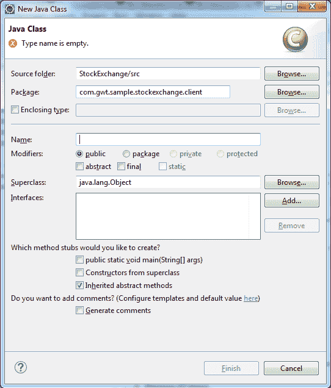
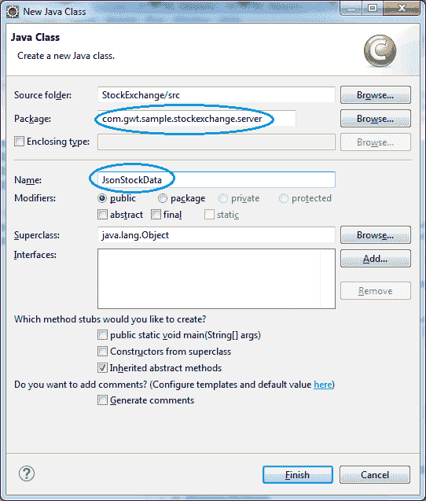
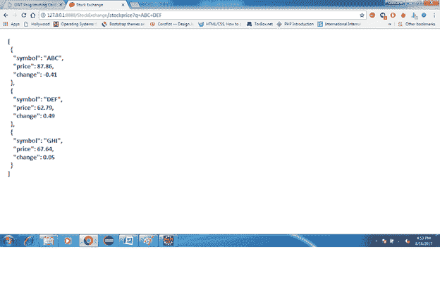

# GWT JSON

> 原文：<https://www.javatpoint.com/gwt-json>

JSON 是一种独立于语言的数据格式。它类似于 XML，因为 XML 使用标签，JSON 使用 JavaScript 的对象文字表示法。

**实施**

创建**证券交易所**的 JSON 数据源示例:

我们实现了股票价格分类和刷新观察列表方法，如下所示:

```
/**
   * Generate random stock prices.
   */
  private void refreshWatchList() {
    final double MAX_PRICE = 100.0; // $100.00
    final double MAX_PRICE_CHANGE = 0.02; // +/- 2%

    StockPrice[] prices = new StockPrice[stocks.size()];
    for (int i = 0; i < stocks.size(); i++) {
      double price = Random.nextDouble() * MAX_PRICE;
      double change = price * MAX_PRICE_CHANGE
          * (Random.nextDouble() * 2.0 - 1.0);

      prices[i] = new StockPrice(stocks.get(i), price, change);
    }

    updateTable(prices);
  }

```

* * *

## 正在创建 Servlet

在本文中，我们创建了一个 JSON 格式的股票报价 servlet 文件。创建 servlet 的步骤如下:

1) **创建一个 Servlet**

1.  在包浏览器中，选择客户端**包:com . Google . gwt . sample . stock watcher . client**
2.  在 Eclipse 中，打开新建 Java 类向导(文件>新建>类)。



2) **在“包”下，将名称从更改为。客户到。服务器**

1.  在“名称”下，输入 JsonStockData。
2.  Eclipse 将为服务器端代码创建一个包，并为 JsonStockData 类创建一个存根。



3) **用以下代码替换存根:**

```
package com.google.gwt.sample.stockexchange.server;

   import java.io.IOException;
import java.io.PrintWriter;
import java.util.Random;

    import javax.servlet.ServletException;
import javax.servlet.http.HttpServlet;
import javax.servlet.http.HttpServletRequest;
import javax.servlet.http.HttpServletResponse;

    public class JsonStockData extends HttpServlet {

      private static final double MAX_PRICE = 100.0; // $100.00
  private static final double MAX_PRICE_CHANGE = 0.02; // +/- 2%

      @Override
  protected void doGet(HttpServletRequest req, HttpServletResponse resp)
      throws ServletException, IOException {

        Random rnd = new Random();

        PrintWriter out = resp.getWriter();
    out.println('[');
    String[] stockSymbols = req.getParameter("q").split(" ");
    boolean firstSymbol = true;
    for (String stockSymbol : stockSymbols) {

          double price = rnd.nextDouble() * MAX_PRICE;
      double change = price * MAX_PRICE_CHANGE * (rnd.nextDouble() * 2f - 1f);

          if (firstSymbol) {
        firstSymbol = false;
      } else {
        out.println("  ,");
      }
      out.println("  {");
      out.print("    \"symbol\": \"");
      out.print(stockSymbol);
      out.println("\",");
      out.print("    \"price\": ");
      out.print(price);
      out.println(',');
      out.print("    \"change\": ");
      out.println(change);
      out.println("  }");
    }
    out.println(']');
    out.flush();
  }

    }

```

* * *

## 包括服务器端代码

GWT 由内置 servlet 容器 **Jetty** 组成，该容器托管生成 JSON 格式股票数据的 servlet。在 GWT 包含服务器端代码的步骤如下:

1.  在**stock watcher/war/WEB-INF/WEB . XML**下编辑以下代码

```
<?xml version="1.0" encoding="UTF-8"?>
<!DOCTYPE web-app
    PUBLIC "-//Sun Microsystems, Inc.//DTD Web Application 2.3//EN"
    "http://java.sun.com/dtd/web-app_2_3.dtd">

    <web-app>

      <!-- Default page to serve -->
  <welcome-file-list>
    <welcome-file>StockExchange.html</welcome-file>
  </welcome-file-list>

      <!-- Servlets -->
 <servlet>
    <servlet-name>jsonStockData</servlet-name>
    <servlet-class>com.google.gwt.sample.stockexchange.server.JsonStockData</servlet-class>
  </servlet>

      <servlet-mapping>
    <servlet-name>jsonStockData</servlet-name>
    <url-pattern>/stockexchange/stockPrices</url-pattern>
  </servlet-mapping>

    </web-app>

```

* * *

## 检索 JSON 数据

1.  在开发模式下调试 StockExchange。

1.  此时，股票数据仍然来自客户端代码。

3.  测试股票报价服务器。

1.  确保开发模式代码服务器正在运行，并将股票代码传递给 servlet URL**http://localhost:8888/stock exchange/stock rices？q=ABC+DEF**

5.  servlet 生成一个用 JSON 格式编码的模拟股票数据数组。

