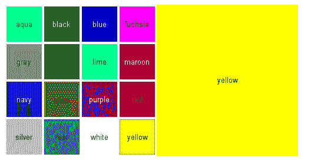

# GWT 定制小部件

> 原文：<https://www.javatpoint.com/gwt-custom-widget>

谷歌网络工具包提供了多种创建定制小部件的方法。最简单的方法是通过对现有的基本小部件进行分组并添加一些交互逻辑来创建复合小部件。

要创建自定义小部件，需要实现以下三个创建自定义小部件的一般概念:

1.  构建复合小部件。
2.  为新的小部件创建 Java 代码。
3.  使用 JSNI 方法包装 JavaScript。

### 构建复合小部件

要创建复合小部件，它应该扩展**复合类**。复合组件是一个专门的小部件，可以包含另一个组件。它的行为就像它包含的小部件一样。在创建复合小部件时，我们可以将现有的小部件组合成一个本身就是可重用小部件的复合部件。

### 为新部件创建 Java 代码

Widget 是在 package**com . Google . gwt . user . client . ui**下用 java 语言编写的。源代码在 gwt-user.jar 中，用这种方法创建一个基本的小部件是一个复杂的方法。许多基本的小部件都是这样写的，比如按钮和文本框。

### 使用 JSNI 方法包装 JavaScript

当实现直接从**小部件基类**派生的自定义小部件时，我们使用 JavaScript 编写一些小部件的方法。这个方法最终实现了，因为它变得更加难以调试。

## GWT 定制小部件示例

**/*colorpicker.java*T3】**

```
import com.google.gwt.event.dom.client.*;
import com.google.gwt.user.client.*;
import com.google.gwt.user.client.ui.*;

public class GwtColorPicker extends Composite
                            implements ClickHandler {

    // The currently selected color name to give client-side 
    // feedback to the user.
    protected Label currentcolor = new Label();

    public GwtColorPicker() {
        // Create a 4x4 grid of buttons with names for 16 colors
        final Grid grid = new Grid(4, 4);
        final String[] colors = new String[] { "aqua", "black",
                "blue", "fuchsia", "gray", "green", "lime",
                "maroon", "navy", "olive", "purple", "red",
                "silver", "teal", "white", "yellow" };
        int colornum = 0;
        for (int i = 0; i < 4; i++) {
            for (int j = 0; j < 4; j++, colornum++) {
                // Create a button for each color
                Button button = new Button(colors[colornum]);
                button.addClickHandler(this);

                // Put the button in the Grid layout
                grid.setWidget(i, j, button);

                // Set the button background colors.
                DOM.setStyleAttribute(button.getElement(),
                                      "background",
                                      colors[colornum]);

                // For dark colors, the button label must be
                // in white.
                if ("black navy maroon blue purple"
                        .indexOf(colors[colornum]) != -1) {
                    DOM.setStyleAttribute(button.getElement(),
                                          "color", "white");
                }
            }
        }

        // Create a panel with the color grid and currently
        // selected color indicator.
        final HorizontalPanel panel = new HorizontalPanel();
        panel.add(grid);
        panel.add(currentcolor);

        // Set the class of the color selection feedback box 
        // to allow CSS styling. We need to obtain the DOM
        // element for the current color label. This assumes 
        // that the HorizontalPanel 的元素是标签元素的父元素。请注意，//元素在小部件被//添加到水平面板之前没有父元素。final ElEMENT panel cell = DOM . GetParent(current color . GetElEMENT())；DOM . SetElementProperty(panel cell，“className”，“color picker-current colorbox”)；//设置初始颜色。这将被从服务器读取的//值覆盖。setColor(“白色”)；//复合 GWT 小部件必须调用 initWidget()。initWidget(面板)；} /**手柄单击颜色按钮。*/@覆盖公共 void onClick(ClickEvent 事件){ //使用按钮标签作为颜色名称来设置 setColor(((Button)event . getsource())。getText())；} /**设置当前选定的颜色。*/public void setColor(String new color){//通过更改标签中的颜色//名称给出客户端反馈。current color . SetText(new color)；//获取 DOM 元素。这假设
        // element of the HorizontalPanel is the parent of the
        // caption element.
        final Element caption = currentcolor.getElement();
        final Element cell = DOM.getParent(caption);

        // Give feedback by changing the background color
        DOM.setStyleAttribute(cell, "background", newcolor);
        DOM.setStyleAttribute(caption, "background", newcolor);
        if ("black navy maroon blue purple"
                .indexOf(newcolor) != -1)
            DOM.setStyleAttribute(caption, "color", "white");
        else
            DOM.setStyleAttribute(caption, "color", "black");
    }
}

**/*color picker . CSS***

```
/* Set style for the color picker table.
 * This assumes that the Grid layout is rendered
 * as a HTML . */
table.example-colorpicker {
    border-collapse: collapse;
    border: 0px;
}

/* Set color picker button style.
 * This does not make assumptions about the HTML
 * element tree as it only uses the class attributes
 * of the elements. */
.example-colorpicker .gwt-Button {
    height: 60px;
    width: 60px;
    border: none;
    padding: 0px;
}

/* Set style for the right-hand box that shows the
 * currently selected color.  While this may work for
 * other implementations of the HorizontalPanel as well,
 * it somewhat assumes that the layout is rendered
 * as a table where cells are 
|  elements. */
.colorpicker-currentcolorbox {
    width: 240px;
    text-align: center;
    /* Must be !important to override GWT styling: */
    vertical-align: middle !important;
}

输出:

