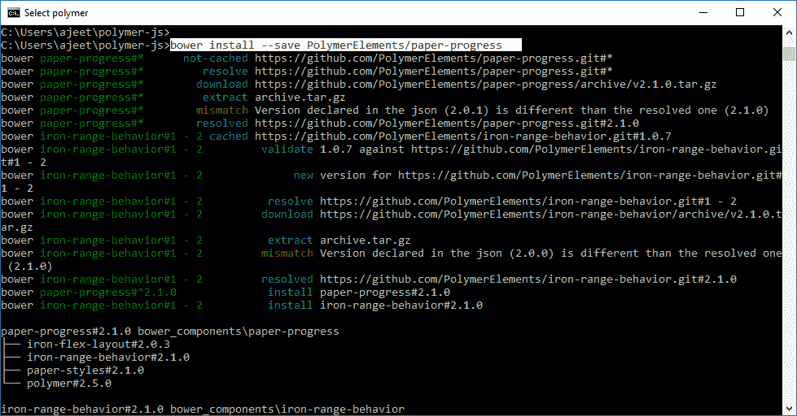
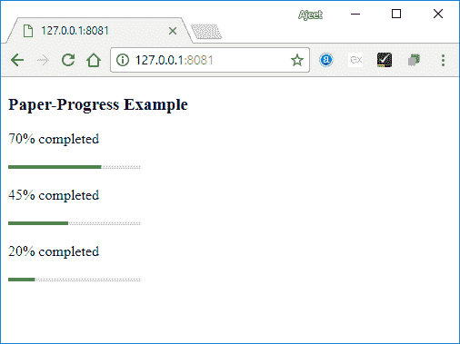

# PolymerPaper 进展

> 原文：<https://www.javatpoint.com/polymer-paper-progress>

在 Polymer.js 中，纸张进度条用于确定任务完成的百分比。它指定用户必须花费多少时间来完成任务。次要进度也可用于显示中间进度。

在命令提示符下使用以下命令，在工作状态下获取目录中的纸张进度。

```

bower install --save PolymerElements/paper-progress

```



### 示例:

创建一个 index.html 文件，并在其中添加以下代码，以查看 Polymer.js 中纸张进度元素的使用

```

<!doctype html>
<html>
   <head>
      <link rel = 'import' href = 'my-app.html'>
   </head>
   <body>    
      <my-app></my-app>
   </body>
</html>

```

现在，打开 my-app.html 文件，并在其中包含以下代码。

```

<link rel = 'import' href = 'bower_components/polymer/polymer.html'>
<link rel = "import" href = "bower_components/paper-progress/paper-progress.html">
<dom-module id = 'my-app'>
   <template>
      <style>
         paper-progress {
            display: block;
            width: 30%;
            margin: 20px 0;
         }
      </style>      
      <h3>Paper-Progress Example</h3>
      <p>70% completed</p>
      <paper-progress value = "70"></paper-progress>
      <p>45% completed</p>
      <paper-progress value = "45"></paper-progress>
      <p>20% completed</p>
      <paper-progress value = "20"></paper-progress>
   </template>  
   <script>
      Polymer ({
         is: 'my-app', ready: function() {
            this.async(function() {         
            });
         }
      });
   </script>
</dom-module>

```

**输出**

