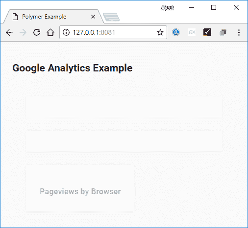

# Polymer 谷歌分析查询

> 原文：<https://www.javatpoint.com/polymer-google-analytics-query>

谷歌分析是谷歌网络组件的一个元素，用于查询谷歌分析核心报告应用编程接口。

运行以下命令在项目目录中安装 google-analytics 元素。之后，您可以在应用程序中使用这个元素:

```

bower install --save GoogleWebComponents/google-analytics

```

### 例子

创建一个 index.html 文件，并在其中添加以下代码，以查看谷歌分析元素在聚合体中的使用

```

<!doctype html>
<html>
<head>
<title>Polymer Example</title>
<script src = "bower_components/webcomponentsjs/webcomponents-lite.js"></script>
<link rel = "import" href = "bower_components/polymer/polymer.html">
<link rel = "import" href = "bower_components/paper-styles/demo-pages.html">
<link rel = "import" href = "bower_components/google-signin/google-signin.html">
<link rel = "import" href = "bower_components/google-analytics/google-analytics.html">

<style>
google-analytics-dashboard {
display: block;
padding: 2em;
transition: opacity .2s ease;
         }
google-analytics-dashboard:not([authorized]) {
opacity: .3;
pointer-events: none;
         }
google-analytics-chart {
box-shadow: 0 0 .5em rgba(0,0,0,.1);
background: #fff;
float: left;
margin: 0 2em 2em 0;
padding: 2em 2em 1em;
transition: opacity .2s ease;
max-width: 100%;
         }
google-analytics-view-selector, google-analytics-date-selector {
box-shadow: 0 0 .5em rgba(0,0,0,.1);
background: #fff;
display: -webkit-flex;
display: -ms-flexbox;
display: flex;
            -webkit-flex-direction: column;
            -ms-flex-direction: column;
flex-direction: column;
margin: 0 0 2em 0;
max-width: 600px;
padding: 2em .5em 1em 2em;
         }
google-analytics-date-selector {
max-width: 500px;
         }
google-analytics-view-selector {
max-width: 750px;
         }
:root {
            --google-analytics-control: {
display: block;
               -webkit-flex: 1 1 0%;
               -ms-flex: 1 1 0%;
flex: 1 1 0%;
margin: 0 1.5em 1em 0;
min-width: 0;
            };
            --google-analytics-label: {
display: block;
font-weight: bold;
padding: 0 0 .4em 2px;
            };
            --google-analytics-field: {
border: 1px solid #ccc;
border-radius: 4px;
box-sizing: border-box;
height: 34px;
line-height: 20px;
padding: 6px 12px;
transition: border-color .2s;
width: 100%;
            };
            --google-analytics-field-focus: {
border-color: #4d90fe;
outline: 0;
            };
         }
google-analytics-view-selector {
            --google-analytics-view-selector-control:
var(--google-analytics-control);

            --google-analytics-view-selector-label:
var(--google-analytics-label);

            --google-analytics-view-selector-select:
var(--google-analytics-field);

            --google-analytics-view-selector-select-focus:
var(--google-analytics-field-focus);
         }
google-analytics-date-selector {
            --google-analytics-date-selector-control:
var(--google-analytics-control);

            --google-analytics-date-selector-label:
var(--google-analytics-label);

            --google-analytics-date-selector-input:
var(--google-analytics-field);

            --google-analytics-date-selector-input-focus:
var(--google-analytics-field-focus);
         }
</style>
</head>

<body>
<h2>Google Analytics Example</h2>
<google-signin></google-signin>

<google-analytics-dashboard>
<google-analytics-view-selector></google-analytics-view-selector>
<google-analytics-date-selector></google-analytics-date-selector>

<google-analytics-chart
type = "pie"
metrics = "ga:pageviews"
dimensions = "ga:browser"
sort = "-ga:pageviews"
max-results = "5">
<h3>Pageviews by Browser</h3>
</google-analytics-chart>
</google-analytics-dashboard>
</body>
</html>

```

**输出:**

