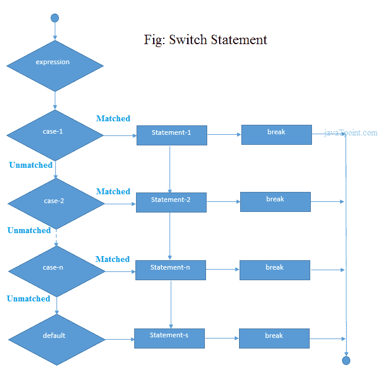
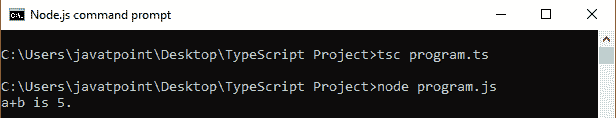
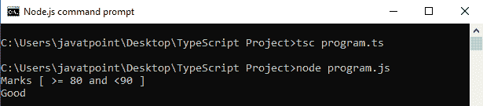
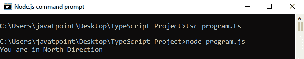
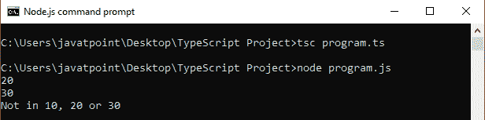

# TypeScript 切换语句

> 原文：<https://www.javatpoint.com/typescript-switch-statement>

TypeScript 开关语句从多个条件中执行一条语句。它根据表达式的值计算表达式的值，该值可以是布尔值、数字、字节、短整型、整型、长整型、枚举类型、字符串等。switch 语句有一个对应于每个值的代码块。当找到匹配时，将执行相应的块。switch 语句的工作方式类似于 if-else-if 梯形语句。

**在切换语句中必须记住以下几点:**

*   switch 语句中可以有 N 种情况。
*   案例值必须唯一。
*   案例值必须是常数。
*   每个 case 语句在代码末尾都有一个 break 语句。break 语句是可选的。
*   switch 语句有一个写在最后的默认块。默认语句是可选的。

### 句法

```

switch(expression){

case expression1:
    //code to be executed;
    break;  //optional

case expression2:
    //code to be executed;
    break;  //optional
    ........

default:
    //when no case is matched, this block will be executed;
    break;  //optional
}

```

switch 语句包含以下内容。switch 语句中可以有任意数量的情况。

**Case:**Case 后面应该只有一个常量，然后是一个分号。它不能接受另一个变量或表达式。

**Break:**Break 应该写在块的末尾，以便在执行一个 case 块后从 switch 语句中出来。如果我们不写 break，执行将继续，将匹配的值传递给后续的 case 块。

**Default:** 默认块应该写在 switch 语句的末尾。它在没有匹配案例时执行。



### 例子

```

let a = 3;
let b = 2;

switch (a+b){
    case 1: {
        console.log("a+b is 1.");
        break;
    }
    case 2: {
        console.log("a+b is 5.");
        break;
    }
    case 3: {
        console.log("a+b is 6.");
        break;
    }

    default: {
        console.log("a+b is 5.");
        break;
    }
}

```

**输出:**



* * *

## 带细绳的开关盒

```

let grade: string = "A";
switch (grade)
{ 
    case'A+':
      console.log("Marks >= 90"+"\n"+"Excellent");
      break;

    case'A':
      console.log("Marks [ >= 80 and <90 ]"+"\n"+"Good");
      break;

    case'B+':
      console.log("Marks [ >= 70 and <80 ]"+"\n"+"Above Average");
      break;

    case'B':
      console.log("Marks [ >= 60 and <70 ]"+"\n"+"Average");
      break;

    case'C':
      console.log("Marks < 60"+"\n"+"Below Average");
      break;

    default:
        console.log("Invalid Grade.");
}

```

在这个例子中，我们有一个字符串变量 grade。switch 语句计算等级变量值并与 case 子句匹配，然后执行其相关语句。

**输出:**



* * *

## 带枚举的开关盒

在 TypeScript 中，我们可以通过以下方式将开关用例与枚举一起使用。

### 例子

```

enum Direction {
    East,
	West,
	North,
    South    
};
var dir: Direction = Direction.North;

function getDirection() {
    switch (dir) {
        case Direction.North: console.log('You are in North Direction');
            break;
        case Direction.East: console.log('You are in East Direction');
            break;
        case Direction.South: console.log('You are in South Direction');
            break;
        case Direction.West: console.log('You are in West Direction');
            break;
    }
}
getDirection();

```

**输出:**



* * *

## TypeScript 切换语句是失败的。

TypeScript 开关语句是失败的。这意味着如果 break 语句不存在，那么它将在第一个匹配大小写之后执行所有语句。

### 例子

```

let number = 20;  
switch(number)
{  
    //switch cases without break statements  
    case 10: console.log("10");  
    case 20: console.log("20");  
    case 30: console.log("30");  
    default: console.log("Not in 10, 20 or 30");
}

```

**输出:**

