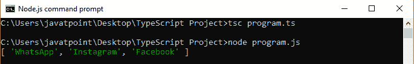
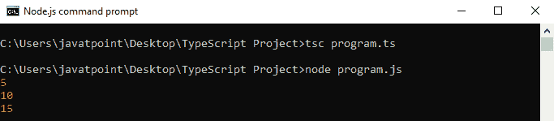

# TypeScript forEach

> 原文：<https://www.javatpoint.com/typescript-foreach>

forEach()方法是一种数组方法，用于对数组 中的每一项 ***执行一个函数。我们可以将它用于像数组、地图、集合等 JavaScript 数据类型。这是一种在数组中显示元素的有用方法。***

### 句法

我们可以如下声明 forEach()方法。

```

array.forEach(callback[, thisObject]);

```

forEach()方法按照**升序**对数组中的每个元素执行一次提供的**回调**。

### 参数详细信息

**1。回调:**是用来测试每个元素的函数。回调函数接受**三个参数**，如下所示。

*   **元素值:**是该物品的当前值。
*   **元素索引:**是数组中当前处理元素的索引。
*   **数组:**这是一个正在 forEach()方法中迭代的数组。

#### 注意:这三个参数是可选的。

**2。thisObject:** 它是一个在执行回调时用作这个的对象。

### 返回值

它将返回创建的数组。

### 带字符串的示例

```

let apps = ['WhatsApp', 'Instagram', 'Facebook'];
let playStore = [];

apps.forEach(function(item){
  playStore.push(item)
});

console.log(playStore);

```

对应的 JavaScript 代码是:

```

var apps = ['WhatsApp', 'Instagram', 'Facebook'];
var playStore = [];
apps.forEach(function (item) {
    playStore.push(item);
});
console.log(playStore);

```

**输出:**



### 带数字的示例

```

var num = [5, 10, 15];
num.forEach(function (value) {
  console.log(value);
});

```

**输出:**



### forEach()的缺点

以下是使用 forEach()方法的缺点:

1.  它不提供停止或**中断**forEach()循环的方法。
2.  只有**和**用数组工作。

* * *