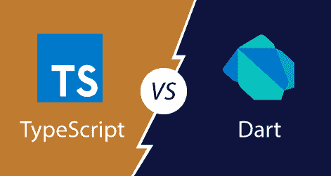

# TypeScript 和飞镖的区别

> 原文：<https://www.javatpoint.com/typescript-vs-dart>

## 镖

Dart 是一种开源的、通用的、基于类的、面向对象的语言，具有 T2 C 风格的语法，可以选择性地转换成 JavaScript。它用于构建移动、桌面和网络应用程序。它支持各种编程概念，如接口、类、集合、泛型、混合和可选类型。由**谷歌**开发，后被 **ECMA 集团**批准为标准。Dart 最初发布于【2013 年 11 月。

Dart 可以用来创建**单页应用**，只适用于网站和 web 应用。单页应用程序支持在网站屏幕之间导航，而无需在浏览器中加载不同的网页。一个经典的例子是 Gmail。在 Gmail 中，当您点击收件箱中的邮件时，浏览器会停留在同一网页上，但 JavaScript 代码会隐藏收件箱，并将邮件正文显示在屏幕上。

**飞镖优势**

*   对于有 [C#](c-sharp-tutorial) 、 [Java](java-tutorial) 、 [JavaScript](javascript-tutorial) 知识的开发人员来说很容易学会。
*   Dart 编译成 JavaScript，这有助于在现代网络上轻松运行 Dart 应用程序。
*   它有强大的工具支持。
*   它支持运算符重载。
*   它是一种面向对象的编程语言，支持继承、接口和可选的类型特性。

## 以打字打的文件

TypeScript 是一种开源的纯面向对象编程语言。它是 JavaScript 的强类型**超集**，可以编译成普通的 JavaScript。TypeScript 由**微软**根据 **Apache 2** 许可证开发和维护。它不是直接在浏览器上运行的。它需要一个编译器在 JavaScript 文件中编译生成。TypeScript 源文件在中。ts "扩展。

我们可以将 Typescript 用于**服务器端**和**客户端**网络应用程序。也用于开发**大规模**网络应用。它增加了对 ECMAScript 中存在的不同特性的支持，ECMAScript 由 ECMA 集团的一个 **TC39** 委员会维护。

**安德斯·海尔斯伯格**开发了 TypeScript。其第一版于 2012 年 10 月**向公众推出**。经过微软两年的内部开发，新版 **TypeScript 0.9** 于 **2013** 发布。当前版本的 TypeScript 为 **TypeScript 3.4.5** ，于 2019 年 4 月 24 日**发布。**

 ****TypeScript 的优势**

*   它用于服务器端和客户端语言。
*   它是一种开源和面向对象的编程语言。
*   最适合大型项目。
*   它支持 ECMA 脚本 6 功能。
*   它是 JavaScript 的超集。

## TypeScript 与飞镖

我们可以从下表中了解 TypeScript 和 Dart 之间的主要区别。

|  | 以打字打的文件 | 镖 |
| **简介** | TypeScript 是一种开源的纯面向对象编程语言。它是 JavaScript 的强类型超集，可以编译成普通的 JavaScript。 | Dart 是一种开源的、通用的、基于类的、面向对象的语言，具有 C 风格的语法，可以选择性地跨代码编译成 JavaScript。 |
| **归**所有 | 微软 | 谷歌 |
| **由**创建 | 安德斯·赫斯伯格 | 拉斯·贝克和卡斯珀·伦德 |
| **首次发布** | TypeScript 的第一次发布是在 2012 年 10 月。 | Dart 的首次发布是在 2013 年 11 月。 |
| **牌照** | Apache 2.0。 | 巴克利软件发行公司。 |
| **当前版本** | TypeScript 的当前版本是 2019 年 7 月的 3.5.3。 | Dart 的当前版本是 2019 年 6 月的 2.4。 |
| **设计** | 它是 JavaSript 的类型化超集。 | 它是一种完整的脚本语言，不是 JavaSript 的超集。 |
| **操作员超载** | 它不支持运算符重载。 | 它支持运算符重载。 |
| **图书馆** | 有数量适中的图书馆。 | 与 TypeScript 相比，可用的库数量更多。 |
| **工装支架** | TypeScript 支持以下工具:

*   VS 代码
*   web 图形
*   开发工具
*   原子
*   lofty
*   solar eclipse
*   精力
*   编辑器

 | Dart 支持以下工具:

 |
| **构建工具** | 它有自己的构建工具。 | 它支持所有主要的 JavaScript 构建工具(浏览器、大口、咕噜、网络包等)。) |

* * ***