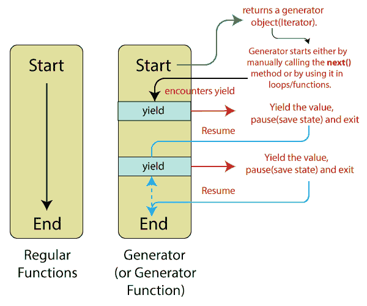

# ES6 发电机

> 原文：<https://www.javatpoint.com/es6-generators>

发电机(或发电机功能)是 ES6 中引入的新概念。它为您提供了一种使用迭代器和函数的新方法。

ES6 生成器是一种不同的功能，可以在中间暂停一次或多次，稍后可以恢复。当调用标准函数时，控制停留在被调用的函数上，直到它返回，但是 [ES6](https://www.javatpoint.com/es6) 中的生成器允许调用函数控制被调用函数的执行。



生成器与正则函数在某些地方是相同的，除了:

*   当生成器被调用时，它不运行它的代码。相反，它返回一个特殊的对象，称为“**生成器对象**，用于管理执行。
*   生成器函数可以在任何时候将控制返回给调用者(**或让出**)。
*   与常规函数不同，生成器可以根据需求一个接一个地返回(**或产生**)多个值。

### 句法

生成器函数的语法几乎与正则函数相同。唯一真正的区别是，生成器函数由**表示，在**函数关键字**后面加上一个**星号(*)** 。**

在下面的语法中，我们向您展示了定义生成器函数的一些有效方法:

```

function* mygenfun()	// Valid
{
yield 1;
yield 2;
...
...
}

function *mygenfun()	// Valid
{
yield 1;
yield 2;
...
...
}

function*mygenfun()	// Valid
{
yield 1;
yield 2;
...
...
}

```

### 例子

```

function* gen()
{
yield 100;
yield;
yield 200;
}
// Calling the Generator Function
var mygen = gen();
console.log(mygen.next().value);
console.log(mygen.next().value);
console.log(mygen.next().value);

```

**输出**

```
100
undefined
200

```

## 收益率报表

yield 语句暂停函数执行，并将一个值发送回调用方。它保留了足够的状态，使功能能够从停止的地方恢复。当它恢复时，函数在最后一次产出运行后立即继续执行。它可以产生一系列的值。

## next()方法

在上面的例子中，我们使用了 **next()** 方法，这是生成器的主要方法。当您调用带有参数的 **next()** 方法时，它将恢复生成器函数的执行，用来自 **next()方法的参数替换**产生的**表达式，其中执行被暂停。**

**next()** 方法的结果总是一个具有两个属性的对象:

*   **值:**是屈服值。
*   **done:** 是一个布尔值，如果函数代码已经完成，则该值为真。否则，它给出假的。

例如，在这里，我们正在创建一个生成器函数，并获取它的返回值。

### 例子

```

function* show() {
yield 100;
}

var gen = show();	//here 'gen' is a generator object
console.log(gen.next()); // { value: 100, done: false }

```

**输出**

```
{ value: 100, done: false }

```

## 生成器对象

生成器函数返回生成器对象。生成器对象是生成器函数的一个实例，它符合 iterable 和 iterator 接口。

可以通过调用 **next()方法**或在循环中使用生成器对象来使用生成器对象。生成器对象是迭代器；这就是为什么你可以在**中使用它来处理**循环或者其他接受可迭代的函数。

在上面的 **next()方法**示例中，变量 **gen** 是生成器对象。

## 生成器中的返回语句

Return 用于将指定的值发送回其调用方。它用于结束函数调用的执行，并将结果返回给调用方。在函数中，在返回语句之后定义的语句不会被执行。这就是为什么 return 语句应该是函数的最后一个语句。

让我们通过一个例子来理解生成器中的**返回**语句:

### 例子

```

function* myGen()  {
yield 'First yield statement';
yield 'Second yield statement';
return 'Return statement';
yield 'Second yield statement';
}
let genobj = myGen();

console.log(genobj.next());    //returns {value: 'First yield statement', done: false}

console.log(genobj.next());   //returns {value: 'Second yield statement', done: false}

console.log(genobj.next());  //returns {value: 'Return statement', done: true}

console.log(genobj.next());	//returns {value: undefined, done: true}

```

**输出**

```
{ value: 'First yield statement', done: false }
{ value: 'Second yield statement', done: false }
{ value: 'Return statement', done: true }
{ value: undefined, done: true }

```

在上面的例子中，我们定义了一个生成器函数 **myGen()** ，其中我们定义了四个语句，包括三个 **yield 语句**和一个 **return 语句。**每当我们调用 **next()方法时，**函数就会恢复，直到它命中下一个 **yield 语句。**

您可以注意到第一个 **next()方法**如何返回**“第一个收益率声明”**当我们第二次调用 **next()方法 a** 时，它恢复执行并返回**“第二次收益声明”**。再次调用**下一个()方法**后，函数不再找到 **yield** 语句，返回**“Return 语句”**但是当我们第四次调用 **next()方法**时，它不会考虑 **yield** 语句并返回 **undefined** ，因为它写在 **return** 语句之后。

在上例的输出中可以看到 **next()方法**并不考虑**返回语句之后的任何语句。**

## 带有 for…循环的生成器函数

使用带生成器函数的 for…循环减少了代码行。您可以在下面的示例中看到相同的插图。

### 例子

```

"use strict" 
function* vowels() { 
   // here the asterisk marks this as a generator 
   yield 'A'; 
   yield 'E'; 
   yield 'I'; 
   yield 'O'; 
   yield 'U'; 
} 
for(let alpha of vowels()) { 
   console.log(alpha); 
}

```

**输出**

```
A
E
I
O
U

```

#### 注意:生成器函数不能用箭头函数表示。

* * *