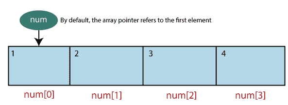

# 它有 6 个阵列

> 原文：<https://www.javatpoint.com/es6-arrays>

[JavaScript 中的数组](https://www.javatpoint.com/javascript-array)是一个对象，用来表示相似类型元素的集合。它允许您在单个变量名中存储多个值或一组值。数组用于按时间顺序存储值的集合。数组是同质元素的集合，或者我们可以说数组是相同数据类型的值的集合。

我们可以存储任何有效值，如对象、数字、字符串、函数以及其他数组，这使得创建复杂的数据结构成为可能，如数组或对象数组。

### 句法

声明数组有两种方法。

```

var array_name = new Array();  // By using the new keyword

var array_name = [value1, value2,....valueN];  //By using Array literals
				or,
var array_name;   //Declaration
array_name=[value1, value2,…..valueN]; //Initialization

```

数组参数包含整数和字符串的列表。建议使用**数组文字**来创建数组，而不是使用**新关键字**。

新的关键字只会使代码变得复杂，有时还会产生意想不到的结果。如果在数组的构造函数中指定一个数字参数(或者用新的关键字**创建一个数组)，那么它将被视为数组的长度。**

#### 注意:数组允许的最大长度是 4，294，967，295。

假设像 **var num = [1，2，3，4]** 这样的声明会给你一个数组，如下所示:

## 访问数组元素

数组是从 0 开始索引的。后跟下标的数组名用于引用数组元素。

### 句法

```

array_name[subscript];

```

### 例子

```

var num;
num = [2,4,6,8];
console.log(num[0]);
console.log(num[1]);

```

**输出**

```
2
4

```

## 数组构造器

我们也可以使用数组构造函数创建一个数组。数组构造函数可以传递为:

*   用逗号或逗号分隔的值列表，
*   指示数组大小的数值

以下示例将向您展示相同的插图:



### 示例-单个数值

```

var num = new Array(5); // This single numeric value indicates the size of array.
var i;
for(i=0;i
```

**输出**

```
0
5
10
15
20

```

### 示例-逗号分隔值

```

var num = new Array(1,2,3,4,5);
var i;
for(i=0;i
```

**输出**

```
1
2
3
4
5

```

## JavaScript 数组

JavaScript 支持以下类别的数组。

*   多维数组
*   将数组传递给函数
*   从函数返回数组

### ES6 多维阵列

[ES6](https://www.javatpoint.com/es6) 也支持多维数组概念。多维数组可以定义为对另一个数组的数组引用。

JavaScript 中没有直接提供多维数组。如果需要创建多维数组，必须使用一维数组。

我们也可以说二维数组是多维数组最简单的形式。

**申报**

以下语法说明了如何在 JavaScript 中声明二维数组。

```

var array_name = [[value1,value2,value3],[val1,val2,val3]];

```

**数组二维元素的访问**

```

var array_name[initial_array_index][referenced_array_index]

```

**例**

```

var multi = [[2,3,4],[4,9,16]]  
console.log(multi[0][0]) 
console.log(multi[0][1]) 
console.log(multi[0][2]) 
console.log(multi[1][0]) 
console.log(multi[1][1]) 
console.log(multi[1][2])    

```

**输出**

```
2
3
4
4
9
16

```

### 将数组传递给函数

将数组作为参数传递给函数时，必须指定不带括号的数组名称(对数组的引用)。让我们试着用下面的例子来理解它。

**例**

```

var rainbow = new Array["Violet", "Indigo", "Blue", "Green", "Yellow", "Orange", "Red"];
function show(rainbow) {    
   for(var i = 0;i
```

**输出**

```
Violet
Indigo
Blue
Green
Yellow
Orange
Red

```

### 从函数返回数组

它允许函数返回数组。

**例**

```

function show() { 
    return new Array("Blue", "Red", "Green", "Yellow") 
 } 
 var colors = show() 
 for(var i in colors) { 
    console.log(colors[i])   
 }

```

**输出**

```
Blue
Red
Green
Yellow

```

## 数组方法

ES6 中的数组方法对于处理存储在数组中的数据非常有用。数组方法用于使用数组轻松执行复杂的任务。

点击此链接[可以了解更多数组方法 ES6 数组方法](es6-array-methods)

## 析构赋值

ES6 为我们提供了一个名为**析构赋值**的新特性，它允许我们从对象和数组中提取特定的项，并通过使用速记语法将它们放入变量中。它不仅有助于减少代码，而且改变了代码的结构方式。它是打破结构的过程。

析构赋值是一个 JavaScript 表达式，它可以从数组、映射、集合以及不同变量中的对象属性中提取数据。

## 数组析构

解构意味着把一个复杂的结构分解成更简单的部分。使用析构语法，您可以从对象和数组中提取更小的片段。它可以用于赋值和变量声明。

要了解更多关于数组析构的内容，可以点击此链接 [ES6 数组析构](es6-array-destructuring)。

## 对象破坏

它类似于数组析构，只是不是从数组中取出值，而是可以从对象中取出属性(或键)及其对应的值。

想了解更多关于对象析构的内容，可以点击此链接 [ES6 对象析构](es6-object-destructuring)。

* * *