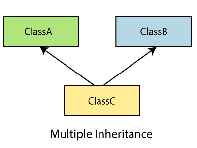
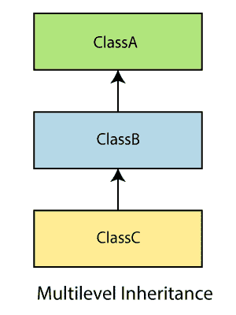

# ES6 类

> 原文：<https://www.javatpoint.com/es6-classes>

类是面向对象编程的一个重要部分。类用于定义现实世界对象建模的蓝图，并将代码组织成可重用的逻辑部分。

在 ES6 之前，很难在 [JavaScript](https://www.javatpoint.com/javascript-tutorial) 中创建一个类。但是在 ES6 中，我们可以使用 **class** 关键字来创建类。我们可以通过类表达式或使用类声明在代码中包含类。

一个类定义只能包含**构造函数**和**函数**。这些组件一起被称为类的数据成员。这些类包含**构造器**，为类的对象分配内存。类包含负责对对象执行操作的**功能**。

#### 注意:类的主体只包含方法，而不是数据属性。

**语法:类表达式**

```

var var_name = new class_name {
}

```

**语法:类声明**

```

class Class_name{
}

```

让我们看看类表达式和类声明的图示。

**示例-类别声明**

```

class Student{
    constructor(name, age){
    this.name = name;
    this.age = age;
    }

}

```

**示例类表达式**

```

var Student = class{
    constructor(name, age){
    this.name = name;
    this.age = age;
    }
}

```

## 从类实例化对象

像其他面向对象的编程语言一样，我们可以使用 new 关键字从类中实例化一个对象。

**语法**

```

var obj_name = new class_name([arguements])

```

**例**

```

var stu = new Student('Peter', 22)

```

## 访问功能

对象可以访问类的属性和函数。我们使用**' '点符号(**或**句点)**用于访问类的数据成员。

**语法**

```

obj.function_name();

```

**例**

```

'use strict' 
class Student { 
   constructor(name, age) { 
      this.n = name; 
      this.a = age;
   } 
   stu() { 
      console.log("The Name of the student is: ", this.n) 
      console.log("The Age of the student is: ",this. a) 
   } 
} 

var stuObj = new Student('Peter',20); 
stuObj.stu();

```

在上面的例子中，我们已经声明了一个类**学生**。该类的构造函数包含两个参数**名称**和**年龄，**。关键字**‘this’**指的是类的当前实例。我们也可以说上面的构造函数初始化了两个变量**‘n’和‘a’**以及传递给构造函数的参数值。

类中的函数 **stu()** 将打印**姓名**和**年龄**的值。

**输出**

```
The Name of the student is:  Peter
The Age of the student is:  20

```

#### 注意:在类中包含构造函数定义是必需的，因为默认情况下，每个类都有一个构造函数。

## 静态关键字

**static** 关键字用于制作类中的静态函数。静态函数只能通过使用类名来引用。

**例**

```

'use strict' 
class Example { 
   static show() { 
      console.log("Static Function") 
   } 
} 
Example.show() //invoke the static method

```

**输出**

```
Static Function

```

## 类继承

在 [ES6](https://www.javatpoint.com/es6) 之前，继承的实现需要几个步骤。但是 ES6 通过使用**扩展**和**超级**关键字简化了继承的实现。

继承是从现有实体创建新实体的能力。为创建新类而扩展的类称为**超类/父类**，而新创建的类称为**子类/子类**。

一个类可以通过使用**‘extends’**关键字从另一个类继承。除了父类的构造函数，子类继承了所有的属性和方法。

**语法**

```

class child_class_name extends parent_class_name{
}

```

一个类通过使用**扩展**关键字从另一个类继承。

**例**

```

'use strict' 
class Student { 
   constructor(a) { 
    this.name = a;
   } 
} 
class User extends Student { 
   show() { 
      console.log("The name of the student is:  "+this.name) 
   } 
} 
var obj = new User('Sahil'); 
obj.show()

```

在上面的例子中，我们已经声明了一个班级**学生**。通过使用**扩展**关键字，我们可以创建一个新的类**用户**，该用户与其父类**学生**具有相同的特征。所以，我们可以看到这些类之间是有继承关系的。

**输出**

```
The name of the student is:  Sahil

```

## 继承的类型

继承可以分为单级继承、多级继承和多级继承。ES6 不支持多重继承。

### 单级继承

它被定义为一个派生类只能从一个基类继承的继承。它允许派生类继承基类的行为和属性，从而实现代码的可重用性以及向现有代码添加新功能。它减少了代码的重复。


### 多重继承

在多重继承中，一个类可以从几个类中继承。ES6 不支持。



### 多级继承

在多级继承中，派生类是从另一个派生类创建的。因此，多级继承有多个父类。



让我们用下面的例子来理解它。

**例**

```

class Animal{  
   eat(){
      console.log("eating...");
   }  
   }  
   class Dog extends Animal{  
    bark(){
       console.log("barking...");
   }  
   }  
   class BabyDog extends Dog{  
    weep(){
       console.log("weeping...");
      }  
   }  
   var d=new BabyDog();  
   d.eat();  
   d.bark();  
   d.weep();  

```

**输出**

```
eating...
barking...
weeping...

```

## 方法重写和继承

这是一个允许子类提供其父类之一已经提供的方法的特定实现的特性。

为方法重写定义了一些规则-

*   方法名必须与父类中的相同。
*   方法签名必须与父类中的相同。

让我们试着理解同样的插图:

**例**

```

'use strict' ;
class Parent { 
   show() { 
      console.log("It is the show() method from the parent class");
   }
}
class Child extends Parent { 
   show() { 
      console.log("It is the show() method from the child class");
   } 
} 
var obj = new Child(); 
obj.show();

```

在上面的例子中，超类函数的实现在子类中发生了变化。成功执行上述代码后，您将获得以下输出:

**输出**

```
It is the show() method from the child class

```

## 超级关键词

它允许子类调用直接父类的属性、方法和构造函数。它是在 ECMAScript 2015 或 ES6 中引入的。 **super.prop** 和**super【expr】**表达式在对象文字和类中的任何方法的定义中都是可读的。

**语法**

super(arguments);

**例**

在这个例子中，父类的特性已经扩展到了它的子类。这两个类都有其独特的属性。这里，我们使用 **super** 关键字来访问从父类到子类的属性。

```

'use strict' ;
class Parent { 
   show() { 
      console.log("It is the show() method from the parent class");
   }
}
class Child extends Parent { 
   show() {
      super.show();
      console.log("It is the show() method from the child class");
   } 
} 
var obj = new Child(); 
obj.show();

```

**输出**

```
It is the show() method from the parent class
It is the show() method from the child class

```

* * *