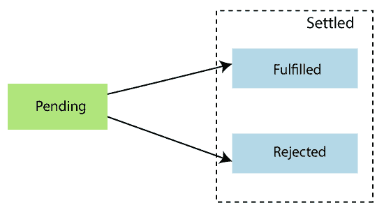
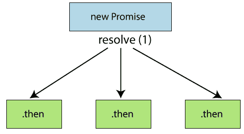
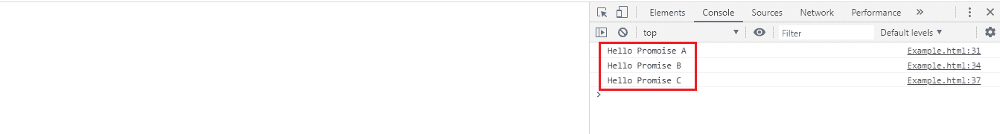

# ES6 承诺

> 原文：<https://www.javatpoint.com/es6-promises>

承诺代表最终实现的东西。承诺可以根据操作结果被拒绝或解决。

[ES6](https://www.javatpoint.com/es6) Promise 是在 [JavaScript](https://www.javatpoint.com/javascript-tutorial) 中使用异步编程最简单的方法。异步编程包括从主线程单独运行进程，并在主线程完成时通知主线程。在承诺之前，**回调**用于执行异步编程。

## 回收

回调是一种在另一个函数执行完成后处理函数执行的方法。

回调将有助于处理事件。在回调中，一个函数可以作为参数传递给另一个函数。

## 为什么需要承诺？

回调是处理像最小异步操作这样的基本情况的好方法。但是，当您开发一个包含大量代码的 web 应用程序时，使用回调会很麻烦。这种过度的回调嵌套通常被称为**回调地狱**。

处理这种情况，就要用**承诺**而不是**回电**。

## Promise 是如何工作的？

承诺代表**异步操作**的完成。它根据被**拒绝**或**解决**的操作返回单个值。承诺主要有三个阶段，如下所示:



**待定-** 是每个承诺的初始状态。它表示结果还没有计算出来。

**完成-** 表示操作已经完成。

**拒绝-** 表示计算过程中出现故障。

一旦承诺被履行或拒绝，它将是不可改变的。 **Promise()** 构造函数接受两个参数，一个是**拒绝的**函数，一个是**解析的**函数。基于异步操作，它返回第一个参数或第二个参数。

## 创造承诺

在 JavaScript 中，我们可以通过使用 **Promise()** 构造函数来创建 Promise。

**语法**

```

const Promise = new Promise((resolve,reject) => {....});

```

**例**

```

let Promise = new Promise((resolve, reject)=>{
    let a = 3;
    if(a==3){
        resolve('Success');
    }
    else{
        reject('Failed');
    }
})
Promise.then((message)=>{
    console.log("It is then block. The message is: ?+ message)
}).catch((message)=>{
console.log("It is Catch block. The message is: ?+ message)
})

```

**输出**

```
It is then block. The message is: Success

```

## 承诺方法

承诺方法用于处理**承诺**对象的拒绝或解决。让我们理解 Promise 方法的简要描述。

### 。然后()

当承诺被履行或拒绝时，此方法调用。这种方法可用于处理拒绝或履行承诺。**解决**和**拒绝**需要两个函数参数。第一个在承诺实现时被调用，第二个(可选)在承诺被拒绝时被调用。

让我们通过下面的例子来了解如何使用**来处理承诺拒绝和解决。然后()方法**。

**例**

```

let success = (a) => {
    console.log(a + " it worked!")
  }

  let error = (a) => {
    console.log(a + " it failed!")
  }

  const Promise = num => {
    return new Promise((resolve,reject) => {
      if((num%2)==0){
        resolve("Success!")
      }
      reject("Failure!")
    })
  }

  Promise(100).then(success, error) 
  Promise(21).then(success,error)

```

**输出**

```
Success! it worked!
Failure! it failed!

```

### 。catch()

这是处理失败和拒绝的好方法。它只需要一个函数参数来处理错误。

让我们通过下面的例子来了解如何使用**处理承诺拒绝和失败。赶()法**。

**例**

```

const Promise = num => {
    return new Promise((resolve,reject) => {
      if(num > 0){
        resolve("Success!")
      }
      reject("Failure!")
    })
  }

  Promise(20).then(res => {
    throw new Error();
    console.log(res + " success!")
  }).catch(error => {
    console.log(error + " oh no, it failed!")
  })

```

**输出**

```
Error oh no, it failed!

```

### 。解析()

它返回一个新的 Promise 对象，该对象用给定的值解析。如果该值有**。然后()**方法，然后返回的承诺将遵循**。然后()**方法采用其最终状态；否则，返还的承诺将有价值地履行。

```

Promise.resolve('Success').then(function(val) {
    console.log(val);
  }, function(val) {
  });

```

### 。拒绝()

它以给定值返回一个被拒绝的**承诺**对象。

**例**

```

function resolved(result) {
    console.log('Resolved');
  }

  function rejected(result) {
    console.error(result);
  }

  Promise.reject(new Error('fail')).then(resolved, rejected);

```

**输出**

```
Error: fail

```

### 。全部()

它以一系列承诺作为论据。这个方法返回一个**解析的承诺**，当所有作为可迭代传递的承诺都已经实现时，这个承诺就实现了。

**例**

```

const PromiseA = Promise.resolve('Hello');
const PromiseB = 'World';
const PromiseC = new Promise(function(resolve, reject) {
  setTimeout(resolve, 100, 1000);
});

Promise.all([PromiseA, PromiseB, PromiseC]).then(function(values) {
  console.log(values);
});

```

**输出**

```
[ 'Hello', 'World', 1000 ]

```

### 。种族()

此方法用于根据解析的第一个引用的承诺返回解析的承诺。

**例**

```

const Promise1 = new Promise((resolve,reject) => {
    setTimeout(resolve("Promise 1 is first"),1000)
})

const Promise2= new Promise((resolve,reject) =>{
    setTimeout(resolve("Promise 2 is first"),2000)
})

Promise.race([Promise1,Promise2]).then(result => {
    console.log(result);
})

```

**输出**

```
Promise 1 is first

```

## ES6 承诺链

承诺链允许我们控制 JavaScript 异步操作的流程。通过使用承诺链接，我们可以使用承诺的返回值作为另一个异步操作的输入。



有时候，把承诺联系在一起是可取的。例如，假设我们要执行几个异步操作。当一个操作给我们数据时，我们将开始对该数据进行另一个操作，以此类推。

当我们有多个相互依赖的异步函数时，承诺链是有帮助的，并且这些函数应该一个接一个地运行。

让我们通过下面的例子来理解承诺链的概念:

**例**

```

<!DOCTYPE html>
<html lang="en">
<head>
    <meta charset="UTF-8">
    <meta name="viewport" content="width=device-width, initial-scale=1.0">
    <meta http-equiv="X-UA-Compatible" content="ie=edge">

    <title>Document</title>
</head>
<body>
    <script>
        const PromiseA = () =>{
            return new Promise((resolve,reject)=>{
                resolve("Hello Promoise A");
            });
        }

        const PromiseB = () =>{
            return new Promise((resolve,reject)=>{
                resolve("Hello Promise B");
            });
        }

        const PromiseC = () =>{
            return new Promise((resolve,reject)=>{
                resolve("Hello Promise C");
            });
        }
        PromiseA().then((A)=>{
                  console.log(A);
                    return PromiseB();
                }).then((B)=>{
                    console.log(B);
                    return PromiseC();
                }).then((C)=>{
                    console.log(C);
                });       
     </script>
</body>
</html>

```

在浏览器中执行上述代码，使用 **ctrl+shift+I** 打开终端。成功执行上述代码后，我们将获得以下输出。

**输出**



* * *