# 社交媒体营销教程

> 原文：<https://www.javatpoint.com/social-media-marketing>

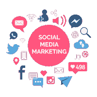

**社交媒体营销** (SMM)利用各种**社交媒体平台**与观众进行连接。一些最重要的社交媒体平台是**脸书**、 **Instagram** 、 **Twitter** 、 **LinkedIn** 、 **YouTube** 、 **Pinterest** 、 **Google+、星巴克**、 **Snapchat** 。我们利用这些社交媒体平台与人们联系，推广我们的业务，增加销售，并提高对产品和服务的认识。

在我们的社交媒体营销教程中，我们将讨论以下主题-

*   [什么是社交媒体？](#SocialMedia)
*   [什么是社交媒体营销？](#SocialMediaMarketing)
*   [为什么是社交媒体营销？](#Why)
*   [社交媒体营销法则](#Laws)
*   [社交媒体营销平台](#Platform)
*   [社交媒体营销优势](#Advantages)
*   [社交媒体营销的劣势](#Disadvantages)
*   [社交媒体营销策略](#Strategy)
*   [社交媒体营销工具](#Tools)
*   [社交媒体优化(SMO)与社交媒体营销(SMM)的区别](#Difference)

* * *

## 什么是社交媒体？

社交媒体是一种时尚的**电子交流方式**，通过它，我们可以创建我们的在线交流网站，与我们的朋友、商业伙伴、亲戚以及客户分享信息、图像、想法、音频、视频和其他内容。

简单来说，我们可以说社交媒体就是建立营销人员和客户之间的沟通。

有以下三种社交媒体分类工具-

### 1.社会出版

社交发布允许我们以内容形式(文字和视频)发布信息。

**例:**博客，YouTube。

### 2.网络社交

社交网络帮助我们与朋友、商业伙伴、亲戚和客户保持联系。

**示例:** LinkedIn、Twitter、脸书

### 3.基于照片的社交网络

基于照片的社交网络用于使用社交网站共享照片。

**示例:** Pinterest、Snapchat、Instagram

* * *

## 什么是社交媒体营销？

社交媒体营销是一个平台，通过它我们可以在观众面前展示我们的业务。它主要用于通过创建各种形式的内容(视频、博客、信息图表等)来促进我们的业务，增加网站流量、客户参与度、品牌知名度和其他营销目标。)在脸书、Instagram、Twitter、LinkedIn 等各种社交媒体平台。

使用社交媒体营销的主要目标是增加网站的流量，增加点赞、评论和分享。

* * *

## 为什么是社交媒体营销？

使用社交媒体营销有以下原因-

1.  社交媒体营销帮助我们提高产品知名度和品牌知名度。
2.  社交媒体营销使用各种社交媒体营销平台，如脸书、推特、Instagram、YouTube 和 Snapchat 来接触目标受众。
3.  它提供了经济高效的技术来发展我们的业务。
4.  它帮助我们提高搜索引擎排名。
5.  有助于我们提升品牌的权威性。
6.  社交媒体营销提供了获得新客户见解的机会。
7.  它有助于我们增加顶部漏斗流量。
8.  它帮助我们产生新的线索。

* * *

## 社交媒体营销法则

社交媒体营销专注于以下法律，以促进业务和提高产品知名度:

### 1.聚焦定律

高度集中的社交媒体营销策略有助于我们接触目标受众。一个成功的营销者主要关注于提高他提供给顾客的产品的价值。

### 2.倾听的法则

如果你想在社交媒体营销和内容营销方面取得成功，那么永远要试着倾听观众的要求，而不是说话。

### 3.质量定律

众所周知，质量永远比数量好，这意味着最好与 1000 个经常阅读我们内容的在线客户打交道，并与自己的受众分享我们的内容，而不是与那 10000 个只阅读我们内容一次，从不与他人分享的在线客户打交道。

### 4.耐心法则

在社交媒体营销中，成功不是一蹴而就的，所以我们既要保持耐心，也要努力工作，等待合适的时机取得成功。

### 5.复合定律

复合定律帮助我们在不同的社交媒体平台上与多个受众共享内容，如脸书、推特、Pinterest 和领英。它还包括一种能力，如果任何用户喜欢我们在脸书的帖子，他或她也可以在推特、领英和 Pinterest 上分享这篇帖子，这就是为什么它为观众找到相关内容创造了更多的接入点。

### 6.影响力定律

花时间在市场上搜索在线影响者，并尝试与他们建立联系和关系，因为他们在市场上最有需求。始终尝试与对您的产品和业务感兴趣的影响者建立联系并建立牢固的纽带，以增加您的追随者和份额。

### 7.价值规律

如果我们定期在社交媒体上分享我们的产品和服务，那么客户可能会对我们的产品和服务不感兴趣，因此我们应该更加注意制作相关内容，因为适当有效的内容有助于我们提高产品的价值。

### 8.承认法

根据承认的法则，永远不要忽视向我们伸出援手与观众建立关系的人。

### 9.无障碍法则

在社交媒体平台中，不要发布想要在一段时间后从社交媒体平台中删除的内容。确保有价值和相关的内容应该始终可供您的目标受众使用。始终努力让您的受众能够发布有价值的内容，解决他们的疑问，并参与对话；否则，观众很容易用别人取代你。

* * *

## 社交媒体营销平台

社交媒体营销包括各种社交媒体平台，以接触新客户，促进他们的业务，创造品牌知名度，并增加销售额。

我们在社交媒体营销中经常使用的一些最常见的社交媒体平台如下-

### 1.脸谱网

**日活跃用户-14.5 亿**

**月活跃用户-22 亿**

脸书是最好的社交媒体营销平台，由**马克·扎克伯格**于 2004 年 2 月 4 日创立。它允许我们通过向朋友、亲戚、同事和客户发送消息、图像、音频和视频来邀请他们并与之建立联系。它还允许我们喜欢和评论他们分享的帖子。

大多数大小组织都将脸书作为其社交媒体营销的“中心”。组织利用脸书来推广他们的品牌，创造对他们产品的认知，并接触到更广泛的受众。脸书还帮助观众看到我们的最新内容、我们的工作时间、他们对某个特定产品的评论，以及在地图上看到我们组织的位置。

使用脸书平台进行社交媒体营销有以下优势-

*   脸书帮助我们轻松接触目标受众。
*   它允许我们向观众分享预算友好的广告。
*   利用脸书，我们可以低成本学习和使用新的市场策略。
*   它提供各种营销平台。
*   它允许组织与客户交流。

### 2.推特

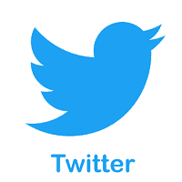

**日活跃用户-1.45 亿**

**月活跃用户-3.2 亿**

Twitter 是由**杰克·多西****诺亚玻璃****比兹·斯通****伊万·威廉姆斯**打造的最有效、最受欢迎、最快节奏的社交媒体营销平台之一，于 2006 年 7 月**上线**。是一个基于**短信的通讯**平台，允许注册用户读写名为**“推文**”的小消息使用推特，营销人员可以轻松接触到成百上千的客户，分享最新消息并推广他们的品牌。使用 twitter 的主要缺点是，我们只能使用 280 个字符的消息。

使用推特平台有以下优势-

*   它有助于我们提高客户满意度。
*   它允许我们以称为“推文”的小消息的形式持续发送信息。
*   这有助于我们与客户建立更牢固的关系。
*   它提高了有机搜索引擎排名。
*   这是一个非常有效的收集客户反馈的平台。

### 3.照片墙

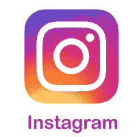

**日活跃用户- 5 亿**

**月活跃用户- 8 亿**

Instagram 由**脸书**维护。这是一个有效的工具，以达到观众，并允许营销人员分享图像，迷因和视频，以促进他们的业务。根据一项调查，80%的账户关注 Instagram 上的一项业务。它在手机和平板电脑上运行完美。最近 Instagram 推出了一个新功能，就是每天分享故事。这项功能有助于营销人员每天轻松地向客户更新新产品信息。

使用 Instagram 平台有以下原因-

*   Instagram 的全球排名(Worldwide rank)在互联网上排名第 5。
*   Instagram 帮助营销人员提升他们的品牌。
*   这是一个对营销人员友好的平台。
*   它有助于营销人员推动流量和业务增长。
*   它帮助营销人员轻松获得客户。
*   在 Instagram 上，内容以图像和视频的形式提供，这有助于客户以非常简单的方式了解产品。
*   Instagram 的品牌参与度和视觉内容比脸书高出十倍。

### 4.商务化人际关系网

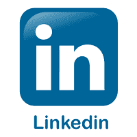

**注册用户数-5.62 亿**

**月活跃用户-3.03 亿**

领英是最好的 B2B (Business 2 Business)社交媒体营销平台，成立于 2002 年。它允许我们作为新生或专业人士创建个人资料。这是一个帮助我们寻找工作、与专业人士保持联系、招聘新员工以及与有经验的员工讨论商业想法以促进我们业务的地方。LinkedIn 上的公司简介不仅有助于我们产生本地销售线索，还能帮助我们吸引全球销售线索。

以下原因使得领英成为一个非常有效的社交媒体营销平台-

*   它提供了一个了解新技术的机会。
*   它帮助我们显示和更新简历，以寻找新的工作机会。
*   是一个以职业发展为主的免费平台。
*   它有助于建立和推广商业品牌。
*   它被用来产生更多的线索。

### 5.拼趣

**月活跃用户-3.2 亿**

**日活跃用户-1.2 亿**

Pinterest 是“图钉”(图钉)和“兴趣”(有趣)两个词的组合。它与所有其他社交媒体营销平台有很大不同。这是一个 2009 年推出的形象钉扎网站。目前，Pinterest 已成为最大的视觉社交网络之一，用于分享和发现想法、图像、食谱、视频、新品牌、信息图表等。

使用 Pinterest 进行社交媒体营销的原因如下-

*   Pinterest 是增长最快的在线内容分发平台。
*   它主要用于创建品牌知名度和增加网站线索。
*   它的用户友好的平台允许我们为商业和发布新闻创建一个可视化的档案。
*   它的视觉化社交网络帮助我们以低成本在网站上建立更多的流量。

#### 注意:pin 是 Pinterest 上的用户从浏览器创建、查找和保存的想法。

### 6.油管（国外视频网站）

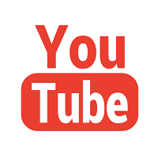

**日活跃用户数-10 亿**

**月活跃用户数-20 亿**

YouTube 是社交媒体营销的绝佳**免费视频分享平台**。它创建于 **2005** 。YouTube 帮助我们创建和上传有价值内容的视频，并以教程的形式将其传递给观众。YouTube 就像一个平台，我们可以在这里展示自己的才华来吸引观众。在 YouTube 中，内容主要以播客、信息图、演示和视频系列的形式提供。

YouTube 在社交媒体营销中有以下优势-

*   YouTube 是第二大搜索引擎和第三大 T2 网站。
*   这是学习新技术最好最简单的方法。
*   它帮助我们在全球范围内推广和销售我们的产品。
*   它完全免费使用，有助于获得合格的流量。
*   它会让你接触到大量的观众。

### 注意:YouTube 是社交媒体营销和内容营销的混合体。

### 7。快照聊天

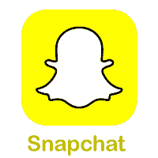

**日活跃用户数-2.1 亿**

**月活跃用户数-3.6 亿**

Snapchat 是成年人的一个很好的平台。可以免费下载。它允许我们在网络上创建一种新型的社交媒体。Snapchat 移动应用程序用于共享照片、视频，并兼作用户的消息服务。它之所以为人所知，是因为消息和内容在它上面消失了。用户可以直接将内容发送给另一个用户，也可以将这些内容作为他们的“故事”上传，用户可以在接下来的 24 小时内看到这些内容。

在社交媒体营销中使用 Snapchat 有以下原因-

*   它允许我们分享和收集特定事件的快照，以在社交媒体平台上创作故事。
*   它用于在照片上添加滤镜，使照片更有吸引力。
*   它允许客户与其他有经验的客户互动，了解产品的优缺点。
*   使用 Snapchat，客户可以直接与公司沟通。
*   这是一个对新来者友好的平台。

### 8.Google+

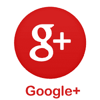

**注册用户数-20 亿**

**月活跃用户数-3.95 亿**

谷歌+是一个强大的社交媒体营销工具，由**谷歌**开发。它帮助我们提高了本地搜索的可见性，建立了与客户和其他企业的关系。

在社交媒体营销中使用 Google+有以下优势-

*   Google+允许我们跟踪其他人。
*   它允许我们向目标客户分享信息、图像。
*   它帮助我们找到其他有相似兴趣的人。

### 9.星巴克

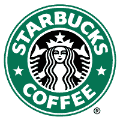

**日活跃用户数-1000 万**

**月活跃用户数-1900 万**

星巴克是脸书引人入胜的品牌之一。引入星巴克的主要目的是帮助建立一个忠实粉丝的在线社区，并与他们互动。

最近，星巴克推出了一项战略，根据消费者在脸书页面上的建议推出其现有产品的新变种，因此顾客不仅可以享受营销人员投放的点击量和照片，还可以享受脸书的现场观众。

### 10.抖音国际版

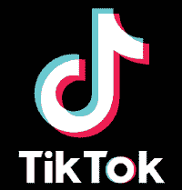

**日活跃用户数-1.5 亿**

**月活跃用户数- 3 亿**

抖音是 2018 年推出的最好的社交媒体营销平台之一。这是一个流行的视频流和共享应用程序，允许我们创建和共享一个特定主题的 15 秒视频。

使用抖音进行社交媒体营销的原因如下-

*   它以最简单的方式瞄准了大量的观众。
*   它创造更好的用户参与度。
*   它允许我们创建一个小视频，并与他们的追随者分享，以获得更多的喜欢和评论来发展我们的业务。
*   最近，Tiktok 推出了自己的广告平台，利用 Tiktok 广告做广告业务。现在，Tiktok 广告成为生产和推出新产品和服务的最佳平台。

* * *

## 社交媒体营销的优势

众所周知，社交媒体营销是我们发展业务的绝佳方式。它是一个平台，由商人、学生、私人组织和政府组织使用。

社交媒体营销最受欢迎的优势如下-

### 1.提高品牌知名度

品牌知名度是社交媒体营销最重要的优势之一。社交媒体营销使用各种社交媒体平台来了解与特定产品、公司和网站相关的受众。

### 2.在网站上产生更多的入站流量

如果我们不使用社交媒体营销，那么我们只能接触到我们的老客户，但是当我们使用社交媒体营销时，那么我们就能够轻松接触到数百万客户。社交媒体营销还帮助我们在网站上产生更多的入站流量。众所周知，在网站或博客上获得更多的流量有助于我们赚钱。

### 3.帮助我们接触大量观众

社交媒体营销利用社交媒体平台与数百万活跃受众建立联系，因此社交媒体是我们接触对我们的产品和服务感兴趣的受众的绝佳机会。

使用社交媒体平台的美国观众百分比如下-

*   脸书:68%
*   推特:24%
*   统计数据:35%
*   YouTube: 73%
*   领英:25%
*   Pinterest: 29%
*   Snapchat: 27%

### 4.提高品牌忠诚度和客户参与度

根据研究，在线营销在社交媒体平台上与数百万客户互动，并通过社交媒体营销获得受众更好的品牌忠诚度。

营销人员通常遵循以下三个步骤来提高品牌忠诚度-

*   倾听客户
*   提升客户评价
*   像你的顾客一样思考

### 5.让我们的客户与时俱进

社交媒体营销提供了最简单的方法，让我们的客户了解新产品、服务或即将举行的活动的最新情况。大多数最新的客户通常对你的网站和企业更感兴趣。

### 6.经济高效

社交媒体营销具有成本效益，因为创建新的用户档案，几乎每个社交媒体营销平台都可以免费签约。

### 7.提高搜索引擎排名

在社交媒体上分享帖子有助于观众到达我们的网站，这对我们网站增加流量和创建反向链接的成功非常重要。根据 SEO 技术，反向链接对我们提高搜索引擎排名更重要。当我们网站的流量和反向链接都增加时，我们的网站将出现在搜索引擎的顶端，这有助于我们更快地发展业务。

### 8.更快、更轻松的沟通

社交媒体营销彻底改变了与受众的沟通方式。现在，超过 28 亿用户使用社交媒体营销平台与营销人员交流。社交媒体平台帮助客户轻松接触营销人员，并与他们分享他们实际想要的需求。

* * *

## 社交媒体营销的弊端

虽然不缺社交媒体营销，但其中肯定存在一些风险。如果你总是分享积极的评论，并在上面发布相关的信息内容，那么你永远不会对此有任何问题。

社交媒体营销的一些常见缺点如下-

### 1.耗时

时间是社交媒体营销的主要问题，因为每个初创公司都需要大量时间来拓展业务。

### 2.收到观众的负面反馈

观众在社交媒体平台上分享他们的正面和负面体验，所有其他观众都可以看到。

### 3.需要合格的人员

为了专注于业务问题，我们必须招聘合格的人员来管理我们的业务账户和流量。这意味着我们必须花更多的钱来雇佣他们。

### 4.与竞争对手的接触

社交媒体营销让我们能够研究竞争对手的战略。然而，你的竞争对手仍然可以通过你的社交媒体营销平台与你的商业方法论联系起来。

* * *

## 社交媒体营销策略

社交媒体营销战略是每个营销人员为实现客户满意度和产生更多线索而执行的计划。

### 1.设定目标

首先，设定你想通过社交媒体营销实现的目标。总的来说，每个社交媒体营销人员都希望实现以下 9 个目标:

*   提高品牌知名度
*   生成新的销售线索
*   通过增加销售或注册来增加收入
*   为我们的网站产生流量
*   助力带接合
*   围绕业务建立社区
*   提供社交客户服务
*   在媒体上增加提及
*   听听关于你品牌的对话

### 2.了解你的目标受众的一切

一旦你确定了你的目标，那么了解你的受众，他们想在社交媒体平台上看到什么，他们通常喜欢和分享哪种类型的内容。这个策略帮助你了解你真正想要实现和需要的潜在粉丝、客户和追随者。

关于你的观众，你应该知道以下几点-

*   他们是谁？(例子:他们的年龄、性别、地点、兴趣等。)
*   他们对哪个领域感兴趣？(举例:娱乐、内容、案例、教育、电子等。)
*   他们一般在哪个社交媒体平台上线？(例如:脸书、Instagram、Snapchat 等)
*   他们如何消费内容？(例子:看社交媒体帖子，看视频等。)

例如，超过 75%的青少年在脸书、Instagram 和 Snapchat 上。

### 3.研究竞争

每天研究竞争对手的社交媒体营销活动，以接触受众。花大部分时间研究以下问题-

*   他们发布什么样的内容？
*   他们在哪个平台最活跃？
*   他们用什么标签？
*   他们说话的语气是什么？
*   他们与目标受众的沟通方式是什么？
*   他们一般花多少时间在社交媒体平台上？

您还可以进行竞争分析，以了解您的竞争对手正在做什么来瞄准受众并扩展他们的行业。

### 4.为观众选择合适的社交媒体平台

我们应该分析哪个社交媒体平台对我们的业务最有价值，哪个社交媒体平台对我们的受众最有效，以及我们的目标受众在哪里。

### 5.制定品牌指南

这是社交媒体营销策略最重要的步骤之一。

有以下社交媒体营销品牌指南-

*   品牌声音
*   表情符号的使用
*   哈希表的使用
*   与观众互动的协议
*   禁止的词语/话题

### 6.建立你的初始状态

建立一个初步的存在包括一个关于你的企业的小介绍，主要包括小企业的信息，一些图像，以及我们的第一个针对受众的帖子。

初始存在阶段包括以下步骤-

*   **输入业务信息-** 它包括您的业务概述、联系方式和网站链接。
*   **上传图像-** 包括可识别的轮廓图像，如徽标。请始终记住，图像是以适当的尺寸设计的，并负责桌面和移动视图。
*   **创建你的第一个帖子-** 它是你的受众最容易看到的页面，所以一定要把这个页面创建得更有互动性，更好看。
*   **关注你的人脉-** 首先，开始关注那些经常喜欢并关注你的账号和帖子的忠实客户，让你的业务不断增长。

### 7.规划您想要与观众分享的内容类型

内容是在社交媒体平台上实现我们目标的最有效方式之一，因此请始终计划与您的受众分享有效、有价值、信息丰富和高质量的内容。

社交媒体平台上有以下各种类型的内容-

*   照片
*   录像
*   制图法
*   文章
*   直播流
*   故事

### 8.创建社交媒体内容日历

内容日历有助于我们了解向受众发布内容的频率。

### 9.在社交媒体平台上投放广告来推广你的产品和服务

所有社交媒体平台都允许我们在社交媒体上投放各种广告(付费和不付费)，以扩大我们的业务和受众规模。

你在社交媒体平台上投放的广告有以下几种类型-

*   **全店折扣-** 让观众以折扣价选择购买产品和服务。
*   **新产品促销-** 投放这些广告的主要目的是让受众了解新发布的产品。
*   **新客户交易-** 旨在鼓励观众从您的网站购买他们的产品。
*   **活动/网络研讨会推广-** 用于邀请观众加入您的活动，以增加他们的关注度。

### 10.测试并评估你的结果

您可以根据以下参数评估社交媒体平台的使用情况-

*   追随者/喜欢-它用于分析我们社交媒体受众的规模。
*   Reach -它显示有多少人看到你的社交媒体帖子。
*   约定-它显示我们在内容上收到的赞、评论和分享的数量。
*   点击量——它显示了我们在帖子上收到的点击量。

* * *

## 社交媒体营销工具

社交媒体营销使用各种社交媒体管理工具。最常用的社交媒体营销工具列表如下-

### 1.SocialOomph

SocialOomph 帮助我们跨社交媒体平台自动执行大量业务任务。使用社交网站，你还可以在一个地方管理你的推特、脸书和领英活动。

点击下面的链接注册 SocialOomph。

**网站:**[https://www.socialoomph.com/](https://www.socialoomph.com/)

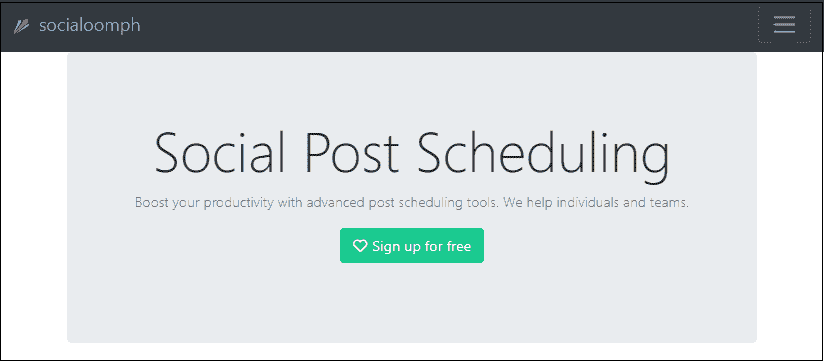

### 2.PostPlanner

PostPlanner 用于安排脸书的更新，这有助于我们提高客户在社交媒体平台上的参与度。它漂亮的功能帮助营销人员获得比任何其他社交媒体营销工具多 660%的客户参与度。简而言之，对于那些只想增加客户参与度的营销人员来说，我们可以说它是最好的工具。

使用 PostPlanner 的主要优点是，它允许我们根据星级选择最佳内容。众所周知，更好的星级会带来更多的客户参与度。

单击下面的链接注册 PostPlanner。

**网站:**[https://www.postplanner.com/](https://www.postplanner.com/)

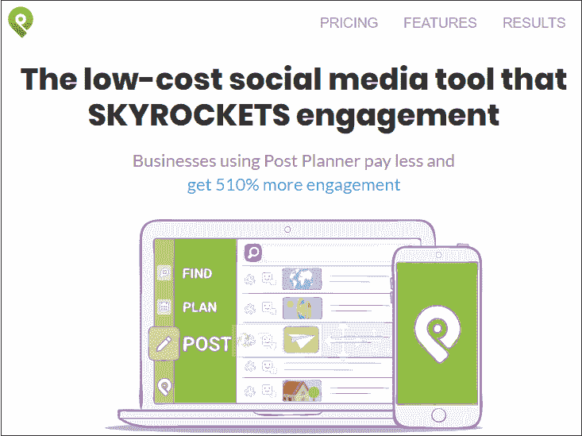

### 3.广场

Agorapulse 是当前市场时代最好的社交营销工具。它主要关注受众、客户参与度和品牌知名度。

它包括以下功能，例如:

**社交媒体收件箱**

社交媒体收件箱帮助我们检查所有社交媒体更新。它还与电子邮件帐户一起使用，以检查定期更新的通知和收件箱中的所有传入邮件。

**发布调度**

发布和调度是 agorapulse 最大的特点。利用这一点，我们可以在任何网络上发布我们的帖子并安排它们。

**监控**

监控是用来监控我们的社交媒体平台，在 Twitter 上创建和搜索某些关键词，在 Instagram 上监控标签。

点击下面的链接注册 Agorapulse。

**网站:**[https://www.agorapulse.com/](https://www.agorapulse.com/)

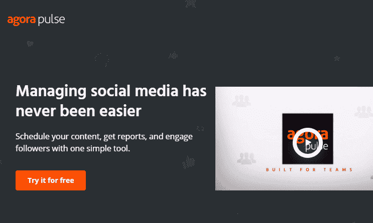

### 4.聊天人

Chattypeople.com 是最重要的社交媒体营销工具之一，用于通过脸书向我们的客户发布按需促销和优惠。Chattypeople 也兼容信使。它适用于小型和大型组织创建一个简单的聊天机器人货币化脸书广告和管理客户管理系统自动使用人工智能。使用 Chattypeople 的优势在于，它不需要编码知识来创建聊天机器人。

Chattypeople 支持以下内容管理系统平台:

1.  客户支持
2.  带 Shopify 的 EShop
3.  食物和餐馆
4.  活动管理
5.  递送引擎

点击下面的链接注册 Chattypeople。

**网站:**[https://www.crunchbase.com/organization/chattypeople](https://www.crunchbase.com/organization/chattypeople)

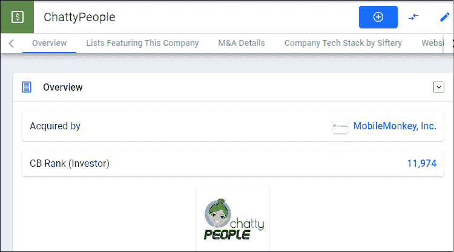

### 5.帆布

Canva 是最知名的社交媒体营销工具之一。它可以免费使用。它主要用于为社交媒体帖子创建图像。它通过使用多种模板、字体和颜色来创建图像。

点击下面的链接注册 Canva。

**网站:**[https://www.canva.com/](https://www.canva.com/)

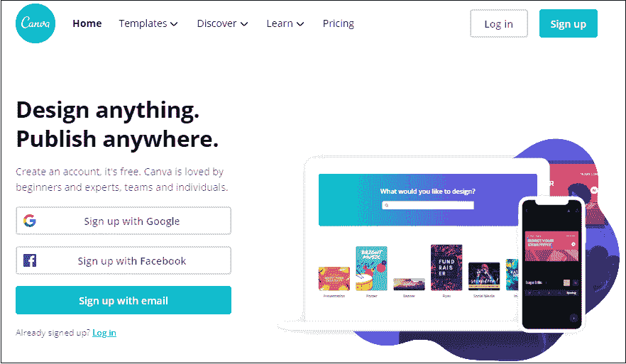

### 6.缓冲器

Buffer 是发布工具，它帮助我们在社交网络上发布内容，以提高客户的参与度。它在脸书、推特、Instagram、谷歌+、Pinterest 和领英等各种社交媒体平台上工作。它主要是为企业设计的，用于在一个地方安排社交媒体帖子、分析性能和管理他们的帐户。

使用 Buffer 的优势在于它与 Pablo 集成，这有助于我们轻松创建图像并与观众分享，从而增加流量和客户参与度。

点击以下链接注册缓冲区。

**网站:**[https://buffer.com](https://buffer.com)

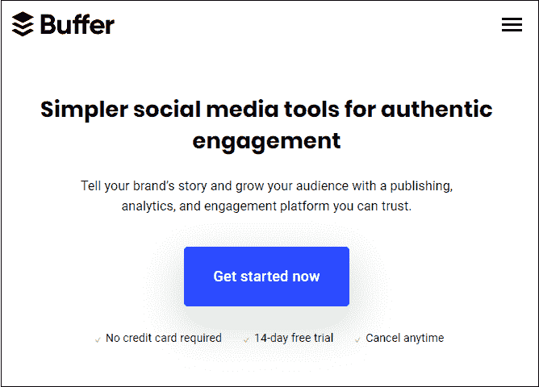

### 7.品牌 24

这是一个简单、有效、基于网络的社交媒体营销工具。它用于分析关键词，并监控特定关键词的互联网长度和广度。

我们可以使用以下计划选择品牌 24

*   49 美元的个人优惠
*   专业溢价 99 美元
*   专业商务 499 美元

点击以下链接注册 Brand24 网站。

**网站:**T2【https://brandcom 24/

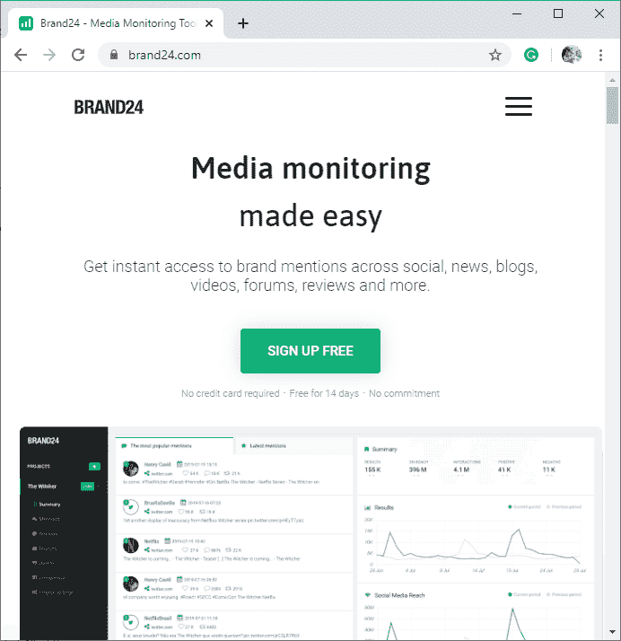

* * *

## 社交媒体优化(SMO)和社交媒体营销(SMM)的区别

下表显示了社交媒体优化(SMO)和社交媒体营销(SMM)之间的差异:

| 社交媒体优化(SMO) | 社交媒体营销(SMM) |
| 社交媒体优化(SMO)是一项在网站上进行的**页面活动**，旨在提高流量、页面排名等。 | 社交媒体营销(SMM)是由营销人员在各种社交媒体渠道上实施的**页外活动**。 |
| 它以一种特定内容易于搜索的方式优化内容。 | 它用于在我们的网站上产生业务线索和流量。 |

* * *