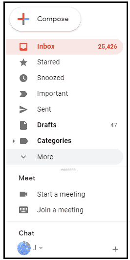
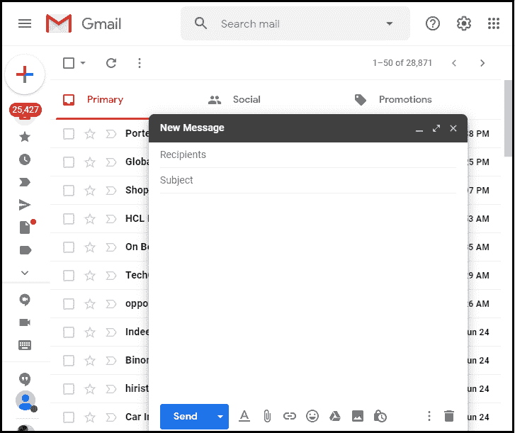
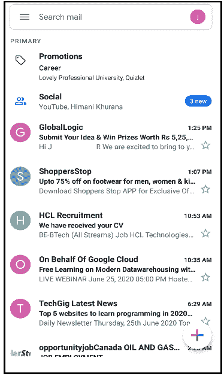
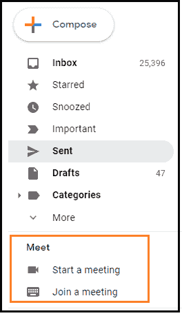
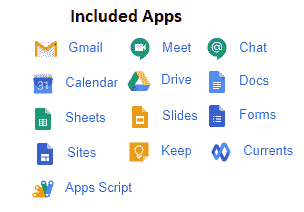
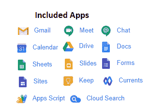

# 什么是 Gmail？

> 原文：<https://www.javatpoint.com/gmail>

谷歌邮箱是由 T2 谷歌推出的免费电子邮件服务。它允许通过互联网发送和接收邮件。

我们还可以同时向多个用户发送电子邮件。Gmail 网站是一种网络邮件。

我们可以通过网络和移动设备上的应用程序访问 Gmail。我们也可以使用第三方程序访问 Gmail。此类程序通过协议 IMAP ( **互联网消息访问协议**)或 POP ( **邮局协议**)来同步电子邮件内容。Gmail 的一些基本细节如下:

| **由**开发 | 谷歌有限责任公司 |
| **由**创建 | 保罗·布施 |
| **创建于** | 2004 年 4 月 1 日 |
| **可用语言** | One hundred and five |
| **初始存储容量** | 1 千兆字节 |
| **当前存储容量** | 15 千兆字节 |
| **项目代号** | 卡里布 |
| **全球活跃用户** | 15 亿+ |
| **占所有邮件的百分比账户** | 27 % |
| **巨大的存储容量增加** | 年份- 2012
2 GB 至 7.5 GB 至 10GB |
| **注册** | 是 |
| **订阅** | 仅供个人使用-存储容量最高可达 30tb |
| **用编程语言编写** | 服务器端的 Java、JavaScript/Ajax
C++和 Java |
| **牌照** | 所有人 |
| **网站 URL** | [https://mail.google.com/](https://mail.google.com/) |
| **兼容性** | 所有设备 |
| **用户界面设计器** | 凯文·福克斯 |

发布时的存储容量为千兆字节，今天扩展至**15gb**。电子邮件的接收容量是每个用户 50 兆字节，而发送容量是 25 兆字节，包括附件。

Gmail 中的电子邮件交流可以包括**文本**或**消息、图片、视频和音频。**

最初，Gmail 于 2004 年 4 月 1 日**创建，并于 2009 年 7 月 7 日结束测试。存储容量为 1 GB，与当时的其他竞争对手相比，这是一个相当大的数字。**

 **Gmail 很早就采用了 [Ajax](https://www.javatpoint.com/ajax-tutorial) (异步 JavaScript 和 XML)网络开发技术，而不是其他网络开发人员。

Gmail 还覆盖了全球[互联网](https://www.javatpoint.com/internet)用户所说的 94%的语言。我们可以从谷歌驱动器插入文件，以便发送更大的存储文件。

Gmail 中的搜索界面类似于互联网上的搜索论坛。

谷歌的服务器可以自动扫描多用途电子邮件，还可以过滤恶意软件和垃圾邮件。

## Gmail 的特点

Gmail 的功能如下:

*   **免费使用**
    Gmail 提供**15gb**的免费存储容量。由于存储问题，我们不需要删除邮件。2012 年 4 月 24 日，谷歌宣布与 Google Drive、Google + Photos 和 Gmail 共享存储。总存储量为 15 GB。
*   **Storage Capacity**
    The users can increase their storage capacity by opting the monthly subscription plans from Google One. The storage is shared among the three platforms (Google Drive, Google + Photos, and Gmail).

    付费计划最高可达 15tb，供个人使用。
    允许发送包括附件在内的电子邮件的存储空间不应大于 25 兆字节。

*   **多账户支持**
    我们可以直接从 Gmail 应用中使用非 Gmail 和 Gmail 地址。非 Gmail 地址包括雅虎邮箱、Outlook.com 邮箱或任何其他 IMAP 或 POP 邮箱。
*   **有组织的**
    Gmail 中的信息分为**促销、社交和主要类别**。这些消息根据类别进行排序和分组。我们可以轻松阅读来自企业、家人和朋友的信息。
*   **可访问性**
    消息或电子邮件可以很容易地从各自的类别中读取。这些信息也是安全的。任何用户都可以轻松使用网络和应用程序的功能。我们可以在搜索框的帮助下找到任何信息。
    它还允许我们随时随地阅读和回复信息。
    新邮件可以通过推送通知快速接收。
*   **垃圾邮件过滤器**
    垃圾邮件过滤器允许用户将邮件标记为垃圾邮件。它从垃圾邮件标识中识别类似的邮件。
*   **界面**
    Gmail 的用户界面侧重于搜索、单页消息的分组、邮件的会话线程等。各种竞争对手进一步复制了这种方法。
    Kevin Fox 是 Gmail 的 UI(用户界面)设计师，旨在让用户专注于单个页面，而不是在其他页面上导航。他还创建了谷歌阅读器、谷歌日历和 Friendfeed 的界面。
*   **语言**
    Gmail 有多种语言版本，这使得全球用户都可以访问。
*   **搜索**
    搜索框和互联网上的搜索一样可用。我们可以使用搜索栏从谷歌日历和谷歌网站中搜索事件。我们还可以搜索存储在谷歌驱动器中的联系人和文件。
*   **语言输入风格**
    Gmail 提供多种语言风格，帮助用户书写键盘限制的语言。【2012 年 10 月，谷歌在 Gmail 中增加了各种输入法编辑器、音译以及 100 多个虚拟键盘。
    谷歌在 2013 年 10 月为 Gmail 添加了手写输入支持。【2014 年 8 月，Gmail 推出字母和上升标记。它允许用户接收和发送拉丁字母以外的邮件。

## Gmail 的历史

*   **Paul Buchheit** 在大学期间开始为个人邮件项目工作。在 20 世纪 90 年代，他已经检查了基于网络电子邮件的想法。
*   **2004 年 4 月 1 日**，谷歌 Gmail 限量版**测试版**发布。
*   2008 年 7 月，谷歌简化了启用安全模式的能力。
*   2012 年 4 月 24 日，谷歌宣布将存储从 2 GB 增加到 7.5 GB。
*   谷歌在 2012 年 6 月推出了一项新的安全功能。该功能旨在保护用户免受国家支持的攻击。据说，用户帐户顶部的横幅会警告用户未经授权的访问和帐户泄露。
*   2013 年 5 月 13 日存储进一步增加到 **15 GB** 。
*   谷歌在 2014 年 3 月宣布了加密 HTTPs 连接。该连接用于发送和接收 Gmail 邮件。Gmail 中的每封邮件都是 100%加密的。
    Gmail 还使用 TLS ( **传输层安全**)协议对发送和接收的电子邮件进行加密。Gmail 会自动对收到的邮件进行病毒扫描。出于安全原因，Gmail 中只允许某些文件类型。
*   2017 年 7 月，谷歌宣布使用**机器学习**识别带有垃圾邮件和网络钓鱼的电子邮件，结果**准确率达到 99.9%**。
*   它还宣布，系统可以延迟大约 0.05%的消息进行详细分析。

## Gmail 中的主要类别

我们 Gmail 帐户中的所有电子邮件都根据五个类别进行了划分，如下所示:

**1。初级**

主选项卡包括所有重要的电子邮件，如来自我们联系人的电子邮件。它被认为是我们 Gmail 账户的主要收件箱。

它还包括一些非机密的电子邮件。

我们还可以将任何电子邮件移动到主文件夹。

**2。社交**

社交标签包括所有来自社交[网站](https://www.javatpoint.com/website)的邮件，如 YouTube、脸书等。

**3。促销**

**促销**类别包含所有与营销和促销优惠相关的电子邮件。

**4。更新**

**更新**类别是一个类似于社交、促销和初级的类别。它包括收据、报表、账单、确认书、通知等。

**5。论坛**

它是 Gmail 中的一个群，允许一个群中的人在网上一起工作。兴趣相投的人很容易合作。

该论坛是专门为组织、团队、团体等创建的。一起交流。

## 可用文件夹

整个文件夹列表显示在 Gmail 主页的左侧，如下所示:

Gmail 中可用的文件夹如下:

*   **收件箱**
    收件箱文件夹包括所有收到的邮件。收到的电子邮件分为促销类、社交类和主要类。
*   **加星**
    所有标记为‘加星’的邮件都会出现在加星文件夹中。
    我们需要点击星标将邮件标记为星标。
*   **休眠**
    标记有休眠的邮件会根据选择的时间重新出现在我们的收件箱中。我们可以设置邮件在收件箱中弹出的时间。
*   **重要**
    重要文件夹包含带有重要标签的邮件。
*   **已发送**
    已发送文件夹包括所有已发送的电子邮件。
*   **草稿**
    草稿文件夹包含未完成的邮件，我们希望稍后发送这些邮件。
    我们也可以在从草稿文件夹发送邮件的同时再次编辑邮件。
*   **聊天**
    聊天文件夹由谷歌闲逛对话组成。
*   **预定**
    预定文件夹中的消息或电子邮件将在预定时间发送。
*   **垃圾邮件**
    由 Gmail 自动识别的可疑邮件属于垃圾邮件类别。垃圾邮件文件夹包含所有被 Gmail 或我们标记为垃圾邮件的邮件。
*   **垃圾**
    删除的邮件将被转移到垃圾文件夹中 30 天。我们还可以从废纸篓中恢复已删除的邮件。30 天后，邮件将从废纸篓文件夹中永久删除，并且无法恢复。

## 平台

Gmail 有两个平台，讨论如下:

### 1.网

基本的 [HTML](https://www.javatpoint.com/html-tutorial) 版本的 Gmail 可以在**所有浏览器**上运行。但是现代的 Ajax 版本在发布版的[网络浏览器](https://www.javatpoint.com/browsers)中得到支持，比如微软 Edge、[互联网浏览器](https://www.javatpoint.com/internet-explorer)、[谷歌 Chrome](https://www.javatpoint.com/google-chrome) 、Safari 和[火狐](https://www.javatpoint.com/mozilla-firefox)。

Gmail 可以在**谷歌 Chrome** 上离线运行。我们可以从 Chrome 的网络商店下载。

Gmail 网页如下图所示:

我们还可以从移动设备上的网络浏览器访问 Gmail。

### 2.移动应用

Gmail 应用程序可用于 iOS 和安卓设备。

2014 年 11 月**谷歌为[安卓](https://www.javatpoint.com/android-tutorial)推出了 Gmail 应用。它允许通过 IMAP/POP 从非 Gmail 地址接收和发送电子邮件。2016 年 11 月**针对 iOS 进一步重新设计了 Gmail。****

 ****该更新包括许多功能，如更流畅的过渡、改善搜索结果的拼写建议、更多颜色的使用、**滑动**(存档/删除)邮件功能、撤销、发送等。

该应用程序在 2017 年 5 月添加了网络钓鱼攻击的安全性。后来，一个“智能回复”功能被添加到机器智能的基础上，然后是其他语言。

我们可以使用 IMAP 或 POP 协议从第三方程序访问 Gmail。

Gmail 应用程序的主页如下图所示:

## 设计更新

谷歌对 Gmail 的一些主要设计更新如下:

*   谷歌在 2008 年推出了 Gmail 实验室功能。
*   谷歌从 2011 年开始重新设计 Gmail，让它看起来更加一致。这些变化包括高质量的主题、简化的对话视图等。
*   谷歌在 2013 年更新了收件箱标签。
*   谷歌在 2018 年为 Gmail 引入了一个新的网络用户界面。其他更新包括双因素身份验证、机密模式等。
*   垃圾邮件文件夹在 2018 年 4 月有了新的设计。
*   安卓和 iOS 的黑暗模式是谷歌在 2019 年推出的。

## 谷歌在 Gmail 中相遇

**谷歌会议**由谷歌于 2017 年 3 月在**推出**，帮助用户从 Gmail 在线开始会议。视频会议仅限 30 名用户参加。该限额根据 G Suite 的订阅计划而有所不同，其中包括 100 名基本用户、150 名商务用户和 250 名企业用户。

由于 2020 年 3 月的[新冠肺炎](https://www.javatpoint.com/post/coronavirus)疫情，2020 年 5 月之后的接入使得消费者账户**免费**。

免费会议电话的参与者人数最多可达 100 人。G Suite 用户的参与者限制为 250 人，而 Hangouts 的参与者限制为 25 人。

我们需要一个谷歌帐户来开始使用 Gmail 开会。

它出现在 Gmail 主页的边栏上，如下所示:

我们需要点击“开始会议”从 Gmail 开始会议。会议包含视频和麦克风(声音)选项。我们可以通过点击视频或麦克风图标来打开/关闭它。

我们也可以通过**游戏商店**上的**谷歌会议应用程序**使用我们的移动设备开始会议。我们需要点击“**立即加入”**选项加入会议。

## 与谷歌产品的关系

*   该插件提供了 2010 年 8 月推出的谷歌聊天和语音功能。后来被**谷歌 hangots**取代。
*   媒体和链接的共享是谷歌在 2010 年 2 月推出的。谷歌 Buzz 工具与 Gmail 集成在一起。后来换成了**谷歌+** 。
*   与 Gmail 集成的**谷歌钱包**是谷歌在 2013 年 5 月推出的。它允许以电子邮件附件的形式汇款，不收取交易费用。它最初是在网上提供的。它在 2017 年扩展到美国用户的移动应用。
*   谷歌旅行应用于 2016 年 9 月由谷歌推出，该应用通常为租车、机票和商品生成旅行卡。该应用程序在 2017 年进一步更新，允许扫描火车票和公共汽车票。

## Gmail 中的安全方法

安全方法如下:

### 1.第三方加密

根据谷歌透明度报告，基于加密电子邮件的信息在第三方和 Gmail 之间传输的百分比。

### 2.锁定

任何未知的使用或活动都会导致帐户锁定一分钟到 24 小时，例如:

*   发送大量无法投递的邮件。
*   如果我们在短时间内删除、下载或收到许多来自 IMAP/POP 的电子邮件。
*   使用外部或第三方软件和扩展。

### 3.两步验证

Gmail 为安全登录提供了两步验证方法。用户需要在从新设备登录时验证其身份。

例如，输入发送到用户注册手机号码的代码。

谷歌在 2004 年引入了使用安全密钥的验证。

### 4.反儿童色情制品

该政策与国家失踪和被剥削儿童中心合作，查找虐待儿童的情况。谷歌为这些色情图片创建了数据库。每个图像都被扫描；寻找散列(给出一个数字)。

发现的任何可疑图像都会报告给国家当局。

## 增长

下表列出了谷歌在各自年份公布的全球活跃用户。

| 年 | 全球活跃用户 |
| **2012** | 4.25 亿 |
| **2015** | 9 亿 |
| **2016** | 10 亿+ |
| **2017** | 12 亿 |
| **2020** | 15 亿+ |

2014 年，Gmail 成为安卓设备上首个突破 10 亿的应用。目前全球活跃用户超过 15 亿。

## 授予

*   Gmail 的排名在 PC World“2005 年 100 款最佳产品”榜单中位列第二。排名第一的是火狐。
*   在 2005 年的底线设计奖中，它还获得了“荣誉奖”。
*   2006 年 9 月，Gmail 还被福布斯评为最佳网络邮件应用。该申请被授予小型企业使用。
*   2006 年 11 月，根据《个人电脑世界》，Gmail 获得了 4 星评级。

## 隐私条款

Gmail 只有一个涵盖所有隐私方法的隐私政策，那就是自动扫描电子邮件。

### 自动扫描电子邮件

Gmail 会出于各种目的自动扫描这些电子邮件，例如过滤恶意软件和垃圾邮件。它还包括电子邮件旁边的上下文相关广告。

### 隐私问题

谷歌面临的主要隐私问题是中国攻击。

### 中国攻击

2010 年起源于中国的网络攻击，面对的是谷歌。业务范围广泛的公司和中国人权活动人士成为攻击目标。攻击发生后，谷歌加强了其系统的安全和隐私条款。它建议用户在计算机系统上安装反间谍软件和反病毒软件。谷歌还警告用户要小心点击任何外部链接。

## 订阅计划

订阅计划可从 G 套件应用程序中获得。

每个计划都包括访问谷歌应用程序。

有三个计划，如下所示:

### 1.基本计划

基本计划的费用是 210 卢比/用户/月。金额可以根据提供的折扣而变化。

包括的应用程序如下所示:

### 2.商业计划

商业计划的费用是 840 卢比/用户/月。金额可以根据提供的折扣而变化。

包括的应用程序如下所示:

### 3.企业计划

企业计划的费用为 1650 卢比/用户/月。金额可以根据提供的折扣而变化。

包括的应用程序如下所示:

* * *******