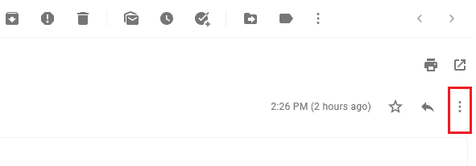
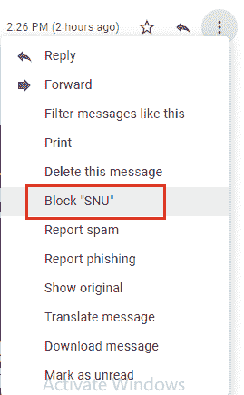
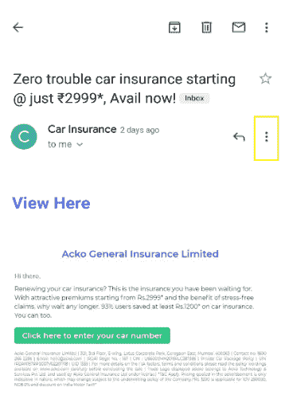
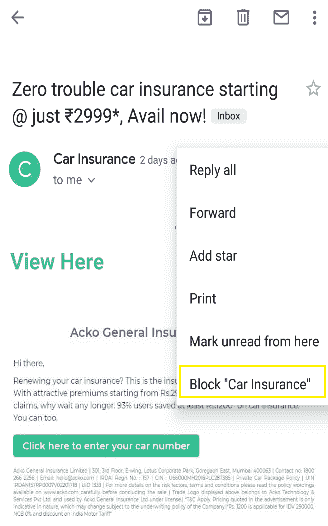
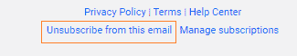
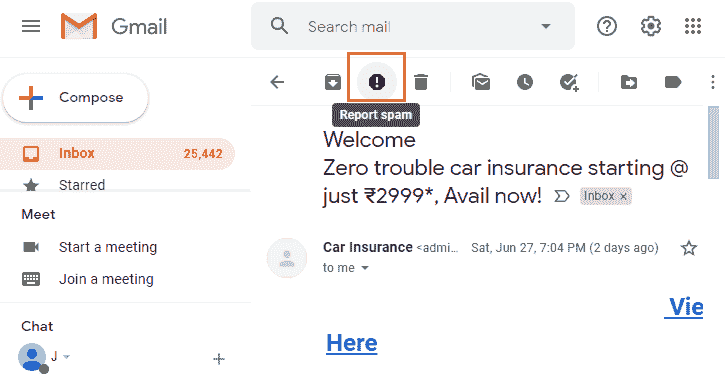
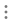
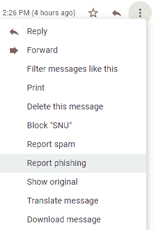

# 如何屏蔽 Gmail 上的邮件？

> 原文：<https://www.javatpoint.com/how-to-block-emails-on-gmail>

**类似问题:**

*   如何在 Gmail 上屏蔽某人
*   如何在 Gmail 中屏蔽电子邮件地址
*   你能在 Gmail 上屏蔽某人吗？
*   如何在 Gmail 上屏蔽

我们只需遵循几个步骤，就可以在手机和桌面上屏蔽特定的 Gmail 地址。

在开始阻止电子邮件的过程之前，让我们先了解一些要点。

**屏蔽邮件地址意味着**

这意味着我们不希望收件箱中出现任何来自该 Gmail 地址的电子邮件。

如果我们不希望收件箱中有任何此类电子邮件，我们可以轻松取消订阅、阻止或报告任何电子邮件。

如果有人使用 Gmail 骚扰或威胁任何用户，这是违反 Gmail 政策的。对于这种情况，我们可以向地方当局报告。

**当我们屏蔽一个电子邮件地址时会发生什么？**

*   它将阻止所有来自该 Gmail 地址的电子邮件。
*   来自被阻止的 Gmail 地址的所有未来邮件都将进入“垃圾邮件”文件夹。
*   我们不会从收件箱中被阻止的电子邮件地址收到任何电子邮件。

在 Gmail 上阻止电子邮件的步骤如下:

## 在计算机上

1.打开 Gmail 账户。
我们可以直接使用[网址](https://www.javatpoint.com/url-full-form):。

2.指定**ID****密码** - >点击**【下一步】**按钮，如下图:

3.打开我们想要阻止的邮件或信息。

4.点击右上角的三个点，如下所示:

5.点击**‘封锁’**选项，如下图:

用户名用双引号括起来，如上所示。

来自上述 ID 的电子邮件现已被阻止。

## 在安卓上

1.使用电子邮件 Id 和密码登录，打开 Gmail 帐户。
或
打开 Gmail 应用。

2.打开我们想要阻止的邮件或信息。

3.点击右上角的三个点，如下所示:

4.点击**‘封锁’**选项，如下图:

5.来自上述 ID 的电子邮件现已被阻止。

## 在 IOS 设备上

1.  打开 Gmail 应用程序。
2.  打开我们想要阻止的邮件或信息。
3.  点击右上角的三个点。
4.  点击**“阻止”**选项。
5.  来自上述 ID 的电子邮件现已被阻止。

**如果我们误堵了一个人会怎么样？**

我们可以使用上面讨论的相同步骤解除阻止任何人。

## 取消订阅大量电子邮件

我们还可以取消订阅收件箱中不需要的电子邮件。当我们在一个发送大量广告、促销等的网站上注册时。，我们可以轻松取消订阅这些电子邮件。

让我们考虑以下取消订阅电子邮件的步骤。

**1。**打开 Gmail 网站，使用 Gmail ID 和密码登录。我们可以直接使用网址:[https://mail.google.com/](https://mail.google.com/)登录。
或
打开 Gmail 应用。

**2。**打开我们想要退订的邮件。

**3。**进入页面底部，点击**取消订阅**，如下图:

我们也可以点击**更改首选项**选项。
如果我们没有找到上述选项，我们可以将邮件报告为**垃圾邮件**。

## 报告垃圾邮件

当上述任何选项不可见时，我们可以使用**“报告垃圾邮件”**选项。

Gmail 中被阻止的邮件会进入“垃圾邮件”文件夹。如果我们在收件箱中收到任何此类邮件，我们可以将该邮件报告为垃圾邮件。

考虑以下步骤将邮件标记为垃圾邮件。

**1。**打开 Gmail 网站，使用 Gmail ID 和密码登录。或者打开 **Gmail** 应用。

**2。**打开邮件。

**3。**点击页面顶部的“**举报垃圾邮件”**图标，如下图所示:

或者

点击右上角的三个点->点击举报垃圾邮件。

#### 注意:谷歌保存了此类邮件的副本，并保护用户免受此类滥用和垃圾邮件的侵害。

如果我们收到任何可疑邮件，我们可以将该邮件报告为网络钓鱼。

## 举报网络钓鱼

如果我们发现任何可疑邮件，我们可以将该邮件报告为**网络钓鱼**。

请考虑以下步骤:

1.  打开 Gmail 网站，使用 Gmail ID 和密码登录。
    或
2.  打开 Gmail 应用程序。
3.  打开邮件或信息。
4.  点击右上角的三个点。
5.  点击**【举报钓鱼】**选项，如下图:
    

* * *