# 如何在 Gmail 中创建群电子邮件

> 原文：<https://www.javatpoint.com/how-to-create-a-group-email-in-gmail>

**类似问题:**

*   如何在 Gmail 中创建群
*   如何在 Gmail 中建立电子邮件群
*   如何在 Gmail 中建立群

我们可以在电脑和移动设备上轻松创建一个 Gmail 群。

**Gmail 里什么是群？**

Gmail 中的一个群包含多个 Gmail 联系人。可以定义为一个部门、组织、员工组、同学、项目组等的一个组。可以使用**谷歌群组**与一个或多个进行通信。

**使用 Gmail Groups 有什么好处？**

使用 [Gmail](gmail) 联系人组的好处如下:

*   我们可以给组里的每个人发一封邮件。
*   更容易在群中找到特定的人或该人的电子邮件地址。
*   我们可以用更好的方式组织我们的联系。
*   它节省时间。
*   它有助于以更好的方式组织会议和活动。
*   它有助于团队成员协作完成项目。

让我们从步骤开始。

### 在计算机上创建 Gmail 组

在计算机上创建 Gmail 组的步骤如下:

1.打开 Gmail 帐户，使用 Gmail ID 和密码登录。
我们可以直接使用[网址](https://www.javatpoint.com/url-full-form):[https://mail.google.com/](https://mail.google.com/)。

2.在谷歌帐户的主页上，点击显示屏右上角的**谷歌应用程序**图标(九个点排列成正方形的图标)。
如下图:

3.将出现一个下拉框，其中包含所有谷歌应用的列表，如下所示:

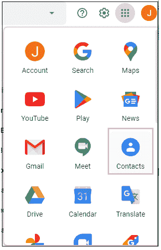

4.点击**‘联系人’**图标，如上图。

5.将出现一个新窗口，其中包含所有联系人的列表，如下所示:

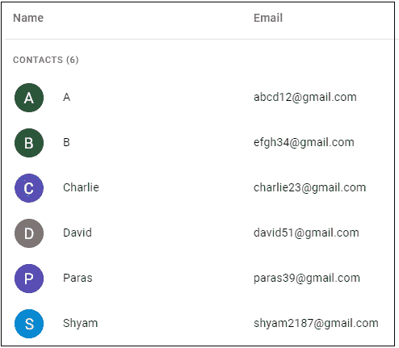

6.点击左侧的**“创建标签”**选项，如下图所示:

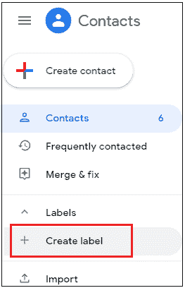

7.将出现一个小对话框。我们需要为一个组的标签指定一个**名称。这里，我们将标签指定为 Javatpoint，如下所示:**

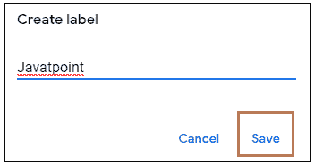

8.点击**‘保存’**按钮，如上图。
将创建名为 Javatpoint 的组，如下所示:

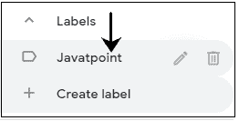

现在，我们将向 Javatpoint 组添加联系人。

9.将鼠标拖动到联系人上，然后单击联系人姓名旁边的方框。单击将在方形框内标记一个复选标记，如下所示:

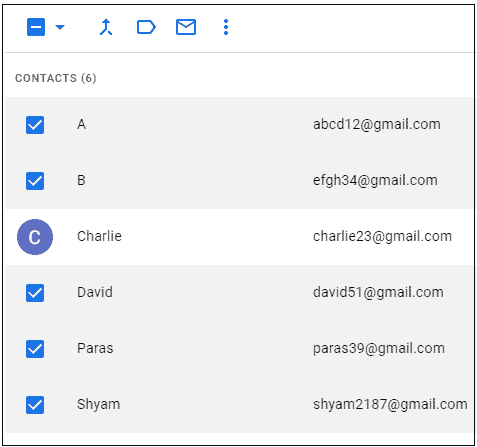

在这里，我们选择了五个联系人添加到组中。

10.点击顶部的**管理标签图标**，如下图:

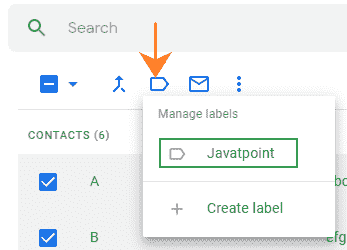

11.点击 **Javatpoint** - >点击**【应用】**按钮，如下图:

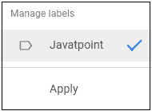

12.这五个联系人将被添加到 Javatpoint 组。要重新检查，请单击左侧创建的组。带有标记联系人的组显示为:

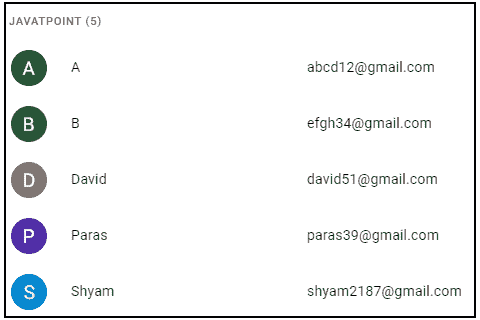

**要在电子邮件中使用群组，请遵循以下步骤:**

1.转到 Gmail 帐户的主页。

2.点击显示屏左上角的**合成**按钮，如下图所示:

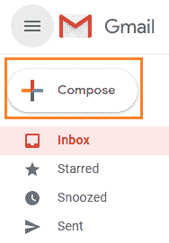

3.将出现一个对话框。在**‘To’**部分前面，开始输入组名。

让我们写上面创建的组。我们一开始打字就能注意到；Gmail 将在搜索框中建议相关名称，如下所示:

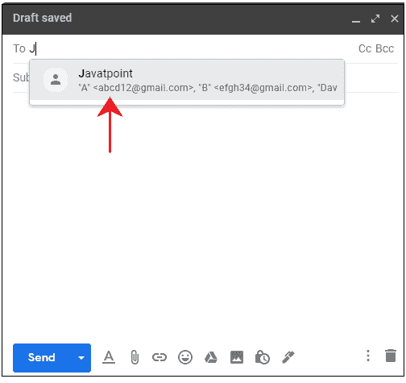

我们可以指定发送此类邮件的主题和消息。邮件将发送给该组中的所有成员。

### 在移动设备上创建 Gmail 群组

在移动设备上创建 Gmail 群组的步骤如下:

1.打开 Gmail 应用程序。

2.单击左上角的菜单图标(显示为三条水平线)，如下所示:

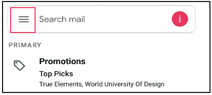

3.向下滚动，点击**“联系人”**选项，如下图:

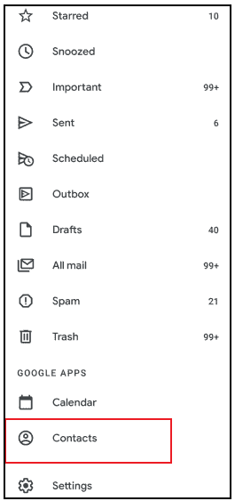

4.它会把我们重定向到谷歌 Play 商店下载谷歌开发的**联系人应用**。如果我们已经安装了联系人应用程序，则不需要下载。

5.将出现联系人列表，如下所示:

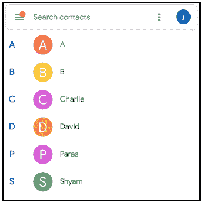

6.点击左上角的菜单选项，如下所示:

7.点击 **'+创建标签'**选项，如下图:

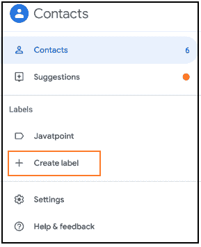

8.将出现一个小对话框。指定组的名称。这里，我们将组名指定为 **Jpoint** ，如下图:

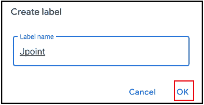

9.点击**‘确定’**按钮，如上图。

10.将出现一个页面，如下所示:

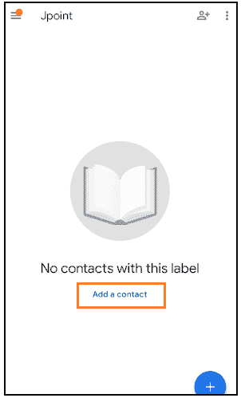

说明群内没有联系人。

添加联系人的步骤如下:

11.点击**“添加联系人”**选项。

12.将出现设备上的联系人列表。长按第一个联系人，然后继续单击其他联系人。
这里我们选择了四个联系人，如下图:

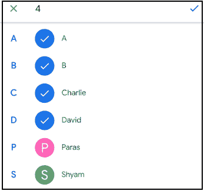

13.点击右上角**勾选**选项，如下图:

14.选定的联系人将被添加到组中。

15.要在群组中添加更多联系人，我们可以单击右上角的添加联系人图标，如下所示:

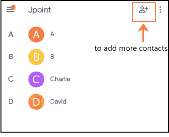

同样，我们可以向组中添加尽可能多的联系人。

**要在我们的手机上使用群发邮件，请按照以下步骤操作:**

1.打开我们想要使用的创建的组，如上所示。

2.点击右上角的三个垂直点，如下所示:

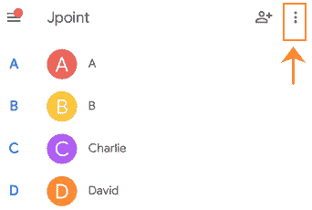

3.将出现一个下拉框。点击**【发送邮件】**选项，如下图:

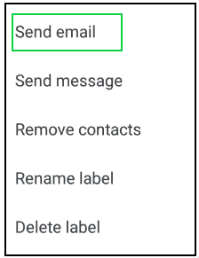

4.将出现一个包含联系人的电子邮件框，如下所示:

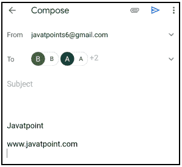

5.我们可以写消息，直接发邮件。

同样，我们可以创建任何有任意数量联系人的组。

* * *