# 如何从 Gmail 注销

> 原文：<https://www.javatpoint.com/how-to-logout-from-gmail>

我们可以在电脑上轻松注销当前的 Gmail 帐户。

在手机应用的情况下，我们可以从设备中删除我们的 Gmail 帐户来注销或在不同的帐户之间切换。

### 注销是什么意思？

这意味着我们想结束从当前帐户的访问。它通知计算机或系统用户想要结束设备的登录会话。

注销术语通常被称为**注销**。

它会阻止其他用户访问该帐户。这也是一种安全措施，为一个人，以确保其证书。

如果我们已经注销，没有身份证明的任何其他人都不能登录我们的帐户。

让我们从步骤开始。

### 在计算机上注销

在电脑上注销我们的 [Gmail](gmail) 账户的步骤如下:

1.  打开 Gmail 帐户，使用 Gmail ID 和密码登录。
    我们可以直接使用网址:[https://mail.google.com/](https://mail.google.com/)。
2.  在 Gmail 帐户的主页上，单击指定您的姓名或照片的图标。出现在页面右上角，如下图:
    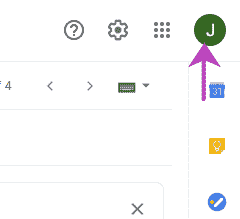
3.  将出现一个对话框。点击对话框底部的**【注销】**选项，如下图:
    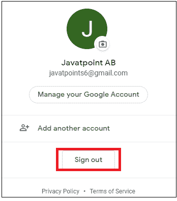
4.  我们将很快从您当前的 Gmail 帐户中注销。
5.  注销后，账户前面会出现一个**“注销”**符号。如下图:
    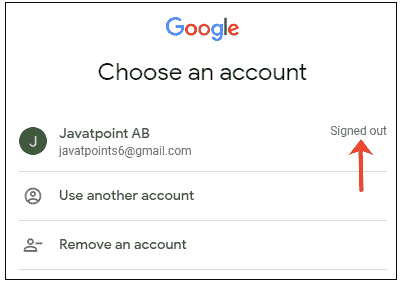

要再次操作您的帐户，我们需要通过指定密码再次登录。

## 通过 Gmail 应用程序注销

如上所述，要从 Gmail 应用程序中注销，我们可以删除自己的帐户，也可以在移动设备或平板电脑的不同帐户之间切换。

**注销选项**

*   从我们的设备中删除谷歌帐户
*   在帐户之间切换

### 从我们的设备中删除谷歌帐户

从 Gmail 中删除谷歌账户也将从所有其他应用程序(如 YouTube 等)中删除该账户。)在我们的移动设备上。但是我们可以使用我们的帐户登录其他设备。

当我们想把我们的设备给别人使用时，上述选择是有益的。

步骤如下:

1.  打开 Gmail 应用程序。
2.  点击页面右上角指定您的姓名或照片的图标，如下图:
    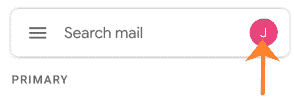
3.  点击底部的**“管理本设备账户”**选项，如下图:
    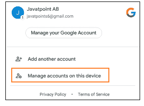
4.  点击**谷歌**图标，如下图:
    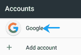
5.  选择您的帐户。
6.  将出现一个页面。点击页面右上角出现的三个点，如下图:
    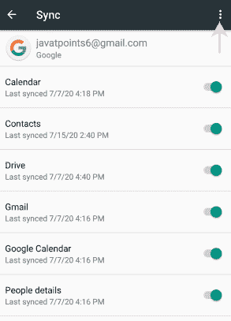
7.  从下拉列表中点击**【删除账号】**选项，如下图:
    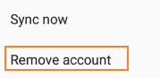
8.  继续之前，将出现一个确认框。点击**【删除账号】**按钮确认，如下图:
    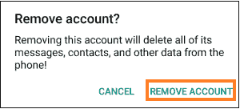
9.  所选帐户将从移动设备中删除。

### 在帐户之间切换

这意味着我们可以在设备上添加多个帐户。无论何时需要，我们都可以从账户列表中开立任何账户。

我们不需要指定在不同帐户之间切换的密码。我们只需要从列表中选择一个账户，然后开始工作。

我们首先需要添加一个账户。之后，我们可以使用相同的步骤轻松地在帐户之间切换。

步骤如下:

1.  打开 Gmail 应用程序。
2.  点击指定姓名或照片的图标，如下图:
    
3.  点击底部出现的**【添加另一个账户】**选项，如下图:
    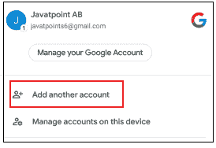
4.  点击**谷歌**图标，如下图:
    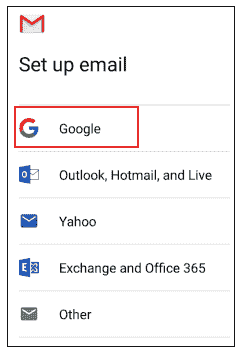
5.  指定 **Gmail ID** ，点击**【下一步】**
6.  指定**密码**，点击**【下一步】**
7.  点击**“我同意”**选项接受谷歌服务条款。
8.  该帐户将被添加到列表中。现在，您可以轻松地在两个帐户之间切换。

* * *